# Triển Khai Hạ Tầng Hybrid (AWS & Proxmox) với HCP Terraform

---

## 1. Yêu Cầu

### 1.1 Kịch Bản Hệ Thống

| Thành phần | Nền tảng | Mục tiêu |
| :--- | :--- | :--- |
| **Database (MySQL/PostgreSQL)** | On-Premise (Proxmox) | Tối ưu chi phí, kiểm soát và bảo mật dữ liệu ở mức cao nhất |
| **Web Server + ALB** | Public Cloud (AWS) | Đón lưu lượng người dùng, đảm bảo tính sẵn sàng cao |
| **State Management** | HCP Terraform (Terraform Cloud) | Quản lý State file, bảo mật biến số, phê duyệt trước khi cấp phát hạ tầng |

### 1.2 Nguyên Tắc Triển Khai

- **VCS Integration:** Tích hợp GitHub/GitLab vào HCP Terraform để tự động hóa quy trình CI/CD.
- **Execution Mode:** Bắt buộc cài đặt `Execution Mode` ở trạng thái **Agent** để agent nội bộ có thể gọi API tới Proxmox mà không cần mở port inbound.
- **Bảo mật biến số:** Tuyệt đối không hardcode mật khẩu trong file code. Tất cả khóa API (AWS Access Key, Proxmox Token) phải được mã hóa dạng **Sensitive Variables** trên giao diện HCP Terraform Cloud.
- **Modularization:** Chia cấu trúc thư mục rõ ràng thành `modules/aws` và `modules/proxmox`.
- **Output:** Hệ thống phải xuất ra địa chỉ DNS của AWS ALB và địa chỉ IP nội bộ của VM chứa Database.

### 1.3 Phân Công Nhiệm Vụ (Team Roles)

Đây là bài lab **team-based** — mỗi role có trách nhiệm và quyền hạn riêng biệt, không được tự ý vượt qua ranh giới của mình.

```
┌─────────────────────────────────────────────────────────────────┐
│                      LUỒNG PHỐI HỢP ĐẦY ĐỦ                     │
│                                                                 │
│  👤 Workspace Admin (Team Leader)                               │
│     └─► Chuẩn bị toàn bộ hạ tầng nền (Proxmox, HCP, Agent)     │
│     └─► Tạo Org / Project / Workspace trên HCP Terraform        │
│     └─► Setup Sensitive Variables (Proxmox token, AWS key...)   │
│     └─► Tạo skeleton code, push lên GitHub                      │
│     └─► Cấp đúng loại token cho từng thành viên                 │
│                          │                                      │
│              ┌───────────┴───────────┐                          │
│              ▼                       ▼                          │
│  👤 On-Premise Engineer      👤 AWS Engineer                    │
│     └─► Viết modules/proxmox    └─► Viết modules/aws            │
│     └─► terraform plan           └─► terraform plan             │
│              │                       │                          │
│              └───────────┬───────────┘                          │
│                          ▼                                      │
│  👤 DevOps Reviewer & Approver                                  │
│     └─► Đọc terraform plan trên HCP UI                          │
│     └─► Kiểm tra luồng kết nối AWS ↔ Proxmox                   │
│     └─► Bấm "Confirm & Apply" — người DUY NHẤT được apply       │
│                          │                                      │
│                          ▼                                      │
│        Hạ tầng được tạo trên cả AWS lẫn Proxmox                 │
└─────────────────────────────────────────────────────────────────┘
```

Chi tiết trách nhiệm và quyền hạn từng role:

| Role | Trách nhiệm chính | Quyền `apply`? |
| :--- | :--- | :--- |
| **👤 Workspace Admin** | Chuẩn bị hạ tầng nền (Proxmox template, HCP, Agent, Tích hợp VCS như GitHub/GitLab), quản lý thành viên, setup Sensitive Variables, tạo skeleton code, cấp token | ✅ Có (setup ban đầu) |
| **👤 On-Premise Engineer** | Viết `modules/proxmox`, cấu hình VM, Cloud-Init, DB | ❌ Chỉ có thể đảy code lên VCS |
| **👤 AWS Engineer** | Viết `modules/aws`, cấu hình VPC, EC2, ALB | ❌ Chỉ có thể đảy code lên VCS |
| **👤 DevOps Reviewer** | Đọc plan, kiểm tra luồng mạng AWS ↔ Proxmox, bấm "Confirm & Apply" trên HCP UI | ✅ Người **duy nhất** được `apply` |

> **Tại sao phải tách Reviewer riêng?** Đây là nguyên tắc **"Four-Eyes Principle"** — không ai được tự viết code lẫn tự phê duyệt code đó. Reviewer độc lập giúp phát hiện lỗi cấu hình (sai CIDR, thiếu Security Group, VM tạo nhầm network...) trước khi hạ tầng thực sự bị thay đổi.

---

## 2. Chuẩn Bị Hạ Tầng `👤 Workspace Admin`

> Toàn bộ mục này do **Workspace Admin** thực hiện. Đây là công việc khởi tạo nền tảng một lần duy nhất.

### 2.1 Proxmox

#### 2.1.1 Yêu Cầu Chung

Trước khi bắt đầu, cần chuẩn bị các thành phần sau trên Proxmox:

- **Một node Proxmox** đang hoạt động.
- **Template `ubuntu-original`** đã được cài sẵn (xem hình).

  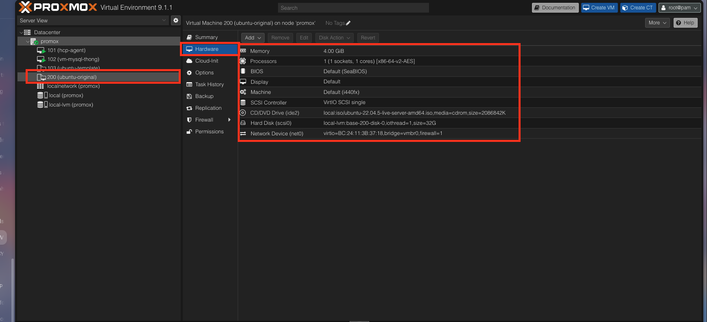

- **Template có sẵn `cloud-init`** để có thể cấp IP tĩnh cho VM, thay vì dùng DHCP cấp động.
- **Một VM riêng biệt** dùng làm Agent của HCP Terraform Cloud.
- **Cấu hình Storage cho Cloud-Init:** Cho phép `cloud-init` lưu file cấu hình vào Proxmox qua đường dẫn: `Datacenter → Storage → chọn nơi lưu trữ (ví dụ: local) → Edit`.

  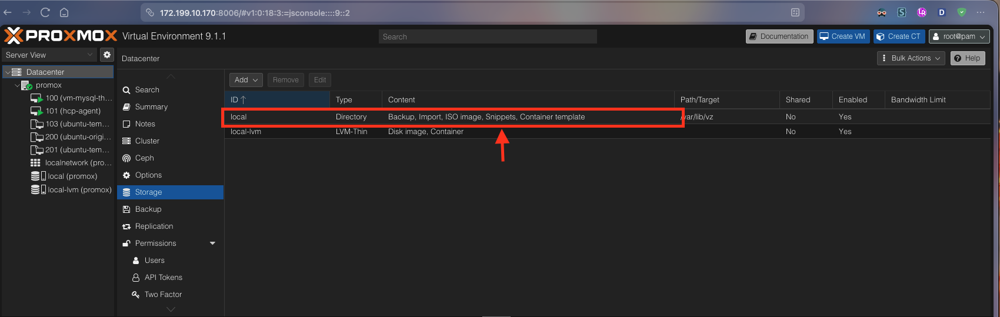

#### 2.1.2 Cài Đặt Ubuntu Template (Base)

**Bước 1: Tải Ubuntu ISO về Proxmox**

Có thể tải qua giao diện Web UI (nhập URL ISO vào ô URL):

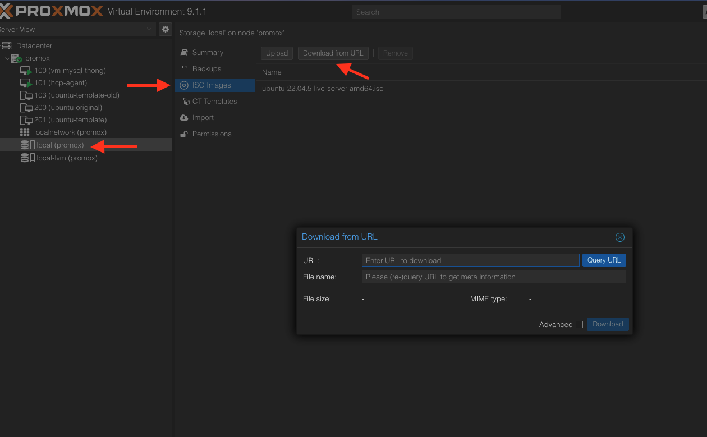

Hoặc dùng CLI trực tiếp trên Proxmox host:

```bash
cd /var/lib/vz/template/iso
wget https://releases.ubuntu.com/22.04/ubuntu-22.04.5-live-server-amd64.iso
```

**Bước 2: Tạo VM và cài Ubuntu**

Tạo máy ảo mới trên Proxmox:

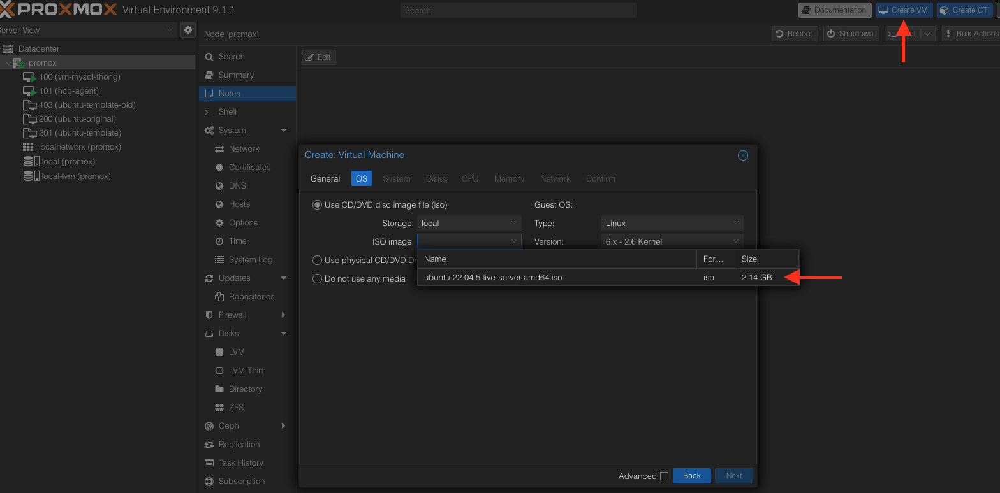

Tiến hành cài Ubuntu lên máy ảo theo [hướng dẫn tại đây](https://www.youtube.com/watch?v=DjlGte968ko&list=PLsvroIvFNP1KU8foUeCC-hbJbqnAggWL2&index=4).

**Bước 3: Chuyển VM thành Template**

Sau khi cài đặt xong, right-click vào VM và chọn "Convert to Template":

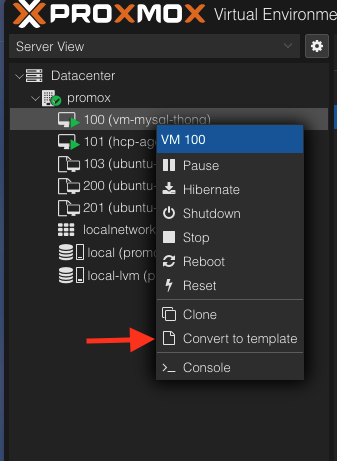

#### 2.1.3 Tạo Ubuntu Template Tích Hợp Cloud-Init

Đây là bước quan trọng nhất, tạo ra một "golden template" chuẩn có sẵn `cloud-init` để Terraform có thể cấp IP tĩnh khi clone VM.

**Bước 1: Khởi chạy VM từ template base và kiểm tra Cloud-Init**

```bash
cat /etc/machine-id
ls -la /var/lib/cloud/
```

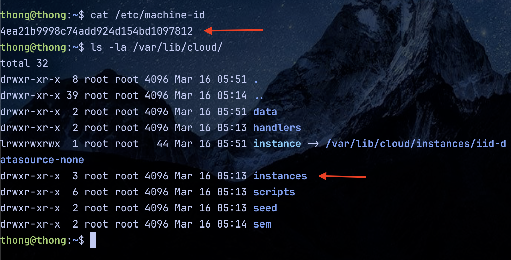

**Bước 2: Cài đặt các gói cần thiết**

```bash
sudo apt update
sudo apt install qemu-guest-agent cloud-init -y
sudo systemctl enable --now qemu-guest-agent
```

> ⚠️ **Lưu ý:** Lệnh là `qemu-guest-agent`, không phải `emu-guest-agent`.

**Bước 3: Cấu hình hệ thống cho Template**

```bash
# Dừng và tắt dịch vụ tự cập nhật (tránh xung đột khi boot)
sudo systemctl stop unattended-upgrades
sudo systemctl disable unattended-upgrades

# Cấu hình Cloud-Init KHÔNG tự update khi boot
sudo sed -i 's/package_upgrade: true/package_upgrade: false/' /etc/cloud/cloud.cfg

# Xóa file cấu hình mạng cũ (để Cloud-Init tự tạo file mới khi clone)
sudo rm -f /etc/netplan/*.yaml

# [Tùy chọn] Cho phép SSH bằng mật khẩu nếu không dùng SSH Key
# Cảnh báo: Không nên bật tùy chọn này trên môi trường production
sudo sed -i 's/#PasswordAuthentication yes/PasswordAuthentication yes/' /etc/ssh/sshd_config
sudo systemctl restart ssh
```

**Bước 4: Kích hoạt QEMU Guest Agent**

Đảm bảo agent đang chạy để Proxmox có thể giao tiếp với VM:

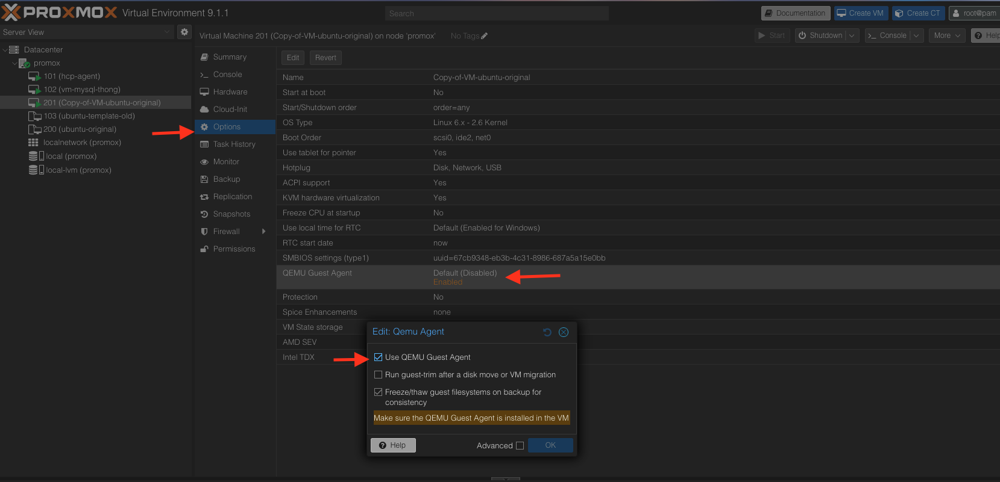

**Bước 5: Dọn dẹp và "niêm phong" VM**

> ⚠️ **Cực kỳ quan trọng:** Sau bước này, **KHÔNG được bật lại VM**. Mọi thay đổi sau khi bật lại sẽ làm hỏng template.

```bash
# 1. Dọn dẹp cache APT để giảm dung lượng template
sudo apt clean
sudo rm -rf /var/log/*

# 2. Xóa định danh máy (machine-id) để mỗi VM clone có ID mạng riêng, tránh xung đột
sudo truncate -s 0 /etc/machine-id
sudo rm -f /var/lib/dbus/machine-id

# 3. Xóa dấu vết của Cloud-Init cũ để nó chạy lại hoàn toàn khi boot lần đầu
sudo cloud-init clean --logs

# 4. Tắt máy ngay lập tức
sudo poweroff
```

**Bước 6: Chuyển VM thành Template và thêm Cloud-Init Drive**

Sau khi VM đã tắt, chuyển nó thành template, sau đó thêm Cloud-Init Drive vào (có thể xóa CD/DVD Drive cũ để nhường cổng `ide2` cho Cloud-Init):

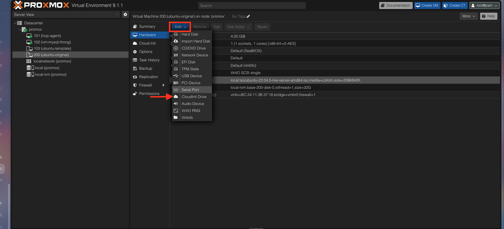
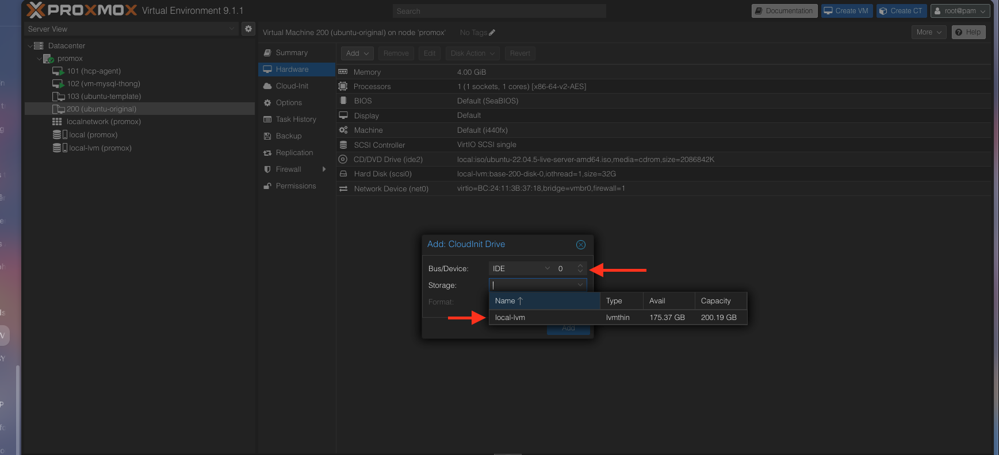
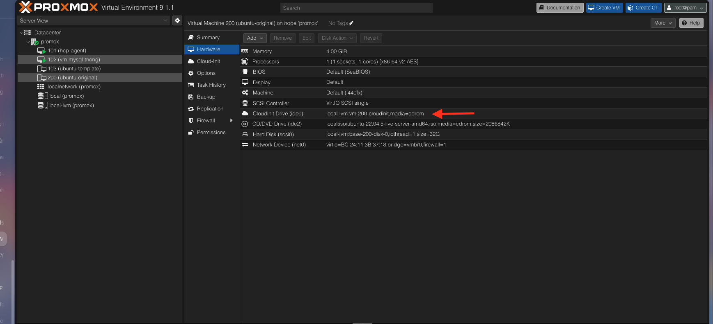
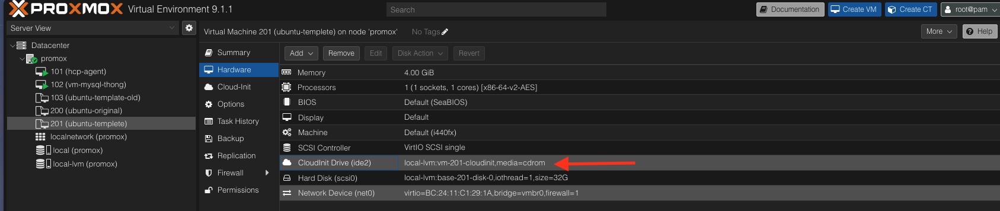

Sau khi hoàn thành, Admin đã có thể chỉ định IP tĩnh cho từng VM clone từ template này mà không bị DHCP cấp ngẫu nhiên.

---

### 2.2 HCP Terraform Cloud

HCP Terraform Cloud đóng vai trò là "bộ não trung tâm" của toàn bộ hệ thống, chịu trách nhiệm lưu trữ State file, quản lý biến nhạy cảm và điều phối lệnh thực thi đến các Agent.

#### 2.2.1 Nguyên Lý Hoạt Động Của Terraform Agent

Đây là điểm mấu chốt về kiến trúc bảo mật của hệ thống. Terraform Agent hoạt động theo mô hình **"Outbound-Only"** (chỉ kết nối chiều ra):

```
┌─────────────────────────────────────────────────────────┐
│                   MẠNG NỘI BỘ (On-Premise)              │
│                                                          │
│   ┌──────────────┐   Pull lệnh   ┌──────────────────┐   │
│   │  VM Agent    │ ─────────────►│  HCP Terraform   │   │
│   │  (Proxmox)   │◄───────────── │  Cloud           │   │
│   └──────┬───────┘   Nhận lệnh  └──────────────────┘   │
│          │                         (Internet)            │
│          │ Gọi API                                       │
│          ▼                                               │
│   ┌──────────────┐                                       │
│   │  Proxmox API │                                       │
│   │  (Tạo VM)    │                                       │
│   └──────────────┘                                       │
└─────────────────────────────────────────────────────────┘
```

**Tại sao Agent an toàn hơn chạy trực tiếp từ máy local?**

| Tiêu chí | Chạy Local (Không Agent) | Dùng Terraform Agent |
| :--- | :--- | :--- |
| **Mở Port Inbound** | Phải mở port để HCP gọi vào | **Không cần mở bất kỳ port nào** |
| **Khởi tạo kết nối** | HCP Cloud → Máy local | Agent → HCP Cloud (chiều ra) |
| **Bảo mật Firewall** | Rủi ro cao, phải whitelist IP | An toàn, Agent chủ động poll lệnh |
| **Tính sẵn sàng** | Phụ thuộc vào máy cá nhân | Agent chạy 24/7 trên VM nội bộ |
| **Truy cập API nội bộ** | Chỉ khi người dùng đang online | Luôn sẵn sàng, độc lập với người dùng |
| **Credential** | Lưu trên máy cá nhân | Lưu an toàn trên HCP Cloud |

**Luồng hoạt động chi tiết:**

1. On-Premise Engineer chạy `terraform plan` từ máy local.
2. HCP Terraform Cloud nhận lệnh, đưa vào hàng đợi (queue) của Workspace.
3. **Agent** (đang chạy trên VM Proxmox) liên tục **poll** HCP Cloud: *"Có lệnh nào cho tôi không?"*
4. Agent nhận lệnh, tải xuống code Terraform từ HCP Cloud.
5. DevOps Reviewer xem xét plan trên HCP UI và bấm **"Confirm & Apply"**.
6. Agent thực thi **ngay trên mạng nội bộ**, gọi Proxmox API để tạo VM.
7. Kết quả được gửi lên HCP Cloud để lưu State file và hiển thị log.

> **Kết luận:** Mạng nội bộ không bao giờ nhận kết nối từ bên ngoài. Toàn bộ giao tiếp là **Agent gọi ra ngoài** qua HTTPS port 443, loại bỏ hoàn toàn rủi ro từ các cuộc tấn công inbound.

#### 2.2.2 Cấu Trúc Tổ Chức Trên HCP Terraform

Luồng tạo tài nguyên theo thứ tự: `Organization → Project → Agent Pool → Workspace`

| Thành phần | Cấp độ | Mục đích |
| :--- | :--- | :--- |
| **Organization** | Gốc (Root) | Quản lý thành viên, cài đặt chung, hóa đơn |
| **Project** | Con của Org | Phân nhóm các Workspace theo phòng ban hoặc dự án |
| **Workspace** | Con của Project | Quản lý State, thực thi code Terraform cụ thể |
| **Agent Pool** | Thuộc Org | Cung cấp hạ tầng thực thi lệnh trong mạng nội bộ |

#### 2.2.3 Cách 1: Tạo Bằng Giao Diện Web UI

**Tạo Organization:**

Truy cập [https://app.terraform.io/app/organizations/new](https://app.terraform.io/app/organizations/new). Chọn plan **Business** nếu cần thêm thành viên vào làm cùng.

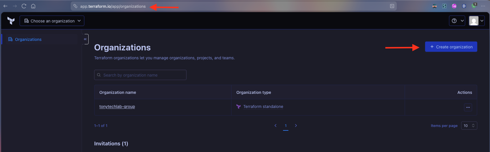
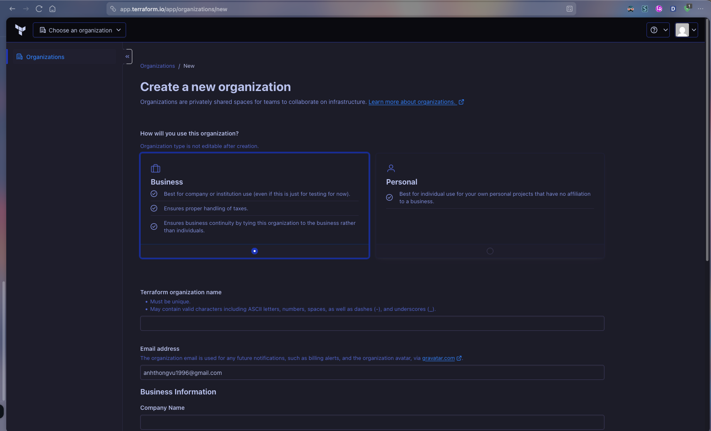

**Tạo Workspace:**

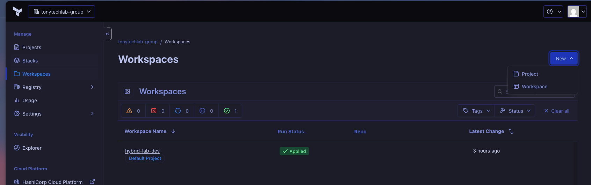

**Tạo Variables cho Workspace:**

Lưu ý có 2 loại biến quan trọng:
- **HCP Variables:** Giá trị được parse theo cú pháp HCL của Terraform.
- **Sensitive Variables:** Giá trị được lưu dạng chuỗi và **ẩn hoàn toàn** trong UI lẫn log — kể cả khi edit, Admin không thể xem lại giá trị cũ.


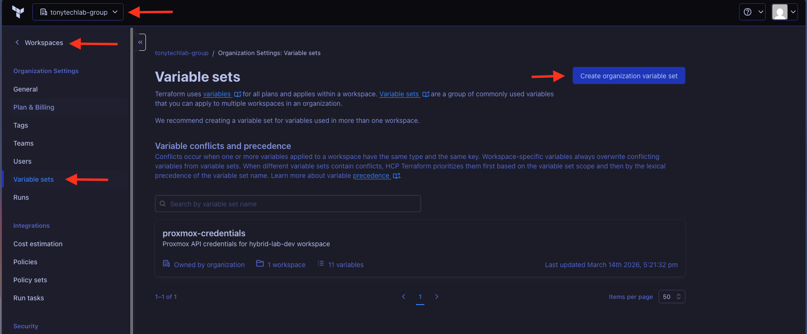
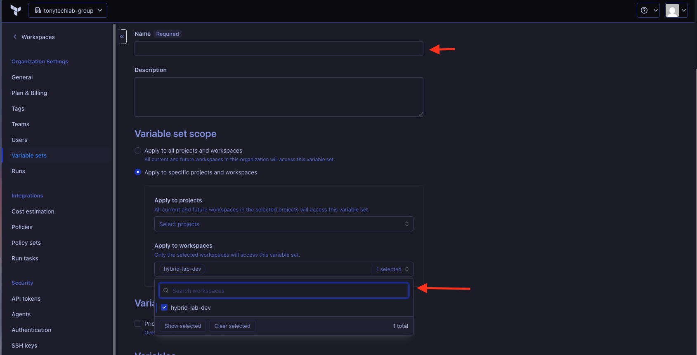
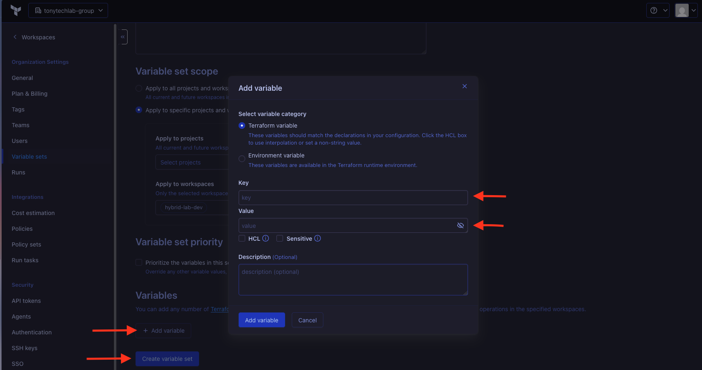

Kết quả sau khi tạo — các biến được đánh dấu `Sensitive` sẽ bị ẩn giá trị:

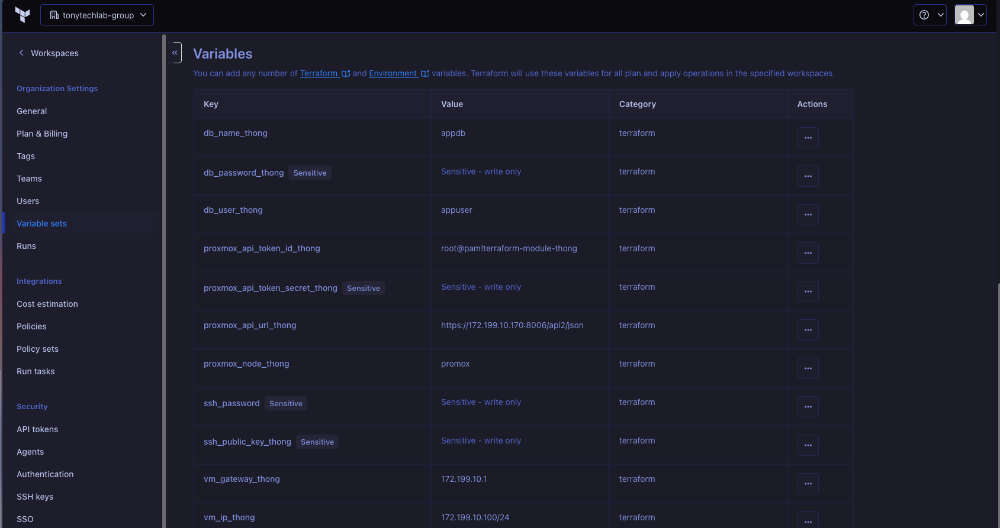
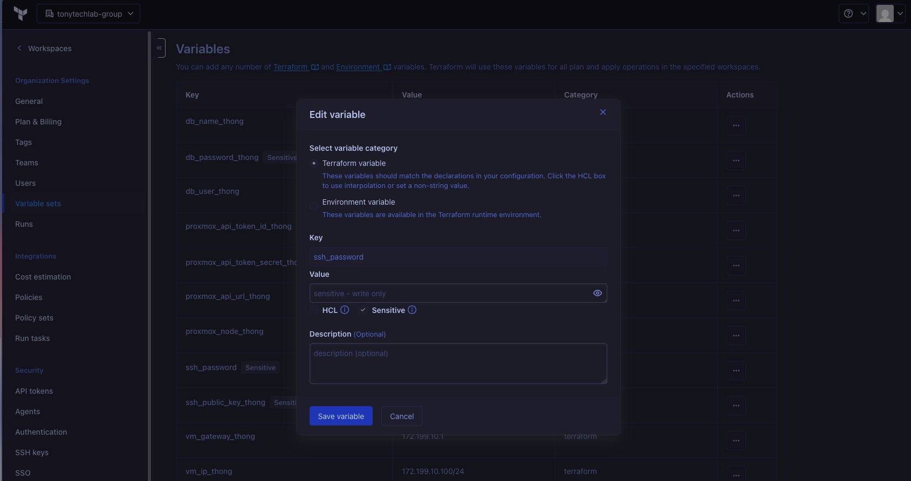

**Tạo Agent Pool:**

Vào `Organizations → Settings → Agents` để tạo Agent Pool mới:

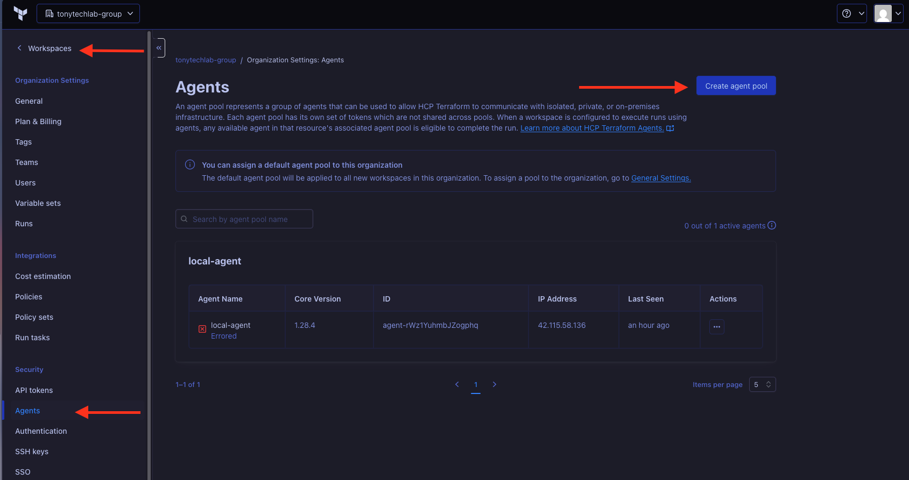
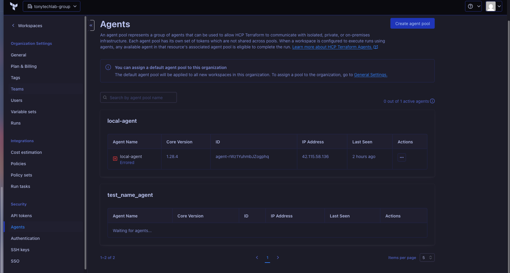

#### 2.2.4 Cách 2: Tạo Bằng API (Tự Động Hóa)

Trước tiên, lấy API Token tại `Account Settings`:

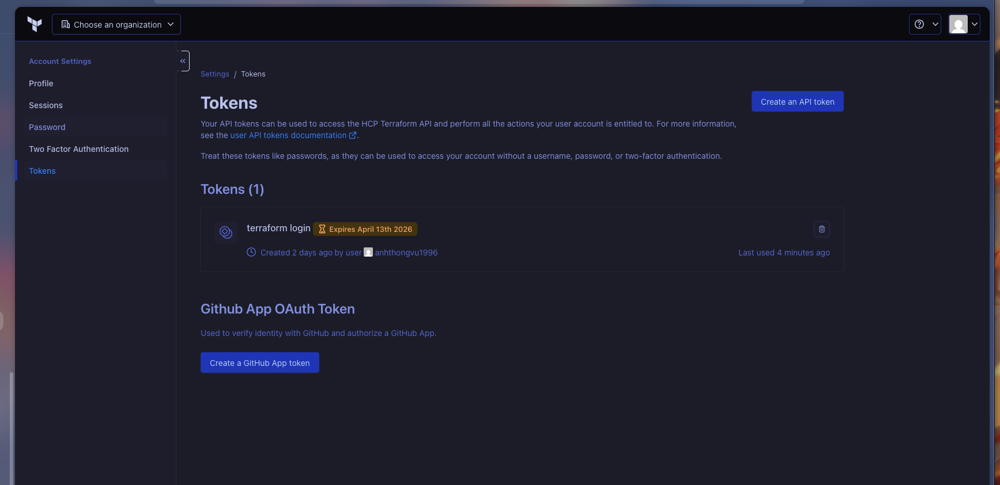

Khai báo biến môi trường:

```bash
export ORG_NAME="your-org-name"
export ORG_EMAIL="your-email@example.com"
export TFC_TOKEN="your-api-token"
```

**Tạo Organization:**

```bash
curl \
  --header "Authorization: Bearer $TFC_TOKEN" \
  --header "Content-Type: application/vnd.api+json" \
  --request POST \
  --data "{
    \"data\": {
      \"type\": \"organizations\",
      \"attributes\": {
        \"name\": \"$ORG_NAME\",
        \"email\": \"$ORG_EMAIL\"
      }
    }
  }" \
  "https://app.terraform.io/api/v2/organizations"
```

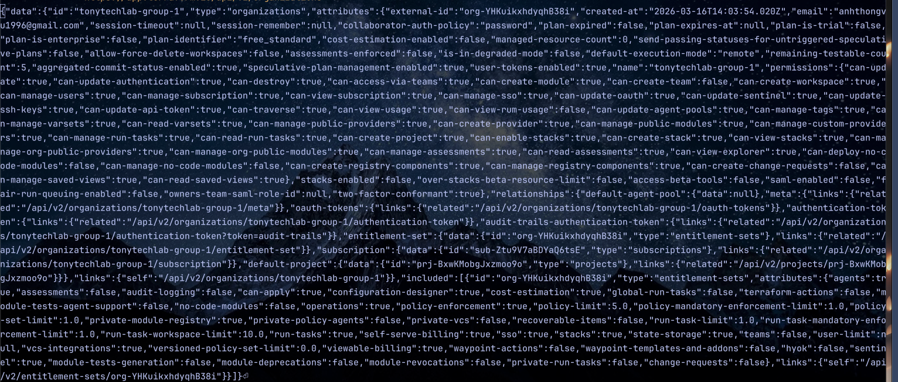

**Tạo Project:**

```bash
curl \
  --header "Authorization: Bearer $TFC_TOKEN" \
  --header "Content-Type: application/vnd.api+json" \
  --request POST \
  --data '{
    "data": {
      "type": "projects",
      "attributes": {
        "name": "Internal-Infrastructure"
      }
    }
  }' \
  "https://app.terraform.io/api/v2/organizations/$ORG_NAME/projects"
```

> 📌 Lưu lại giá trị `"id": "prj-xxxxx"` từ phản hồi JSON để dùng cho bước tạo Workspace.

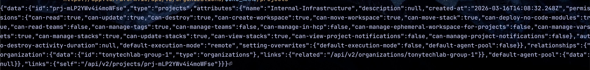

**Tạo Agent Pool:**

```bash
curl \
  --header "Authorization: Bearer $TFC_TOKEN" \
  --header "Content-Type: application/vnd.api+json" \
  --request POST \
  --data '{
    "data": {
      "type": "agent-pools",
      "attributes": {
        "name": "proxmox-home-pool",
        "organization-scoped": true
      }
    }
  }' \
  "https://app.terraform.io/api/v2/organizations/$ORG_NAME/agent-pools"
```

> 📌 Lưu lại giá trị `"id": "apool-xxxxx"` từ phản hồi JSON để dùng cho bước tạo Workspace.

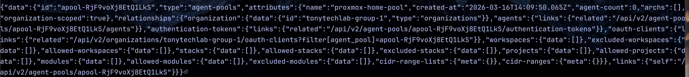

**Tạo Workspace:**

```bash
curl \
  --header "Authorization: Bearer $TFC_TOKEN" \
  --header "Content-Type: application/vnd.api+json" \
  --request POST \
  --data '{
    "data": {
      "type": "workspaces",
      "attributes": {
        "name": "mysql-prod-01",
        "execution-mode": "agent",
        "agent-pool-id": "apool-xxxx-id-cua-pool",
        "description": "Workspace cho DB Team"
      },
      "relationships": {
        "project": {
          "data": {
            "type": "projects",
            "id": "prj-xxxx-id-cua-project"
          }
        }
      }
    }
  }' \
  "https://app.terraform.io/api/v2/organizations/$ORG_NAME/workspaces"
```

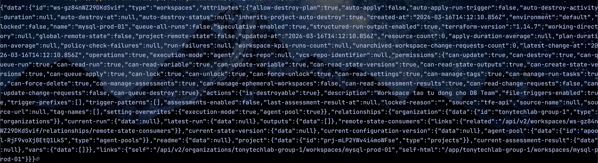

Bảng tóm tắt các endpoint API:

| Tài nguyên | Method | Endpoint URL |
| :--- | :--- | :--- |
| **Organization** | `POST` | `/api/v2/organizations` |
| **Project** | `POST` | `/api/v2/organizations/{org_name}/projects` |
| **Agent Pool** | `POST` | `/api/v2/organizations/{org_name}/agent-pools` |
| **Workspace** | `POST` | `/api/v2/organizations/{org_name}/workspaces` |

#### 2.2.5 Cách 3: Tạo Bằng Terraform (Infrastructure as Code)

Đây là cách được khuyến nghị nhất vì toàn bộ cấu hình HCP đều được quản lý dưới dạng code, dễ tái sử dụng và version control.

Khai báo token vào terminal:

```bash
export TF_VAR_tfc_token="your-tfc-token"
```

**File `variables.tf`:**

```hcl
variable "tfc_token" {
  description = "User API Token lấy từ biến môi trường terminal"
  type        = string
  sensitive   = true
}

variable "org_name" {
  type    = string
  default = "your-org-name"
}

variable "org_email" {
  type    = string
  default = "admin@example.com"
}

variable "project_name" {
  type    = string
  default = "Internal-Services"
}

variable "agent_pool_name" {
  type    = string
  default = "proxmox-home-pool"
}

variable "workspace_name" {
  type    = string
  default = "mysql-automation-project"
}
```

**File `providers.tf`:**

```hcl
terraform {
  required_providers {
    tfe = {
      source  = "hashicorp/tfe"
      version = "~> 0.50.0"
    }
  }
}

provider "tfe" {
  token = var.tfc_token
}
```

**File `main.tf`:**

```hcl
resource "tfe_organization" "org" {
  name  = var.org_name
  email = var.org_email
}

resource "tfe_project" "project" {
  name         = var.project_name
  organization = tfe_organization.org.name
}

resource "tfe_agent_pool" "pool" {
  name                = var.agent_pool_name
  organization        = tfe_organization.org.name
  organization_scoped = true
}

resource "tfe_workspace" "workspace" {
  name           = var.workspace_name
  organization   = tfe_organization.org.name
  project_id     = tfe_project.project.id
  execution_mode = "agent"
  agent_pool_id  = tfe_agent_pool.pool.id
}

resource "tfe_agent_token" "token" {
  agent_pool_id = tfe_agent_pool.pool.id
  description   = "Token cho VM Agent trên Proxmox"
}

output "hcp_agent_token" {
  value     = tfe_agent_token.token.token
  sensitive = true
}
```

> 📎 Source code đầy đủ: [terraform-hybrid-lab/create-hcl-cloud](https://github.com/ThongVu1996/terraform-hybrid-lab/tree/main/create-hcl-cloud)

Thực thi:

```bash
terraform init
terraform fmt
terraform validate
terraform plan
terraform apply
```

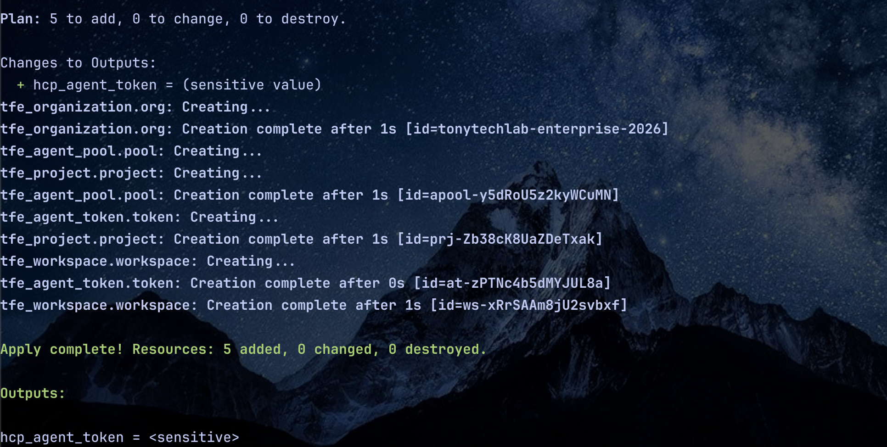

Lấy Agent Token sau khi apply:

```bash
terraform output hcp_agent_token
```

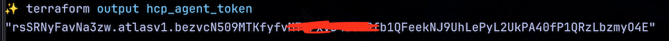

Kiểm tra trên UI để xác nhận Execution Mode đã được cấu hình đúng:

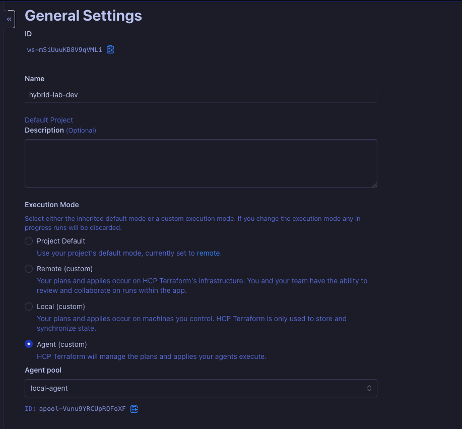

---

### 2.3 Khởi Chạy Terraform Agent

Trên VM đóng vai trò Agent (đang chạy trên Proxmox), Admin khởi chạy Agent bằng Docker:

```bash
export TFC_AGENT_TOKEN="your-agent-token"
export TFC_AGENT_NAME="proxmox-agent-01"

docker run \
  --platform=linux/amd64 \
  -e TFC_AGENT_TOKEN \
  -e TFC_AGENT_NAME \
  hashicorp/tfc-agent:latest
```

> 📖 Tham khảo thêm về cách dùng Agent và mô hình bảo mật: [HashiCorp Terraform Cloud Agents](https://developer.hashicorp.com/terraform/tutorials/cloud/cloud-agents)

### 2.4 Bàn Giao Cho Team

Sau khi hoàn thành toàn bộ mục 2, Admin thực hiện bàn giao:

```
Workspace Admin
      │
      ├── Cấp Team Token ──────────────► On-Premise Engineer
      │   (gắn với workspace proxmox)      (chỉ được plan)
      │
      ├── Cấp Team Token ──────────────► AWS Engineer
      │   (gắn với workspace aws)          (chỉ được plan)
      │
      └── Cấp User Token ──────────────► DevOps Reviewer
          (quyền xem tất cả workspace)     (được Confirm & Apply)
```

> Từ thời điểm này, Admin không cần can thiệp thêm vào luồng code. Mọi thay đổi hạ tầng đều đi qua vòng lặp: Engineer viết code → `plan` → Reviewer duyệt → Agent thực thi.

---

## 3. Viết Code Terraform cho Proxmox `👤 On-Premise Engineer`

> Phần này do **On-Premise Engineer** thực hiện. Engineer đã được Admin cấp Team Token và thông tin Workspace. Nhiệm vụ duy nhất là **viết code** trong `modules/proxmox` và chạy `terraform plan` để gửi kết quả lên HCP UI cho Reviewer xem xét.

### 3.1 Luồng Thực Thi — Ai Làm Gì

```
On-Premise Engineer        HCP Cloud (UI)          DevOps Reviewer
        │                        │                        │
        │  terraform login       │                        │
        │  terraform init        │                        │
        │  terraform plan ──────►│                        │
        │                        │ Plan hiển thị trên UI  │
        │                        │───────────────────────►│
        │                        │                        │ Đọc plan
        │                        │                        │ Kiểm tra
        │                        │                        │ luồng mạng
        │                        │◄─── Confirm & Apply ───│
        │                        │                        │
        │                        │  Agent nhận lệnh       │
        │                        │       │                │
        │                        │       ▼                │
        │                        │  Proxmox API           │
        │                        │  Tạo VM + Cài DB       │
        │                        │       │                │
        │◄── Output: IP VM ──────│◄──────┘                │
```

> ⚠️ **Quy tắc bắt buộc:** On-Premise Engineer **không được** chạy `terraform apply` dưới bất kỳ hình thức nào — kể cả với flag `-auto-approve`. Mọi thay đổi hạ tầng bắt buộc phải qua bước Reviewer xem xét và bấm "Confirm & Apply" trên HCP UI. Đây là nguyên tắc **"Four-Eyes Principle"** đã quy định ở mục 1.3.

### 3.2 So Sánh Phương Pháp Triển Khai

Có 3 cách để cài đặt phần mềm (MySQL, Tailscale...) lên VM sau khi tạo. Bảng dưới đây so sánh ưu nhược điểm của từng phương pháp:

| Tiêu chí | Provisioner | Cloud-Init (telmate) | Cloud-Init (bpg) |
| :--- | :--- | :--- | :--- |
| **Độ ổn định** | Thấp — dễ lỗi, không idempotent | Trung bình | Cao |
| **Inject biến từ HCP** | Có | Không (phải tạo file thủ công) | **Có** |
| **Tự động hóa Snippet** | N/A | Phải tạo file tay trên Proxmox | **Agent tự đẩy file** |
| **Được HashiCorp khuyến nghị** | ❌ Không | ✅ Có | ✅ Có |
| **Quản lý vòng đời** | Không | Hạn chế | **Đầy đủ (Resource ID)** |

> 📖 Tham khảo thêm: [Provisioner vs Cloud-Init: Khi nào nên dùng cái nào?](https://oneuptime.com/blog/post/2026-02-23-terraform-provisioners-last-resort/view)

### 3.3 Phương Pháp 1: Provisioner (Không Khuyến Nghị)

> ⚠️ HashiCorp chính thức không khuyến nghị dùng `provisioner` cho production vì thiếu tính idempotent, khó debug và phụ thuộc vào kết nối SSH tại thời điểm `apply`.

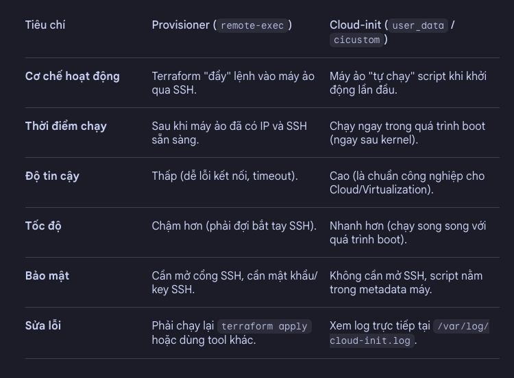

Tham khảo code: [terraform-hybrid-lab/create-vm](https://github.com/ThongVu1996/terraform-hybrid-lab/tree/main/create-vm)

On-Premise Engineer đăng nhập vào HCP bằng Team Token đã được Admin cấp:

```bash
terraform login
```

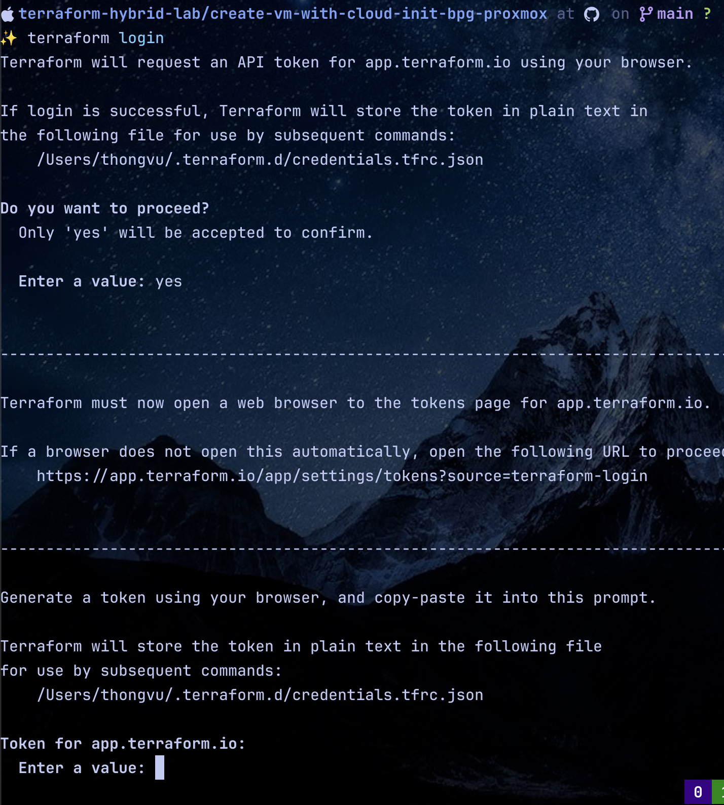
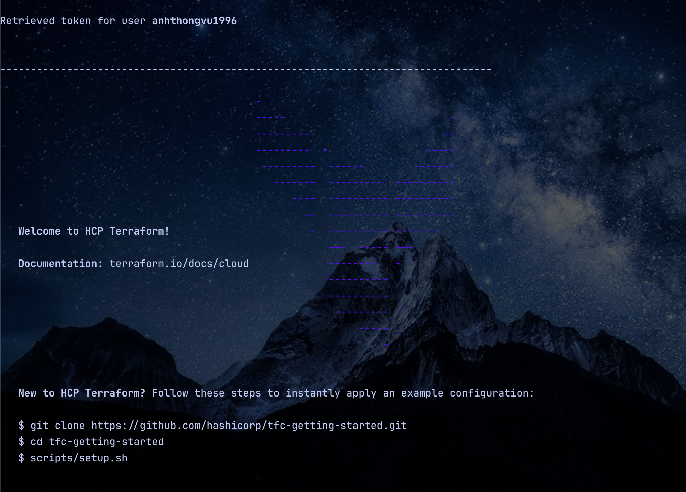

Sau đó chạy các lệnh chuẩn bị và gửi plan lên HCP:

```bash
terraform init && terraform fmt && terraform validate
terraform plan
```

Sau khi `plan` chạy xong, kết quả tự động hiển thị trên HCP UI. **DevOps Reviewer** vào HCP Workspace → tab **"Runs"** → đọc toàn bộ plan → bấm **"Confirm & Apply"** để hạ tầng được tạo.

Kết quả sau khi Reviewer apply thành công:

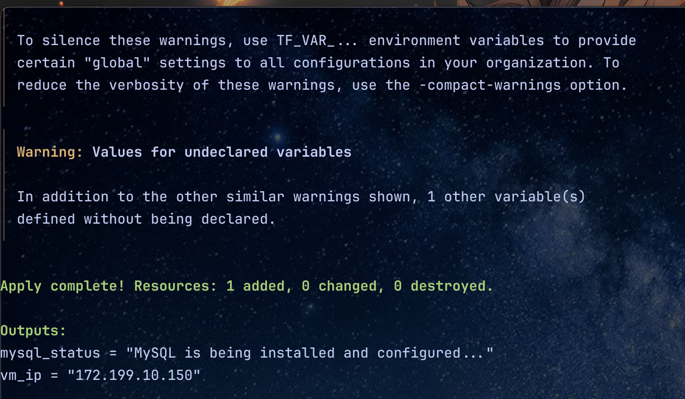
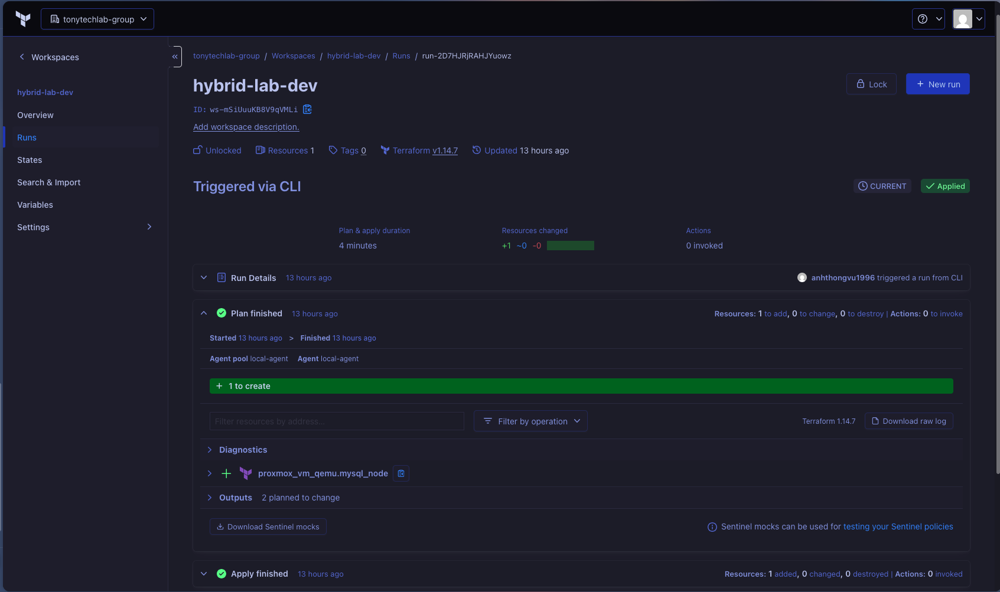
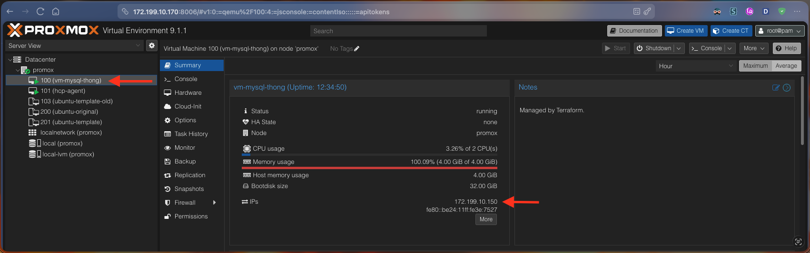
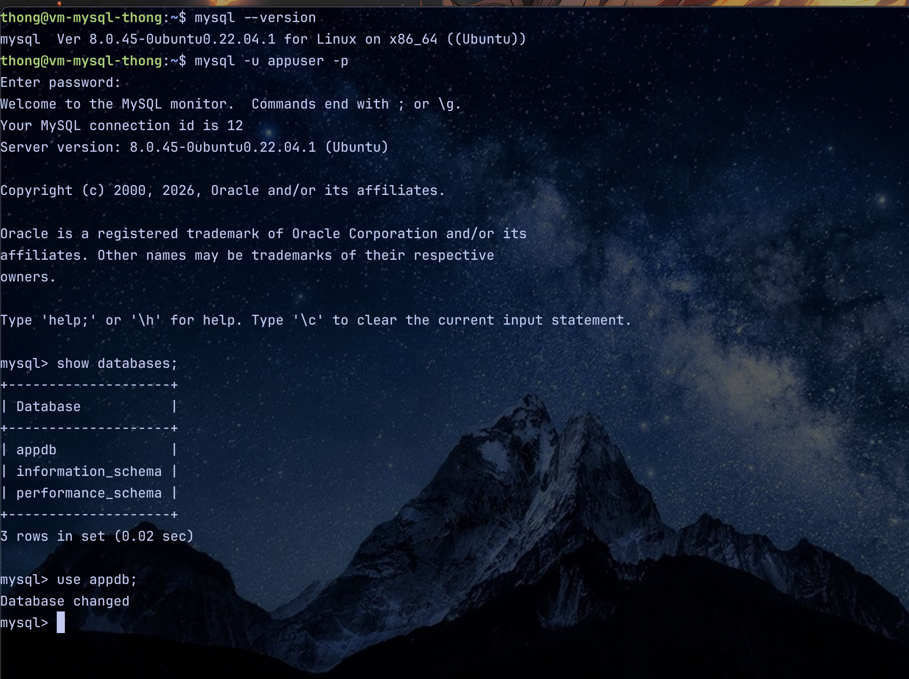

### 3.4 Phương Pháp 2: Cloud-Init với Provider `telmate/proxmox`

Provider `telmate/proxmox` yêu cầu tạo file Snippet **thủ công** trên Proxmox host trước khi chạy Terraform. File này chứa script cài đặt MySQL và Tailscale.

> ⚠️ **Lưu ý phân quyền:** Bước tạo file Snippet thủ công phải do **Workspace Admin** thực hiện trực tiếp trên Proxmox host — vì On-Premise Engineer không có quyền truy cập vào host. Đây chính là hạn chế lớn nhất của provider `telmate`, buộc Admin phải can thiệp thủ công mỗi khi Engineer thay đổi script.

Tham khảo code: [terraform-hybrid-lab/create-vm-with-cloud-init](https://github.com/ThongVu1996/terraform-hybrid-lab/tree/main/create-vm-with-cloud-init)

Admin tạo file `/var/lib/vz/snippets/setup.yaml` trực tiếp trên Proxmox host:

```yaml
#cloud-config
write_files:
  - path: /root/setup_nodes.sh
    permissions: '0755'
    content: |
      #!/bin/bash
      set -e

      echo "=== [1/3] Dọn dẹp APT & Cài đặt MySQL ==="
      systemctl stop unattended-upgrades || true
      rm -f /var/lib/apt/lists/lock /var/cache/apt/archives/lock /var/lib/dpkg/lock*
      sed -i "s/[a-z]*.archive.ubuntu.com/vn.archive.ubuntu.com/g" /etc/apt/sources.list
      apt-get update -y
      apt-get install -y mysql-server curl

      echo "=== [2/3] Cài đặt & Kích hoạt Tailscale ==="
      # ... (thêm bước cài Tailscale tại đây)

      echo "=== [3/3] Hoàn thành ==="
```

**Hạn chế của phương pháp này:** Không thể inject biến động (mật khẩu DB, Tailscale Auth Key) từ HCP Cloud vào file YAML. Mọi thay đổi script buộc phải nhờ Admin can thiệp thủ công vào Proxmox host — phá vỡ tính tách biệt vai trò.

On-Premise Engineer sau đó chạy và gửi plan:

```bash
terraform login
terraform init && terraform fmt && terraform validate
terraform plan
```

Reviewer nhận thông báo, xem xét plan trên HCP UI và bấm **"Confirm & Apply"**.

### 3.5 Phương Pháp 3: Cloud-Init với Provider `bpg/proxmox` (Khuyến Nghị)

Đây là provider thế hệ mới, hiện đại hơn `telmate` và được cập nhật thường xuyên hơn. Đây là **giải pháp được khuyến nghị** vì On-Premise Engineer có thể kiểm soát hoàn toàn nội dung script trong code — không cần nhờ Admin can thiệp vào Proxmox host.

**Ưu điểm vượt trội so với `telmate/proxmox`:**

- **Variable Injection:** Truyền biến (mật khẩu DB, Tailscale Auth Key) từ HCP Cloud **trực tiếp vào nội dung file YAML** — không cần can thiệp thủ công.
- **Quản lý tài nguyên chuyên nghiệp:** Snippet được coi là một Resource có ID, giúp quản lý vòng đời (Lifecycle) dễ dàng.
- **Tự động hóa hoàn toàn:** Agent tự động "đẩy" file Snippet lên Proxmox qua SSH trước khi tạo VM.

#### 3.5.1 Thiết Lập User Chuyên Dụng Trên Proxmox Host

> Bước này do **Workspace Admin** thực hiện **một lần duy nhất** khi setup ban đầu. Mục đích là tạo một user giới hạn quyền để Agent SSH vào host đẩy Snippet — thay vì dùng `root` nguy hiểm.

**Bước 1: Tạo user hệ thống `terraform-user`**

```bash
sudo useradd -m -s /bin/bash terraform-user
id terraform-user
```

**Bước 2: Cấu hình SSH Key cho Agent**

Admin dán **Public Key** của Agent vào `authorized_keys`:

```bash
sudo mkdir -p /home/terraform-user/.ssh
sudo chmod 700 /home/terraform-user/.ssh
sudo chown -R terraform-user:terraform-user /home/terraform-user/
sudo nano /home/terraform-user/.ssh/authorized_keys
```

**Bước 3: Cấp quyền "Hộp cát" (Sandbox) cho thư mục Snippets**

```bash
sudo chown root:root /var/lib/vz/snippets
sudo chmod 1777 /var/lib/vz/snippets
```

> **Giải thích `chmod 1777`:**
> - `777`: Mọi user đều có quyền Đọc, Ghi trong thư mục.
> - Số `1` ở đầu **(Sticky Bit):** *"Dù ai cũng có quyền ghi vào đây, nhưng CHỈ CÓ NGƯỜI TẠO RA FILE mới có quyền Xóa hoặc Sửa file đó."*
> - **Tại sao vẫn an toàn?** Thư mục này chỉ accessible từ nội bộ Proxmox host, không exposed ra internet. Sticky Bit đảm bảo Agent chỉ quản lý được file do chính nó tạo ra.

#### 3.5.2 Cấu Hình Provider Trong Terraform

On-Premise Engineer khai báo kết nối SSH trong `provider.tf` sử dụng `terraform-user` mà Admin đã tạo sẵn:

```hcl
provider "proxmox" {
  # ... cấu hình endpoint và token ...

  ssh {
    agent       = false
    username    = "terraform-user"
    private_key = var.proxmox_ssh_private_key
  }
}
```

#### 3.5.3 Thực Thi và Kiểm Tra Kết Quả

On-Premise Engineer chạy:

```bash
terraform login
terraform init && terraform fmt && terraform validate
terraform plan
```

Sau khi `plan` hoàn thành, **DevOps Reviewer** vào HCP Workspace → tab **"Runs"** → xem xét toàn bộ plan → bấm **"Confirm & Apply"** để Agent thực thi.

Kiểm tra Tailscale sau khi Reviewer apply và VM được tạo thành công:

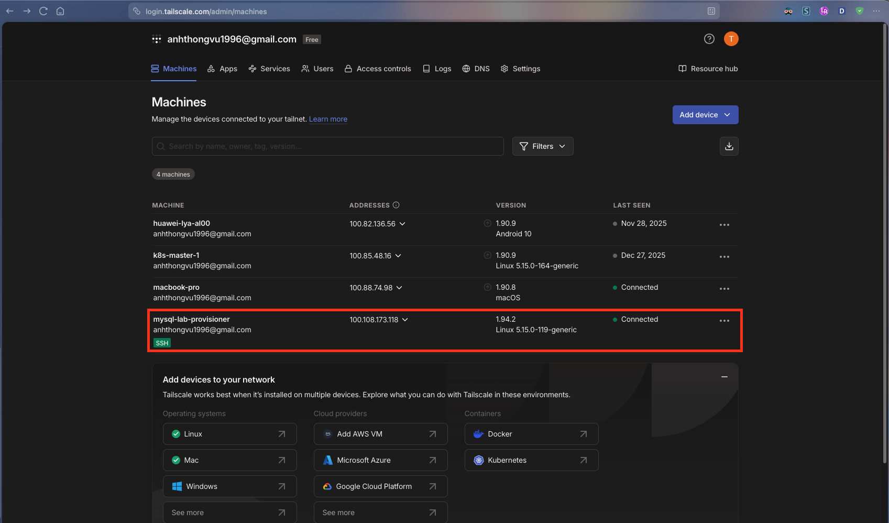
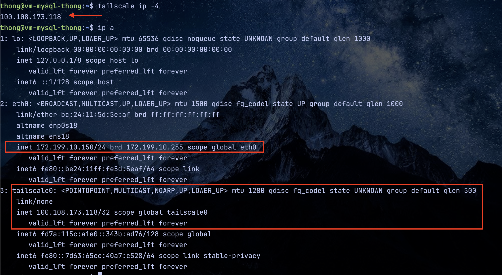

#### 3.5.4 Truy Cập VM Sau Khi Triển Khai (Tailscale SSH)

Sau khi `apply` thành công, VM đã nằm trong mạng VPN Tailscale. Developer không cần biết mật khẩu hay SSH Key của hạ tầng, chỉ cần:

1. Cài Tailscale trên máy Dev.
2. Chạy lệnh: `tailscale ssh username@ip-vm-trong-tailscale` hoặc `tailscale ssh username@ten-goi-trong-tailscale`.
3. Xác thực qua trình duyệt (SSO) → Vào thẳng VM.

> Với quy trình này, Proxmox đã trở thành một Private Cloud chuyên nghiệp với đầy đủ tính năng bảo mật hiện đại.

---

## 4. Tổng Kết — Mô Hình Zero-Touch & Four-Eyes

Toàn bộ quy trình hướng tới hai mục tiêu song hành: **Engineer tập trung viết code** mà không cần biết thông tin hạ tầng nội bộ, và **mọi thay đổi hạ tầng đều có người thứ hai kiểm soát** trước khi thực thi.

### 4.1 Những Gì Engineer Không Bao Giờ Biết

| Thông tin nhạy cảm | Nằm ở đâu | Engineer có thấy không? |
| :--- | :--- | :--- |
| Proxmox API Token | HCP Cloud (Sensitive Variable) | ❌ Ẩn hoàn toàn, kể cả khi edit |
| IP nội bộ của Proxmox host | HCP Cloud (Sensitive Variable) | ❌ Ẩn hoàn toàn |
| Mật khẩu MySQL / DB | HCP Cloud (Sensitive Variable) | ❌ Ẩn hoàn toàn |
| Tailscale Auth Key | HCP Cloud (Sensitive Variable) | ❌ Ẩn hoàn toàn |
| SSH Private Key của Agent | HCP Cloud (Sensitive Variable) | ❌ Ẩn hoàn toàn |
| Nội dung State file | HCP Cloud (được mã hóa) | ❌ Không thể tải về trực tiếp |
| Kết nối trực tiếp vào Proxmox | Chỉ Agent mới có | ❌ Engineer không có đường vào |

### 4.2 Lưu Ý Về Loại Token Cấp Cho Từng Role

| Loại Token | Phạm vi quyền | Cấp cho ai |
| :--- | :--- | :--- |
| **User Token** | Toàn bộ Organization | Workspace Admin |
| **Team Token** | Chỉ các Workspace được gán cho Team | On-Premise Engineer, AWS Engineer |
| **User Token (restricted)** | Xem và Approve tất cả Workspace liên quan | DevOps Reviewer |

### 4.3 Cách Bật Manual Apply Trên HCP Workspace

Admin bật chế độ **Manual Apply** cho tất cả workspace để đảm bảo không ai có thể `apply` mà không qua Reviewer:

`Workspace Settings → General → Apply Method → Manual apply`

```
Engineer chạy terraform plan
        │
        ▼
  Plan hiển thị trên HCP UI
  Reviewer nhận thông báo
        │
        ▼
  Reviewer đọc plan chi tiết
  Kiểm tra resource, network, biến số
        │
   ┌────┴────┐
   │ Duyệt   │ Từ chối
   ▼         ▼
Agent apply  Run bị hủy,
tự động     Engineer nhận thông báo sửa lại
```

### 4.4 Tóm Tắt Giá Trị Của Mô Hình

```
✅ Zero-Touch Infrastructure   — Engineer không chạm vào Proxmox, không SSH vào host
✅ Zero Credential Exposure    — Không một credential nào lộ ra máy Engineer
✅ Zero Inbound Port           — Mạng nội bộ không mở bất kỳ port nào ra ngoài
✅ Four-Eyes Principle         — Mọi apply đều cần Reviewer duyệt, không ai tự apply code của mình
✅ Full Audit Trail            — Mọi lần plan/apply đều có log, thời gian, người thực hiện trên HCP
✅ Role Isolation              — Admin, Engineer, Reviewer hoàn toàn tách biệt quyền hạn
```

---

## 5. Use Cases Thực Tế

Mô hình Proxmox + HCP Terraform Agent không chỉ giải quyết bài toán tạo DB server. Dưới đây là các tình huống thực tế mà kiến trúc này phát huy tối đa giá trị.

> **Nguyên tắc xuyên suốt tất cả use case:** Four-Eyes Principle luôn được giữ nguyên — Engineer (hoặc pipeline CI/CD) chỉ chạy `plan`, còn `apply` luôn cần một hành động có chủ ý từ người có thẩm quyền. Sự khác biệt giữa các use case chỉ là **hình thức approval gate** phù hợp với từng ngữ cảnh.

---

### 5.1 Dev Environment On-Demand (Môi Trường Dev Theo Yêu Cầu)

**Bối cảnh:**
Team có 8 developer, mỗi người cần một môi trường riêng để phát triển và test mà không conflict với nhau. Trước đây tất cả dùng chung một server dev dẫn đến xung đột port, dữ liệu bị ghi đè lẫn nhau.

**Cách áp dụng:**

```
On-Premise Engineer          DevOps Reviewer             Proxmox
        │                          │                        │
        │  terraform login         │                        │
        │  terraform plan          │                        │
        │  -var="owner=alice" ────►│                        │
        │  -var="ttl_hours=8"      │ Xem plan trên HCP UI   │
        │                          │ Xác nhận scope giới hạn│
        │◄──── Confirm & Apply ────│                        │
        │                          │    Agent nhận lệnh ───►│── Tạo VM: dev-alice-env
        │                          │                        │── Cài: Node.js, MySQL, Redis
        │  Output: IP + SSH info   │                        │── Gán IP tĩnh
        │                          │                        │
        │  [8 tiếng sau]           │                        │
        │  terraform plan          │                        │
        │  (destroy) ─────────────►│                        │
        │                          │ Reviewer duyệt destroy │
        │◄──── Confirm & Apply ────│                        │
        │                          │    Agent nhận lệnh ───►│── Xóa VM
```

**Lợi ích đạt được:**

- Không còn xung đột tài nguyên giữa các dev — mỗi người có môi trường riêng biệt
- Tài nguyên Proxmox được tái sử dụng hiệu quả — VM chỉ tồn tại khi cần
- Mọi tạo/xóa VM đều có Reviewer duyệt và được ghi log trên HCP
- Chi phí điện/phần cứng giảm vì không có VM "zombie" chạy qua đêm

**Cấu hình Terraform tham khảo:**

```hcl
variable "owner" {
  type        = string
  description = "Tên dev sở hữu môi trường này"
}

variable "ttl_hours" {
  type        = number
  default     = 8
  description = "Số giờ VM tồn tại"
}

resource "proxmox_vm_qemu" "dev_env" {
  name = "dev-${var.owner}-env"
  tags = "owner=${var.owner},ttl=${var.ttl_hours}h,team=engineering"
}
```

---

### 5.2 Isolated Database Per Feature Branch (DB Riêng Cho Từng Nhánh)

**Bối cảnh:**
Team backend đang phát triển tính năng yêu cầu thay đổi schema database. Nếu chạy migration trên DB dùng chung, toàn bộ team bị ảnh hưởng, CI pipeline của nhánh khác cũng bị break.

**Cách áp dụng:**

```
Git Push → feature/payment-v2
          │
          ▼
   GitHub Actions chạy terraform plan (chỉ plan)
   Post kết quả plan vào PR comment
          │
          ▼
   DevOps Reviewer đọc plan trên PR comment
   Xác nhận trên HCP UI → Confirm & Apply
          │
          ▼
   Agent tạo VM: db-payment-v2
   MySQL: paymentdb_v2 (schema sạch)
          │
          ▼
   CI chạy migration + test trên DB riêng biệt
          │
          ▼
   PR merge → Engineer chạy terraform plan (destroy)
            → Reviewer duyệt → VM bị xóa
```

**Cấu hình GitHub Actions tham khảo:**

```yaml
# .github/workflows/db-provision.yml
name: Provision Branch DB

on:
  pull_request:
    types: [opened, synchronize]

jobs:
  plan:
    runs-on: ubuntu-latest
    steps:
      - uses: actions/checkout@v3

      - name: Setup Terraform
        uses: hashicorp/setup-terraform@v2

      - name: Terraform Login
        run: echo "${{ secrets.TFC_TEAM_TOKEN }}" | terraform login --token-file=-

      - name: Terraform Plan
        run: |
          terraform init
          terraform plan \
            -var="branch=${{ github.head_ref }}" \
            -var="db_name=db_${{ github.event.number }}" \
            -out=tfplan

      - name: Post Plan Summary to PR
        uses: actions/github-script@v6
        with:
          script: |
            github.rest.issues.createComment({
              issue_number: context.issue.number,
              owner: context.repo.owner,
              repo: context.repo.repo,
              body: '📋 Terraform plan đã sẵn sàng. DevOps Reviewer vui lòng xem xét tại HCP Workspace tab Runs và Confirm & Apply nếu hợp lệ.'
            })
```

> **Điểm mấu chốt:** Pipeline CI/CD **chỉ chạy `plan`** và thông báo cho Reviewer. `apply` luôn là thao tác thủ công của Reviewer trên HCP UI — không có `-auto-approve` ở bất kỳ đâu trong bài lab này.

**Lợi ích đạt được:**

- Loại bỏ hoàn toàn tình trạng "migration của tôi break CI của bạn"
- Dev có thể chạy `DROP TABLE` thoải mái mà không lo ảnh hưởng người khác
- Mọi DB được tạo đều có Reviewer kiểm soát, không có hạ tầng nào tồn tại ngoài tầm kiểm soát

---

### 5.3 CI/CD Self-Hosted Runner On-Demand

**Bối cảnh:**
Team đang dùng GitHub Actions runner cloud của GitHub, chi phí tăng cao vào cuối sprint. Ngoài ra một số test cần truy cập vào tài nguyên nội bộ mà GitHub-hosted runner không thể kết nối tới.

**Cách áp dụng:**

```
On-Premise Engineer viết code tạo VM runner
Chạy terraform plan
        │
        ▼
DevOps Reviewer xem plan trên HCP UI
Confirm & Apply
        │
        ▼
Agent tạo VM runner trên Proxmox
Cloud-Init tự động:
  - Cài GitHub Actions Runner
  - Đăng ký runner với repository
  - Label: "self-hosted, proxmox, internal"
        │
        ▼
Job CI chạy trên runner nội bộ
  → Truy cập được DB nội bộ, API nội bộ
  → Tốc độ nhanh hơn (băng thông nội bộ)
        │
        ▼
Hết nhu cầu → Engineer plan destroy
            → Reviewer duyệt → VM bị xóa
```

**So sánh chi phí:**

| Phương án | Chi phí | Truy cập nội bộ |
| :--- | :--- | :--- |
| GitHub-hosted runner | ~$8 / 1000 build-minutes | ❌ Không thể |
| Self-hosted VM chạy 24/7 | ~$15/tháng điện + phần cứng | ✅ Có |
| **Self-hosted On-Demand (mô hình này)** | **Chỉ tốn điện lúc cần** | **✅ Có** |

**Lợi ích đạt được:**

- Runner nằm trong mạng nội bộ, truy cập được database và API không public
- Chi phí tính theo thực tế sử dụng — không trả tiền cho runner đang nhàn rỗi
- Dễ dàng scale: cần 10 runner chạy song song thì `count = 10` trong Terraform

---

### 5.4 Staging Environment Clone Trước Mỗi Release

**Bối cảnh:**
Mỗi lần release, QA cần một môi trường staging giống production nhất có thể để test regression. Hiện tại staging dùng chung và liên tục bị "ô nhiễm" dữ liệu từ các lần test trước.

**Cách áp dụng:**

```
On-Premise Engineer chạy terraform plan
cho workspace "staging-provisioner"
              │
              ▼
DevOps Reviewer xem plan trên HCP UI
Kiểm tra cấu hình staging có khớp production
Confirm & Apply
              │
              ▼
Agent trên Proxmox thực hiện:
┌─────────────────────────────────────────┐
│  1. Clone VM từ template staging-base   │
│  2. Restore DB snapshot từ production   │
│     (đã được ẩn danh hóa - anonymized) │
│  3. Cập nhật config trỏ về đúng service │
│  4. Deploy version mới lên VM           │
└─────────────────────────────────────────┘
              │
              ▼
Release xong → Engineer plan destroy
             → Reviewer duyệt → Giải phóng tài nguyên
```

**Ẩn danh hóa dữ liệu trong cloud-init script:**

```bash
mysql -u root -p"${db_password}" <<EOF
  UPDATE users SET email = CONCAT('user_', id, '@example.com');
  UPDATE users SET phone = '0000000000';
  UPDATE payments SET card_number = '****-****-****-0000';
EOF
```

**Lợi ích đạt được:**

- Mỗi release cycle có staging hoàn toàn "sạch", không bị nhiễm dữ liệu cũ
- QA test với dữ liệu gần giống thực tế nhưng không vi phạm quyền riêng tư
- Môi trường được tạo tự động có Reviewer kiểm soát — không cần Ops setup thủ công

---

### 5.5 Security Sandbox — Môi Trường Pentest Isolate

**Bối cảnh:**
Security team cần môi trường để test vulnerability mà không ảnh hưởng đến bất kỳ hệ thống thật nào. Môi trường cần được isolate hoàn toàn và bị xóa ngay sau khi pentest xong.

**Cách áp dụng:**

```
On-Premise Engineer viết code tạo VLAN isolate + VM
Chạy terraform plan
              │
              ▼
DevOps Reviewer xem plan trên HCP UI
Kiểm tra network isolate có đúng yêu cầu không
Confirm & Apply
              │
              ▼
Trong VLAN isolate, Agent tạo:
┌────────────────────────────────────────────────┐
│  VM Target: Cài ứng dụng cần pentest           │
│  VM Attacker: Cài Kali Linux + công cụ         │
│  VM Monitor: Cài IDS/IPS để ghi lại traffic    │
└────────────────────────────────────────────────┘
              │
              ▼
Security team truy cập qua Tailscale SSH
(không cần mở bất kỳ port nào ra ngoài)
              │
              ▼
Pentest hoàn thành
Engineer plan destroy → Reviewer duyệt
Toàn bộ VLAN + VM bị xóa sạch
```

**Lợi ích đạt được:**

- Môi trường hoàn toàn isolate — exploit thành công cũng không ảnh hưởng production
- Tự động xóa sau khi xong, có Reviewer kiểm soát — không lo để lại VM với lỗ hổng đang mở
- Log đầy đủ trên HCP: ai tạo, lúc mấy giờ, cấu hình gì — phục vụ compliance và audit
- Security team không cần quyền trực tiếp vào Proxmox host

---

### 5.6 Tóm Tắt Các Use Case

| Use Case | Vòng đời VM | Người chạy `plan` | Approval Gate |
| :--- | :--- | :--- | :--- |
| Dev Environment On-Demand | 4–12 giờ | On-Premise Engineer | DevOps Reviewer duyệt trên HCP UI |
| Isolated DB Per Branch | Suốt vòng đời PR | GitHub Actions (plan only) | DevOps Reviewer duyệt trên HCP UI |
| CI/CD Runner On-Demand | Theo nhu cầu | On-Premise Engineer | DevOps Reviewer duyệt trên HCP UI |
| Staging Environment Clone | 3–7 ngày | On-Premise Engineer | DevOps Reviewer duyệt trên HCP UI |
| Security Pentest Sandbox | 1–3 ngày | On-Premise Engineer | DevOps Reviewer duyệt trên HCP UI |

**Điểm chung xuyên suốt tất cả use case:** Approval Gate **luôn là DevOps Reviewer bấm Confirm & Apply trên HCP UI** — không có ngoại lệ. Engineer và pipeline CI/CD chỉ được phép chạy `plan`. Toàn bộ hạ tầng vật lý Proxmox được bảo vệ hoàn toàn phía sau lớp Agent, không ai ngoài Agent có đường kết nối vào.

---

*Tài liệu này đang trong quá trình hoàn thiện. Phần triển khai AWS ALB và Web Server sẽ được bổ sung ở phần tiếp theo.*