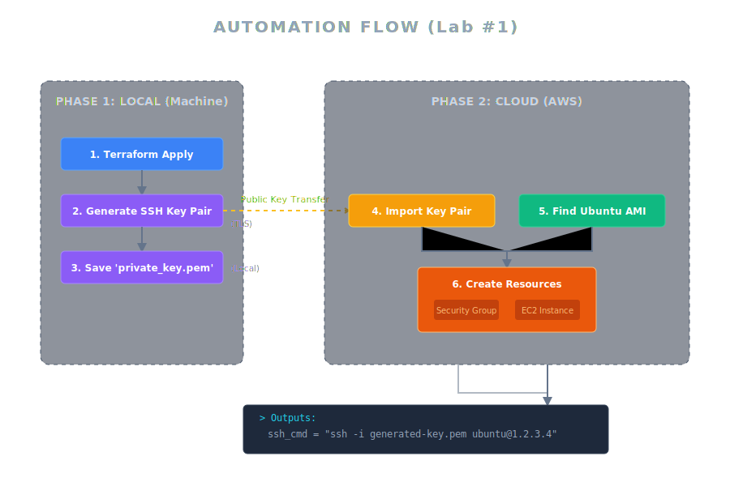
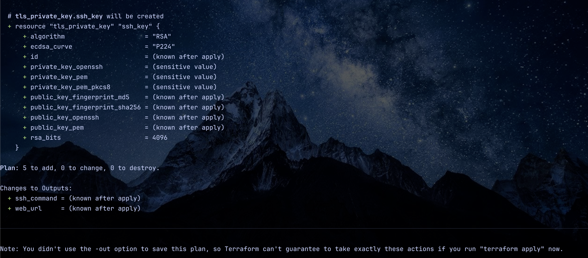
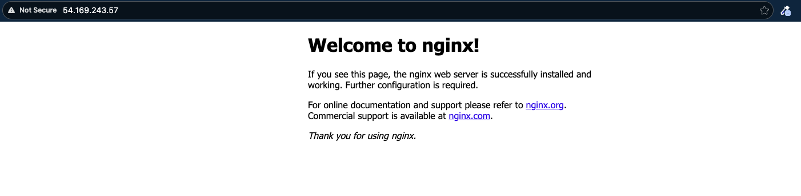
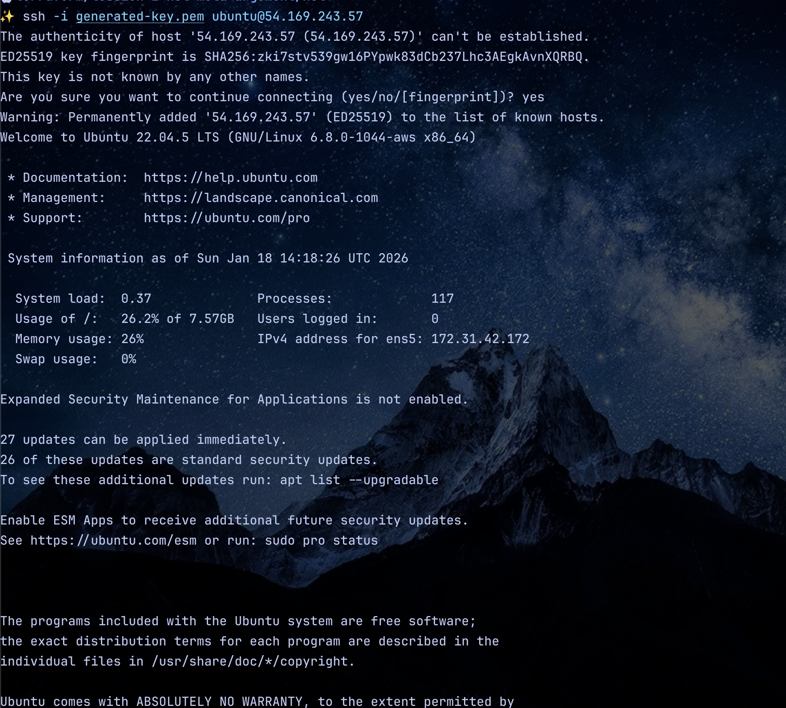
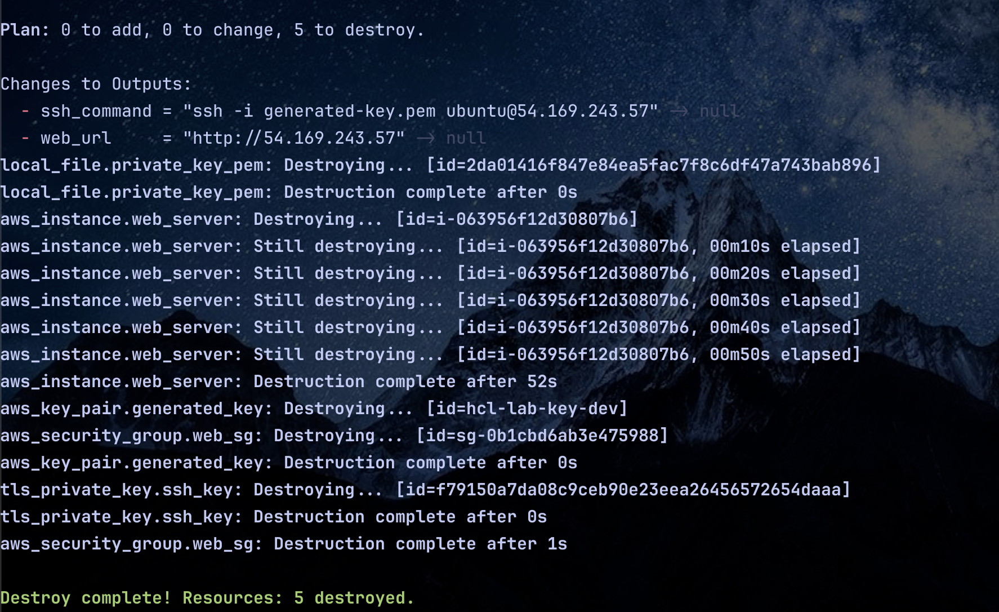

# [Lab #1] Thực chiến: Tự động hóa Web Server & SSH Key Generation từ A-Z

--- 

## Mục lục
- [1. Giới thiệu mục tiêu bài Lab](#1-giới-thiệu-mục-tiêu-bài-lab)
  - [Minh họa: Luồng tự động hóa (Automation Flow)](#minh-họa-luồng-tự-động-hóa-automation-flow)
- [2. Chuẩn bị (Prerequisites)](#2-chuẩn-bị-prerequisites)
- [3. Giải mã "Bộ khung" HCL trong File Lab](#3-giải-mã-bộ-khung-hcl-trong-file-lab)
  - [A. Sức mạnh của các Provider bổ trợ](#a-sức-mạnh-của-các-provider-bổ-trợ)
  - [B. Logic điều hướng (Ternary Operator)](#b-logic-điều-hướng-ternary-operator)
  - [C. Quản lý sự phụ thuộc (Dependency)](#c-quản-lý-sự-phụ-thuộc-dependency)
- [4. Các bước thực hiện (Hands-on)](#4-các-bước-thực-hiện-hands-on)
  - [Bước 1: Khởi tạo](#bước-1-khởi-tạo)
  - [Bước 2: Kiểm tra tính đúng đắn](#bước-2-kiểm-tra-tính-đúng-đắn)
  - [Bước 3: Triển khai](#bước-3-triển-khai)
- [5. Kiểm tra thành quả](#5-kiểm-tra-thành-quả)
- [6. Dọn dẹp (Destroy) - Quy tắc sống còn](#6-dọn-dẹp-destroy---quy-tắc-sống-còn)
- [7. Tổng kết bài Lab](#7-tổng-kết-bài-lab)
- [Lời kết: Nâng tầm quản trị - Khi một Server là chưa đủ!](#lời-kết-nâng-tầm-quản-trị---khi-một-server-là-chưa-đủ)

---

## 1. Giới thiệu mục tiêu bài Lab

Chào anh em! Sau chuỗi bài lý thuyết, đã đến lúc chúng ta "nhúng tay vào chàm". Trong bài Lab này, chúng ta sẽ không chỉ tạo một con Server đơn thuần. Chúng ta sẽ xây dựng một kịch bản **tự động hóa hoàn chỉnh**:

1.  **Tự động sinh khóa bảo mật (SSH Key):** Không cần dùng `ssh-keygen` thủ công.
2.  **Tự động tìm kiếm hệ điều hành:** Luôn lấy bản Ubuntu mới nhất từ chính chủ Canonical.
3.  **Tự động cấu hình Web Server:** Server mọc lên là có sẵn Website Nginx đang chạy.

### Minh họa: Luồng tự động hóa (Automation Flow)


---

## 2. Chuẩn bị (Prerequisites)

Để bài Lab diễn ra mượt mà, anh em cần chuẩn bị sẵn các "vũ khí" sau:

*   **AWS CLI & Credentials:** Đã cài đặt và chạy lệnh `aws configure` để máy nhận diện tài khoản. (Kiểm tra bằng lệnh: `aws sts get-caller-identity`). Nếu chưa cài đặt xem [tại đây](https://github.com/ThongVu1996/documents/blob/main/cd-ci-lab/aws/install.md) 
*   **Quyền hạn (IAM):** User cần có quyền `AmazonEC2FullAccess` để tạo Instance và Security Group.
*   **Terraform CLI:** Version >= 1.0.0.
*   **Môi trường:** Một thư mục trống hoàn toàn trên máy tính (ví dụ: `terraform-lab-1`).
*   **Công cụ kết nối:** Terminal (Linux/Mac) hoặc Git Bash/PowerShell (Windows).

---

## 3. Giải mã "Bộ khung" HCL trong File Lab

```hcl
terraform {
  required_version = ">= 1.0.0"

  required_providers {
    aws = {
      source  = "hashicorp/aws"
      version = "~> 5.0"
    }
    local = {
      source  = "hashicorp/local"
      version = "~> 2.0"
    }
    tls = {
      source  = "hashicorp/tls"
      version = "~> 4.0"
    }
    # [FIX] Thêm random để tránh lỗi lock file nếu môi trường cũ còn lưu vết
    random = {
      source  = "hashicorp/random"
      version = "~> 3.0"
    }
  }
}

provider "aws" {
  region = "ap-southeast-1"
  # profile = "default" 
}

# --- INPUT VARIABLES ---

variable "project_config" {
  description = "Cấu hình dự án (Complex Data Type)"
  # [3] DATA TYPE: Object (Struct) kết hợp Map và List
  type = object({
    env           = string
    instance_size = map(string)
    whitelist_ips = list(string)
  })

  default = {
    env = "dev"
    instance_size = {
      dev  = "t3.micro"
      prod = "t3.medium"
    }
    whitelist_ips = ["0.0.0.0/0"] # Lab thì mở hết
  }
}

# --- DATA SOURCE ---

data "aws_ami" "ubuntu" {
  most_recent = true
  owners      = ["099720109477"] # Canonical

  filter {
    name   = "name"
    values = ["ubuntu/images/hvm-ssd/ubuntu-jammy-22.04-amd64-server-*"]
  }
}

# --- RESOURCES (SSH KEY GENERATION) ---

resource "tls_private_key" "ssh_key" {
  algorithm = "RSA"
  rsa_bits  = 4096
}

resource "aws_key_pair" "generated_key" {
  # [6] FUNCTION: format()
  key_name = format("hcl-lab-key-%s", var.project_config.env)
  # [2] ATTRIBUTE: Tham chiếu
  public_key = tls_private_key.ssh_key.public_key_openssh
}

resource "local_file" "private_key_pem" {
  content         = tls_private_key.ssh_key.private_key_pem
  filename        = "${path.module}/generated-key.pem"
  file_permission = "0400"
}

# --- RESOURCES (INFRASTRUCTURE) ---

resource "aws_security_group" "web_sg" {
  name        = "web-sg-${var.project_config.env}"
  description = "Allow HTTP and SSH"

  ingress {
    from_port   = 80
    to_port     = 80
    protocol    = "tcp"
    cidr_blocks = ["0.0.0.0/0"]
  }

  ingress {
    from_port   = 22
    to_port     = 22
    protocol    = "tcp"
    cidr_blocks = var.project_config.whitelist_ips
  }

  egress {
    from_port   = 0
    to_port     = 0
    protocol    = "-1"
    cidr_blocks = ["0.0.0.0/0"]
  }
}

resource "aws_instance" "web_server" {
  # [7] DEPENDENCY (Explicit)
  depends_on = [aws_key_pair.generated_key]

  ami = data.aws_ami.ubuntu.id

  # [4] CONDITION (Ternary Operator)
  instance_type = var.project_config.env == "prod" ? var.project_config.instance_size["prod"] : var.project_config.instance_size["dev"]

  # [7] DEPENDENCY (Implicit)
  vpc_security_group_ids = [aws_security_group.web_sg.id]
  key_name               = aws_key_pair.generated_key.key_name

  user_data = <<-EOF
              #!/bin/bash
              sudo apt-get update
              sudo apt-get install -y nginx
              echo "<h1>Hello TonyTechLab Terraform Class!</h1><p>Environment: ${var.project_config.env}</p>" > /var/www/html/index.html
              sudo systemctl enable nginx
              sudo systemctl start nginx
              EOF

  tags = {
    Name = "WebServer-${upper(var.project_config.env)}"
  }
}

# --- OUTPUTS ---

output "ssh_command" {
  description = "Lệnh để SSH vào server"
  value       = "ssh -i generated-key.pem ubuntu@${aws_instance.web_server.public_ip}"
}

output "web_url" {
  description = "Link truy cập web"
  value       = "http://${aws_instance.web_server.public_ip}"
}
```

Trong file `main.tf` chúng ta sắp triển khai, có 3 điểm "ăn tiền" anh em cần lưu ý:

### A. Sức mạnh của các Provider bổ trợ
Ngoài `aws`, chúng ta sử dụng thêm:
*   `tls`: Sinh cặp khóa Private/Public Key ngay trong bộ nhớ của Terraform.
*   `local`: Xuất file khóa `.pem` xuống máy tính của bạn để dùng SSH sau này.
*   `random`: Đảm bảo các định danh không bị trùng lặp khi chạy lại nhiều lần.

### B. Logic điều hướng (Ternary Operator)
Dòng code `instance_type = var.project_config.env == "prod" ? ...` giúp Terraform tự hiểu: Nếu là môi trường Prod thì dùng máy lớn, Dev thì dùng máy nhỏ để tiết kiệm tiền.

### C. Quản lý sự phụ thuộc (Dependency)
Terraform biết rằng phải tạo xong SSH Key thì mới có tên Key để gắn vào Instance.
*   **Implicit Dependency:** Tự nhận diện qua tham chiếu biến.
*   **Explicit Dependency:** Dùng `depends_on` để ép thứ tự tạo tài nguyên một cách chắc chắn.

---

## 4. Các bước thực hiện (Hands-on)

### Bước 1: Khởi tạo
Copy nội dung file code bài tập vào file `main.tf` trong thư mục đã chuẩn bị. Mở Terminal và gõ:

```bash
terraform init
```

Lệnh này sẽ tải về các Provider cần thiết. Hãy chắc chắn bạn thấy thông báo thành công 


### Bước 2: Kiểm tra tính đúng đắn
Đừng vội chạy ngay, hãy check cú pháp và xem Terraform định làm gì:

```bash
terraform validate  # Kiểm tra lỗi gõ phím
terraform plan      # Xem "bản nháp" hạ tầng sắp tạo
```



### Bước 3: Triển khai
Gõ lệnh để bắt đầu thuê tài nguyên trên Cloud:

```bash
terraform apply -auto-approve
```
Đợi khoảng 1-2 phút. Khi hoàn tất, hãy nhìn vào thư mục của bạn. Một file mang tên `generated-key.pem` sẽ xuất hiện "thần kỳ"!


---

## 5. Kiểm tra thành quả

Terraform sẽ in ra 2 dòng Output ở cuối màn hình:

1.  **Web URL:** Copy link `http://<IP_PUBLIC>` dán vào trình duyệt. Bạn sẽ thấy trang chào mừng của Nginx hiển thị đúng tên môi trường (Dev/Prod).

2.  **SSH Command:** Copy nguyên dòng lệnh `ssh -i ...` và dán vào Terminal để truy cập trực tiếp vào trong Server.


---

## 6. Dọn dẹp (Destroy) - Quy tắc sống còn

Sau khi vọc vạch xong, hãy xóa tài nguyên để không bị mất tiền oan:

```bash
terraform destroy -auto-approve
```



---

## 7. Tổng kết bài Lab

Chúc mừng anh em đã hoàn thành bài Lab đầu tiên! Chúng ta đã thực sự biến những dòng code khô khan thành một hệ thống sống động:

*   **Không còn copy-paste AMI ID thủ công:** Nhờ sức mạnh của Data Source, Terraform đã tự "đi chợ" và chọn đúng bản Ubuntu chuẩn nhất.
*   **Không còn tự tạo SSH Key bằng tay:** Với TLS Provider, cặp khóa bảo mật đã được sinh ra và lưu trữ an toàn ngay tại máy cục bộ chỉ trong tích tắc.
*   **Hạ tầng có khả năng "tư duy":** Nhờ Logic Ternary, code của chúng ta đã biết tự thích nghi để chọn cấu hình máy phù hợp với từng môi trường.

---

## Lời kết: Nâng tầm quản trị - Khi một Server là chưa đủ!

Thành quả hôm nay rất tuyệt vời, nhưng hãy thử tưởng tượng: Sẽ ra sao nếu sếp yêu cầu bạn không phải tạo 1, mà là **100 Server**? Hay yêu cầu bạn phải triển khai thêm một hệ thống dự phòng y hệt ở tận... Mỹ (US-East-1) để phòng khi vùng Singapore gặp sự cố?

Liệu chúng ta sẽ ngồi copy-paste file `main.tf` này ra hàng chục lần? Chắc chắn là không!

Trong thế giới hạ tầng chuyên nghiệp, chúng ta có những "vũ khí hạng nặng" được gọi là **Meta-Arguments**. Chúng giúp bạn:
*   **Scaling:** Nhân bản hàng loạt tài nguyên chỉ bằng cách thay đổi một con số.
*   **Multi-Region:** Điều khiển cùng lúc nhiều vùng địa lý khác nhau trên toàn cầu.
*   **Zero Downtime:** Cập nhật Firewall hay thay đổi cấu hình mà không làm gián đoạn người dùng.

Đã đến lúc nâng cấp từ một "thợ xây" đơn lẻ thành một "tổng công trình sư". Hãy chuẩn bị tinh thần, vì ở bài thực hành tiếp theo, chúng ta sẽ bước vào một thử thách khắc nghiệt hơn nhưng cũng đầy quyền năng: **[Lab #2] Terraform Meta-Arguments Masterclass - Kịch bản Multi-Region & Scaling hạ tầng.**

