# [Lab #3] Data Source Challenge - Truy vết và Kết nối hạ tầng có sẵn

---
## Mục lục
- [1. Giới thiệu nhiệm vụ: "The Tracker" (Kẻ truy vết)](#1-giới-thiệu-nhiệm-vụ-the-tracker-kẻ-truy-vết)
  - [Minh họa: Nhiệm vụ Truy vết (Mission Flow)](#minh-họa-nhiệm-vụ-truy-vết-mission-flow)
- [2. Chuẩn bị (Prerequisites)](#2-chuẩn-bị-prerequisites)
- [3. Kịch bản thực thi](#3-kịch-bản-thực-thi)
- [4. Nội dung File Lab (`main.tf`)](#4-nội-dung-file-lab-maintf)
- [5. Thao tác thực hành & Kiểm chứng](#5-thao-tác-thực-hành--kiểm-chứng)
  - [Bước 1: Khởi tạo công cụ](#bước-1-khởi-tạo-công-cụ)
  - [Bước 2: Lên kế hoạch trinh sát (Plan)](#bước-2-lên-kế-hoạch-trinh-sát-plan)
  - [Bước 3: Kích hoạt nhiệm vụ (Apply)](#bước-3-kích-hoạt-nhiệm-vụ-apply)
  - [Bước 4: Nghiệm thu kết quả (Verification Checklist)](#bước-4-nghiệm-thu-kết-quả-verification-checklist)
  - [Bước 5: Xóa dấu vết (Clean Up)](#bước-5-xóa-dấu-vết-clean-up)
- [6. Tổng kết nhiệm vụ](#6-tổng-kết-nhiệm-vụ)
- [Lời kết: Từ "Code chạy được" đến "Code chuyên nghiệp"](#lời-kết-từ-code-chạy-được-đến-code-chuyên-nghiệp)

---
## 1. Giới thiệu nhiệm vụ: "The Tracker" (Kẻ truy vết)

Chào mừng các "điệp viên hạ tầng" đã quay trở lại! Trong môi trường thực tế, không phải lúc nào bạn cũng được quyền "khai sơn phá thạch" (tạo mới mọi thứ từ đầu).

Đôi khi, bạn tiếp nhận một dự án mà hệ thống mạng (VPC, Subnet, Security Group) đã được team Network hoặc Security tạo sẵn từ trước. Sếp giao cho bạn nhiệm vụ: *"Hãy tạo một con Server và gắn nó vào cái Security Group bí mật của team DevOps. Tôi không nhớ ID của nó, chỉ biết nó có gắn cái thẻ tên (Tag) là `Matrix-Rev` thôi."*

**Thử thách của bạn:** Làm thế nào để gắn Server vào đúng Security Group đó mà tuyệt đối không được hard-code (điền cứng) ID vào trong code?

**Mục tiêu bài Lab:**
1.  Hiểu cách vận hành của **Data Sources** - "Google Search" của thế giới Terraform.
2.  Sử dụng **Filter** để lọc chính xác tài nguyên mục tiêu qua Tags.
3.  Kết hợp dữ liệu truy vấn được để chèn vào tài nguyên mới tự động.

### Minh họa: Nhiệm vụ Truy vết (Mission Flow)


---

## 2. Chuẩn bị (Prerequisites)

Để thực hiện nhiệm vụ truy vết này, anh em cần chuẩn bị sẵn:
*   **AWS CLI & Credentials:** Đã cấu hình `aws configure` thành công.
*   **Quyền hạn (IAM):** Tài khoản cần có quyền `EC2FullAccess` để tạo và đọc thông tin EC2.
*   **Terraform:** Version >= 1.0.0.
*   **Môi trường:** Một thư mục trống hoàn toàn (ví dụ: `terraform-lab-3`).
*   **Region:** Đảm bảo vùng trong code (`ap-southeast-1`) trùng với vùng bạn đang cấu hình mặc định trên AWS CLI.

---

## 3. Kịch bản thực thi

Bài Lab được chia làm 3 giai đoạn kịch tính trong cùng một lần chạy:

1.  **Giai đoạn 1: "Dàn dựng hiện trường"** - Terraform tạo ra một Security Group (giả lập tài nguyên cũ đã tồn tại).
2.  **Giai đoạn 2: "Truy vết"** - Ngay lập tức, sử dụng Data Source để tìm ID của Security Group vừa tạo dựa trên manh mối Tags.
3.  **Giai đoạn 3: "Hoàn thành nhiệm vụ"** - Triển khai đặc vụ **Agent-007** (EC2) và gắn nó vào đúng ID vừa tìm được.

---

## 4. Nội dung File Lab (`main.tf`)

Hãy tạo file `main.tf` và dán đoạn code sau vào. Hãy chú ý kỹ khối `data`, đây chính là "bộ não" của bài lab này:

```hcl
# [Lab #3] Data Source Challenge: Kịch bản "Điệp viên" truy tìm hạ tầng

terraform {
  required_providers {
    aws = {
      source  = "hashicorp/aws"
      version = "~> 5.0"
    }
  }
}

provider "aws" {
  region = "ap-southeast-1"
}

# =================================================================
# PHẦN 1: HIỆN TRƯỜNG GIẢ (SETUP)
# Giả lập một người khác đã tạo ra Security Group này từ trước
# =================================================================

resource "aws_security_group" "secret_base" {
  name        = "secret-base-sg"
  description = "Can cu bi mat cua Tony"

  # Đây là MANH MỐI duy nhất để tìm ra nó
  tags = {
    CodeName = "Matrix-Rev"
    Team     = "DevOps-01"
  }
}

# =================================================================
# PHẦN 2: THỰC HIỆN NHIỆM VỤ (SOLUTION)
# Học viên viết đoạn này để tìm ID mà không cần hardcode
# =================================================================

data "aws_security_group" "detected_target" {
  # Lọc theo Tag Name
  filter {
    name   = "tag:CodeName"
    values = ["Matrix-Rev"]
  }

  # Quan trọng: Trong môi trường Lab chung 1 file, phải có dòng này
  # để đảm bảo Resource được tạo xong thì Data mới bắt đầu đi tìm.
  # (Trong thực tế nếu Resource đã có sẵn trên AWS thì không cần dòng này)
  depends_on = [aws_security_group.secret_base]
}

# =================================================================
# PHẦN 3: THỬ THÁCH NÂNG CAO (CHALLENGE)
# Tạo EC2 sử dụng Security Group vừa tìm được + Tìm AMI động luôn
# =================================================================

# Bonus: Dùng Data để tìm luôn AMI Ubuntu mới nhất (Khỏi hardcode AMI ID)
data "aws_ami" "ubuntu" {
  most_recent = true
  owners      = ["099720109477"] # Canonical ID

  filter {
    name   = "name"
    values = ["ubuntu/images/hvm-ssd/ubuntu-jammy-22.04-amd64-server-*"]
  }
}

resource "aws_instance" "agent_007" {
  # 1. Sử dụng AMI tìm được từ Data
  ami           = data.aws_ami.ubuntu.id
  instance_type = "t3.micro"

  # 2. Gán vào Security Group tìm được ở Phần 2
  vpc_security_group_ids = [data.aws_security_group.detected_target.id]

  tags = {
    Name = "Agent-007-Mission-Complete"
  }
}

# =================================================================
# KẾT QUẢ BÁO CÁO (OUTPUTS)
# =================================================================

output "mission_report_sg_id" {
  description = "ID cua Security Group tim thay la:"
  value       = data.aws_security_group.detected_target.id
}

output "mission_report_ec2_ip" {
  description = "IP Public cua Agent 007:"
  value       = aws_instance.agent_007.public_ip
}
```

---

## 5. Thao tác thực hành & Kiểm chứng

Mở Terminal tại thư mục chứa file `main.tf` và thực hiện theo trình tự sau:

### Bước 1: Khởi tạo công cụ
Tải về AWS Provider để Terraform sẵn sàng làm việc.
```bash
terraform init
```

### Bước 2: Lên kế hoạch trinh sát (Plan)
Quan sát kỹ Log hiển thị. Bạn sẽ thấy Terraform dự định tạo ra `aws_security_group.secret_base` trước (nhờ `depends_on`), sau đó `data` mới dựa vào đó để tìm ID.
```bash
terraform plan
```

### Bước 3: Kích hoạt nhiệm vụ (Apply)
Triển khai toàn bộ kịch bản.
```bash
terraform apply -auto-approve
```

### Bước 4: Nghiệm thu kết quả (Verification Checklist)
Đây là bước quan trọng nhất để biết "điệp viên" Agent-007 có hoàn thành nhiệm vụ hay không:

1.  **Kiểm tra Báo cáo (Terminal Outputs):**
    *   Nhìn vào dòng `mission_report_sg_id` được in ra ở cuối màn hình (Ví dụ: `sg-0a1b...`).

2.  **Đối chiếu trên AWS Console:**
    *   Truy cập EC2 Dashboard -> **Security Groups**.
    *   Tìm SG có tên `secret-base-sg`.
    *   So sánh ID của nó với ID bạn thấy ở Terminal. Chúng phải trùng khớp 100%.

3.  **Kiểm tra Đặc vụ (Instance):**
    *   Vào menu Instances, chọn `Agent-007-Mission-Complete`.
    *   Nhấp vào tab **Security** (Bảo mật) ở phía dưới.
    *   Xác nhận: Security Group đang được gắn chính là `secret-base-sg` (hoặc tên tương ứng có tag `Matrix-Rev`).

### Bước 5: Xóa dấu vết (Clean Up)
Sau khi hoàn thành bài Lab, hãy hủy bỏ tài nguyên:
```bash
terraform destroy -auto-approve
```

---

## 6. Tổng kết nhiệm vụ

Chúc mừng anh em đã vượt qua thử thách! Qua bài Lab này, chúng ta đã mở khóa được những kỹ năng quan trọng:

1.  **Truy vấn động (Dynamic Query):** Code của bạn giờ đây biết tự "hỏi" AWS để lấy thông tin mới nhất thay vì phải điền tay.
2.  **Lọc theo Tags (Tag Filtering):** Kỹ thuật "sống còn" khi làm việc trong môi trường Enterprise, nơi bạn phải kết nối với hàng nghìn tài nguyên có sẵn.
3.  **Xử lý phụ thuộc:** Hiểu rõ cách `depends_on` hoạt động để điều phối thứ tự chạy giữa Resource và Data Source.

---

## Lời kết: Từ "Code chạy được" đến "Code chuyên nghiệp"

Chúng ta đã trải qua 3 bài Lab với rất nhiều Resource, Data Source và Variables. Nhưng hãy nhìn lại một chút: Code của chúng ta đang bắt đầu xuất hiện những chuỗi ký tự lặp đi lặp lại hoặc những cách đặt tên khá thủ công.

Ví dụ: Nếu sếp yêu cầu đổi quy tắc đặt tên toàn bộ Server thành `[Tên dự án]-[Môi trường]-[Service]`, bạn sẽ phải đi sửa từng dòng `tags` trong từng resource sao?

Sẽ ra sao nếu chúng ta có một "nhà máy xử lý biến" nằm ngay bên trong file Terraform, giúp tính toán và chuẩn hóa mọi dữ liệu trước khi tạo tài nguyên?

```hcl
# Kịch bản Lab tiếp theo: Locals - Biến cục bộ thông minh
locals {
  # Tự động ghép chuỗi chuẩn hóa
  full_server_name = "${var.project_name}-${var.environment}"
  
  # Tự động tính toán Tags chung
  common_tags = {
    Owner   = "DevOps-Team"
    Project = var.project_name
  }
}

resource "aws_instance" "my_server" {
  # ...
  tags = merge(local.common_tags, {
    Name = local.full_server_name # Kết quả: "Payment-App-Prod"
  })
}
```

Đã đến lúc dọn dẹp code cho gọn gàng và chuyên nghiệp hơn. Hẹn gặp lại anh em ở bài viết tiếp theo: **[Lab #4] Refactoring - Làm chủ Locals và Tổ chức biến chuyên nghiệp.**
