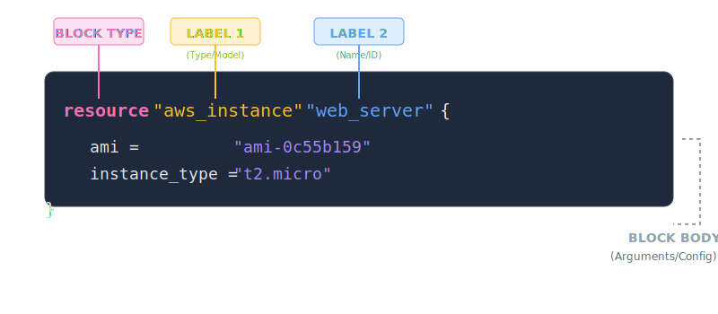

# [Terraform 103] HCL Syntax: Từ cú pháp quen thuộc đến tư duy viết code hạ tầng

## Mục lụcMục lục
- [Lời mở đầu: Đừng để vẻ ngoài đánh lừa](#lời-mở-đầu-đừng-để-vẻ-ngoài-đánh-lừa)
- [1. Giải phẫu một "Block" – Đơn vị cơ bản nhất](#1-giải-phẫu-một-block--đơn-vị-cơ-bản-nhất)
  - [Giải phẫu học HCL (Anatomy)](#giải-phẫu-học-hcl-anatomy)
  - [Cấu trúc tổng quát](#cấu-trúc-tổng-quát)
  - [Ví dụ "soi chiếu"](#ví-dụ-soi-chiếu)
- [2. Arguments vs Attributes: "Đầu vào" và "Kết quả"](#2-arguments-vs-attributes-đầu-vào-và-kết-quả)
  - [Arguments (Đối số) - Thứ bạn "Order"](#arguments-đối-số---thứ-bạn-order)
  - [Attributes (Thuộc tính) - Thứ bạn "Nhận về"](#attributes-thuộc-tính---thứ-bạn-nhận-về)
- [3. Ví dụ thực chiến: Kết nối Web và Database](#3-ví-dụ-thực-chiến-kết-nối-web-và-database)
- [4. Kiểu dữ liệu & Comment](#4-kiểu-dữ-liệu--comment)
- [Lời kết & Gợi mở](#lời-kết--gợi-mở)

---

## Lời mở đầu: Đừng để vẻ ngoài đánh lừa

Ở bài trước, chúng ta đã gọi HCL là một "bản hợp đồng". Nhưng để đặt bút ký bản hợp đồng đó mà không gặp rắc rối về sau, anh em mình cần hiểu rõ từng câu chữ, dấu chấm, dấu phẩy của nó. Sự thật là HCL đã chắt lọc những gì tinh túy nhất để tạo ra một bộ khung xương cực kỳ mạch lạc. Hãy cùng tôi bóc tách nó ngay bây giờ qua những lăng kính quen thuộc nhất.

---

## 1. Giải phẫu một "Block" – Đơn vị cơ bản nhất

Trong thế giới HCL, mọi thứ đều được đóng gói trong các **Blocks**. Bạn cứ tưởng tượng nó như một thùng container chuyên dụng: bên ngoài ghi nhãn loại hàng, bên trong chứa nội dung chi tiết.

### Giải phẫu học HCL (Anatomy)

Để dễ hình dung, hãy nhìn vào "cơ thể" của một block tài nguyên:



### Cấu trúc tổng quát

```hcl
<BLOCK TYPE> "<BLOCK LABEL 1>" "<BLOCK LABEL 2>" {
  # Đây là Body của Block
  <IDENTIFIER> = <EXPRESSION> 
}
```

*   **Block Type:** Loại đối tượng (ví dụ: `resource`, `variable`, `output`).
*   **Block Labels:**
    *   **Label 1 (Chủng loại):** Giống như "phân loại" tài nguyên. Với anh em System, hãy coi đây là Model/Vendor của thiết bị (ví dụ: `aws_instance`, `cisco_switch`).
    *   **Label 2 (Tên riêng):** Là định danh duy nhất bạn đặt cho đối tượng đó. Với anh em Dev, đây chính là **Variable Name** để tham chiếu trong code.

### Ví dụ "soi chiếu"

Hãy nhìn vào block khai báo một máy ảo dưới đây:

```hcl
resource "aws_instance" "web_app_prod" {
  ami           = "ami-0c55b159"
  instance_type = "t2.micro"
}
```

*   **Góc nhìn Developer (JavaScript):** Tương đương việc khởi tạo một đối tượng từ Class.
    ```javascript
    const web_app_prod = new AWS_Instance({
        ami: "ami-0c55b159",
        instance_type: "t2.micro"
    });
    ```
*   **Góc nhìn System Admin:** Giống như dán nhãn thiết bị trong tủ Rack.
    ```text
    [VIRTUAL_MACHINE]          # Block Type
    Model = "AWS_EC2"          # Label 1
    Hostname = "web-app-prod"  # Label 2
    ```

---

## 2. Arguments vs Attributes: "Đầu vào" và "Kết quả"

### Arguments (Đối số) - Thứ bạn "Order"
Đây là những gì bạn đưa vào để ra lệnh cho Terraform.
*   **Dev:** Giống như truyền **props** vào React Component hoặc tham số hàm.
*   **System:** Giống như các dòng cấu hình trong file `nginx.conf` (ví dụ: `listen 80;`).

### Attributes (Thuộc tính) - Thứ bạn "Nhận về"
Là những giá trị mà Terraform trả về sau khi đã thực thi xong (thường chỉ biết sau khi tài nguyên đã tồn tại).
*   **Dev:** Giống như giá trị **return** của một hàm (ví dụ: `server.public_ip`).
*   **System:** Giống như thông số hiện ra sau khi gõ lệnh `ip addr` hoặc `df -h`. Bạn cần cái IP đó để trỏ DNS.

---

## 3. Ví dụ thực chiến: Kết nối Web và Database

Hãy xem cách HCL kết nối hai đối tượng bằng cách dùng **Attribute** của thằng này làm **Argument** cho thằng kia:

```hcl
# 1. Tạo Database
resource "aws_db_instance" "my_db" {
  allocated_storage = 20
  engine            = "mysql"
}

# 2. Tạo Web Server và "ném" địa chỉ DB vào
resource "aws_instance" "my_web" {
  ami           = "ami-xxxxxx"
  instance_type = "t2.micro"

  # Dùng Attribute 'address' của DB làm Argument cho Web
  user_data = "DB_URL=${aws_db_instance.my_db.address}" 
}
```

---

## 4. Kiểu dữ liệu & Comment

HCL hỗ trợ các kiểu dữ liệu cơ bản: `String` (chuỗi), `Number` (số), và `Bool` (true/false).

Để lại "di chúc" cho đồng nghiệp bằng 3 cách comment:
*   `#`: Một dòng (Phổ biến, khuyên dùng).
*   `//`: Một dòng (Dành cho anh em quen tay từ JS/PHP).
*   `/* ... */`: Nhiều dòng cho các đoạn logic phức tạp.

> **💡 Mẹo cho "Dân chơi" Neovim & Mac:**
> Vì bạn đang sử dụng Neovim và quản lý máy bằng Nix, hãy luôn nhớ dùng lệnh `terraform fmt`.
> Trong giới DevOps, code không chỉ cần chạy đúng mà còn phải đẹp. Lệnh này sẽ tự động căn chỉnh các dấu `=` thẳng hàng, giúp bản "hợp đồng" của bạn chuyên nghiệp như một bản vẽ kiến trúc.

---

## Lời kết & Gợi mở

Nắm vững "khung xương" HCL là bạn đã sẵn sàng để xây dựng mọi thứ. Nhưng hạ tầng thực tế cần sự linh hoạt để dùng một bộ code cho nhiều môi trường (Staging, Production) khác nhau.

Hẹn gặp lại các bạn ở bài viết tiếp theo: **[Terraform 104] Variable & Output - Biến hóa hạ tầng theo cách của bạn.**

