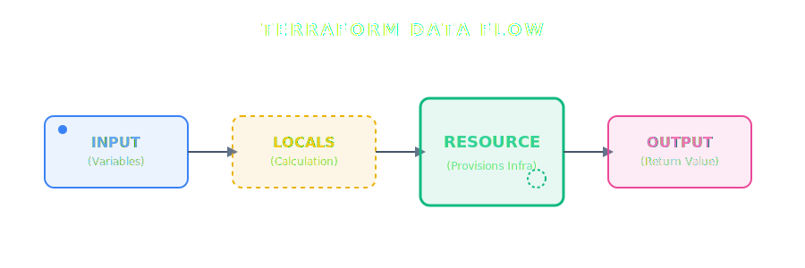

# [Terraform 104] Variables & Outputs: Biến hóa hạ tầng theo cách của bạn

--- 

## Mục lục
- [Lời mở đầu: Thoát khỏi kiếp "Hard-code"](#lời-mở-đầu-thoát-khỏi-kiếp-hard-code)
- [1. Các kiểu dữ liệu cơ bản (Primitive Types)](#1-các-kiểu-dữ-liệu-cơ-bản-primitive-types)
  - [String (Chuỗi)](#string-chuỗi)
  - [Number (Số)](#number-số)
  - [Bool (Logic)](#bool-logic)
- [2. Kiểu dữ liệu tập hợp (Collection Types)](#2-kiểu-dữ-liệu-tập-hợp-collection-types)
  - [List: Mảng các giá trị cùng kiểu](#list-mảng-các-giá-trị-cùng-kiểu)
  - [Map: Cặp Key-Value cùng kiểu](#map-cặp-key-value-cùng-kiểu)
- [3. Kiểu dữ liệu cấu trúc (Structural Types)](#3-kiểu-dữ-liệu-cấu-trúc-structural-types)
  - [Object: Bản ghi đa dữ liệu](#object-bản-ghi-đa-dữ-liệu)
  - [Tuple: Danh sách "hỗn hợp" chặt chẽ](#tuple-danh-sách-hỗn-hợp-chặt-chẽ)
- [4. Cách sử dụng Biến và Output trong thực tế](#4-cách-sử-dụng-biến-và-output-trong-thực-tế)
  - [A. Input Variables: Tham số từ bên ngoài](#a-input-variables-tham-số-từ-bên-ngoài)
  - [B. Local Values: Biến tạm nội bộ (DRY)](#b-local-values-biến-tạm-nội-bộ-dry)
  - [C. Output Values: Kết quả trả về](#c-output-values-kết-quả-trả-về)
- [5. Tổng kết: Luồng đi của dữ liệu](#5-tổng-kết-luồng-đi-của-dữ-liệu)
- [Lời kết & Gợi mở](#lời-kết--gợi-mở)

--- 
## Lời mở đầu: Thoát khỏi kiếp "Hard-code"

Nếu ở bài trước chúng ta đã biết cách xây dựng khung xương cho hạ tầng, thì ở bài này, chúng ta sẽ học cách làm cho khung xương đó "biết đi". Thay vì ghi chết tên server hay thông số RAM vào code (**hard-code**) — một điều tối kỵ của cả Dev lẫn Ops — chúng ta sẽ dùng **Variables**.

Hãy tưởng tượng bạn viết code một lần, nhưng có thể dùng nó để tạo ra hàng trăm môi trường (Dev, Staging, Prod) khác nhau chỉ bằng cách thay đổi tham số đầu vào. Đó chính là sức mạnh của sự linh hoạt!

---

## 1. Các kiểu dữ liệu cơ bản (Primitive Types)

Trước khi học cách dùng biến, ta cần hiểu rõ các loại "nguyên liệu" cơ bản nhất để tránh các lỗi logic khi triển khai.

### String (Chuỗi)
Dùng cho tên gọi, ID. Luôn nằm trong ngoặc kép `" "`. (Ví dụ: `region = "ap-southeast-1"`).
*   **Góc nhìn Dev (JS):** `const region = "ap-southeast-1";`
*   **Góc nhìn System:** Giá trị `HOSTNAME` hoặc `USER`.

### Number (Số)
Dùng cho số lượng CPU, RAM, Port. (Ví dụ: `cpu = 2`).
*   **Góc nhìn Dev (JS):** `const port = 8080;`
*   **Góc nhìn System:** Số lượng bản sao (replica) hoặc chỉ số Port.

### Bool (Logic)
Chỉ có `true` hoặc `false`. Dùng làm "công tắc" bật/tắt tính năng.
*   **Góc nhìn Dev (JS):** `const isPublic = true;`
*   **Góc nhìn System:** Cờ Enable/Disable dịch vụ.

---

## 2. Kiểu dữ liệu tập hợp (Collection Types)
Dành cho việc quản lý các danh sách dữ liệu cùng loại.

### List: Mảng các giá trị cùng kiểu
> **Góc nhìn Dev (JS):** Chính là `Array`.
> ```javascript
> const subnets = ["subnet-1", "subnet-2"];
> ```

**Góc nhìn System:** Giống danh sách DNS trong `/etc/resolv.conf`.
```bash
nameserver 8.8.8.8
nameserver 8.8.4.4
```

**Cú pháp HCL:**
```hcl
dns_servers = ["8.8.8.8", "8.8.4.4"]
```

### Map: Cặp Key-Value cùng kiểu
> **Góc nhìn Dev (JS):** Giống như một `Object` cấu hình.
> ```javascript
> const instanceSizes = { "dev": "t2.micro", "prod": "m5.large" };
> ```

**Góc nhìn System:** Giống tệp `/etc/hosts` – ánh xạ IP và Hostname.
```text
192.168.1.10  web-server
192.168.1.11  db-server
```

**Cú pháp HCL:**
```hcl
server_ips = {
  "web-server" = "192.168.1.10"
  "db-server"  = "192.168.1.11"
}
```

---

## 3. Kiểu dữ liệu cấu trúc (Structural Types)
Dùng để định nghĩa các bộ hồ sơ hạ tầng phức tạp.

### Object: Bản ghi đa dữ liệu
> **Góc nhìn Dev (JS):** Một Object phức tạp chứa nhiều kiểu dữ liệu.
> ```javascript
> const server = { name: "app", cpu: 2, public: true };
> ```

**Góc nhìn System:** Giống cấu hình một Service trong Systemd.
```ini
[Service]
Name=blog-ai
CPUQuota=200%
```

**Cú pháp HCL:**
```hcl
server_config = {
  name = "blog-ai"
  cpu  = 2
  is_public = true
}
```

### Tuple: Danh sách "hỗn hợp" chặt chẽ
**Góc nhìn System:** Giống như một dòng trong file `/etc/passwd`.
```text
thongvu:x:1000:1000:,,,:/home/thongvu:/usr/bin/fish
```

**Cú pháp HCL:**
```hcl
# [Tên_User, UID, Shell_Active]
user_info = ["thongvu", 1000, true]
```

---

## 4. Cách sử dụng Biến và Output trong thực tế

### A. Input Variables: Tham số từ bên ngoài
**Góc nhìn Dev (JS):** Props truyền vào Component.
```javascript
// JS: 'size' là đầu vào để hàm xử lý
function createServer(size) { 
  return `Creating server with size ${size}`; 
}
```

**Góc nhìn System:** Biến tham số khi chạy script Bash.
```bash
# Chạy lệnh: ./script.sh "t2.micro"
INSTANCE_TYPE=$1 # $1 nhận giá trị "t2.micro"
```

**Cú pháp HCL:**
```hcl
variable "instance_type" {
  type    = string
  default = "t2.micro"
}
```

### B. Local Values: Biến tạm nội bộ (DRY)
**Góc nhìn Dev (JS):** Khai báo biến nội bộ để tái sử dụng logic.
```javascript
const env = "prod";
const serverName = `web-${env}`; // Không cần viết lại chữ "prod" nhiều lần
```

**Góc nhìn System:** Gán biến trong script để code gọn hơn.
```bash
PREFIX="prod"
LOG_FILE="/var/log/${PREFIX}-access.log"
```

**Cú pháp HCL:**
```hcl
locals {
  server_name = "web-${var.env}"
}
```

### C. Output Values: Kết quả trả về
**Góc nhìn Dev (JS):** Lệnh `return` của hàm.
```javascript
return instance.public_ip; // Trả về giá trị sau khi xử lý xong
```

**Góc nhìn System:** Lệnh `echo` kết quả ra màn hình.
```bash
IP_ADDR=$(hostname -I)
echo "Server IP is: $IP_ADDR"
```

**Cú pháp HCL:**
```hcl
output "instance_ip" {
  value = aws_instance.web.public_ip
}
```

---

## 5. Tổng kết: Luồng đi của dữ liệu

Để dễ hình dung, hãy nhìn vào quy trình thực tế:

1.  **Input Variables:** Bạn truyền "đơn đặt hàng" vào (RAM 8GB).
2.  **Local Values:** Terraform tính toán nội bộ (Ghép tên Project + RAM).
3.  **Resource:** Terraform thực thi tạo tài nguyên thực tế dựa trên các biến trên.
4.  **Output Values:** Terraform trả lại "hóa đơn" (IP của Server vừa tạo).



---

## Lời kết & Gợi mở

Làm chủ được Biến và Output, bạn đã bắt đầu chế tạo ra những "khuôn đúc" hạ tầng chuyên nghiệp. Nhưng làm sao để lấy dữ liệu từ những thứ đã có sẵn trên Cloud (như ID của một VPC cũ) mà không cần tạo mới?

Hẹn gặp lại các bạn ở bài viết tiếp theo: **[Terraform 105] Logic & Expressions: Biến HCL thành "ngôn ngữ" thực thụ**
