# <center>**Triển ArgoCD Cùng Helm** </center>

---

## **Yêu cầu chuẩn bị (Prerequisites)**
- ArgoCD: Cái này ta đã cài ở lab trước.
- Harbor Registry: Xem hướng dẫn cài [chip inter tại đây](https://tonynguyen.top/harbor-registry-phan-1-cai-dat-harbor-registry-tren-ubuntu/), [chip arm tại đây](./install-harbor.md) 
- Cả việc cài cho chip inter hay chip arm đều cần sửa đoạn 
```bash
# thay harbor.thongdev.site bằng domain của bạn nhưng vẫn phải có https
external_url: https://harbor.thongdev.site
 
 ``` 
---
## Tư tưởng áp dụng 
- Như trong bài trước [argocd-base](./argocd-base.md), chúng tả sử dụng gitlab để lưu trữ registry cho docker image
và để lưu trữ các manifest (file yaml) cho k8s. Nhưng nhiều không phải lúc nào code cũng ở trên gitlab, có thể ở trên
github thì việc lưu trữ docker images ta lại phải đưa lên dockerhub để public thì không tốt.
- Chính vì đó ở bài này chúng ta sẽ sefl-host Harbor để làm nơi lưu trữ các manifest được đóng gói bằng `helm`, cùng với các docker images. 
- Như vậy ở bài này là Jenkins chỉ dừng lại ở việc build images, sau đó đẩy images và các manifest lên Harbor.
- Sau đó ArgoCD sẽ pull images và manifest để deploy lên trên k8s.

---

## **Tạo Helm Chart trên K8S**
- Bước 1: Chuẩn bị Môi trường (Helm & Plugin)
  - Cài đặt plugin helm-push
  ```
     # Cài đặt plugin helm-push (nếu chưa có)
         helm plugin install https://github.com/chartmuseum/helm-push
     # 2. Đăng nhập vào Harbor Registry
     # ("Tài khoản đăng nhập được để trong file harbor.yml, ở bài trước đã hướng dẫn cách cài đặt rồi đó")
        helm registry login harbor.thongdev.site -u admin
  ```
- Bước 2: Tạo và “Dọn dẹp” Helm Chart (Cách chuẩn)
  - Dùng helm create để tạo cấu trúc thư mục chuẩn, sau đó “dọn dẹp” (làm rỗng) các file mẫu không cần thiết bằng echo.
    ```
        # 1. Tạo thư mục làm việc. ở đây Tony sẽ tạo ở /opt/project-helm-build/
            mkdir project-helm-build
            cd project-helm-build

        # 2. Tạo chart mẫu với tên "template-nlb"
            helm create template-nl

        # 3. Dọn dẹp các file YAML mẫu (Cách làm "chuẩn")
            echo "" > template-nlb/templates/service.yaml
            echo "" > template-nlb/templates/deployment.yaml
            echo "" > template-nlb/templates/ingress.yaml
    ```
  - **⚠️ Lưu ý**: Về Namespace và Secret: Chúng ta sẽ không đưa file namespace.yaml và registry-secret.yaml vào Helm chart. Đây là các tài nguyên “cơ sở hạ tầng” (infra), nên được tạo riêng biệt.
- Bước 3: Ghi đè file YAML (Cách chuẩn “Heredoc”)
  - 3.1. Ghi đè `template-nlb/templates/deployment.yaml`
    ```
        cat <<EOF | tee template-nlb/templates/deployment.yaml
        apiVersion: apps/v1
        kind: Deployment
        metadata:
        name: {{ .Values.deployment.name }}
        namespace: {{ .Release.Namespace }} # <-- Tự động lấy namespace lúc cài
        spec:
        replicas: {{ .Values.replicaCount }}
        selector:
            matchLabels:
            app: {{ .Values.deployment.name }}
        template:
            metadata:
            labels:
                app: {{ .Values.deployment.name }}
            spec:
            imagePullSecrets:
            - name: {{ .Values.image.pullSecretsName }} # <-- Biến cho tên Secret
            containers:
            - name: nlb-frontend
                image: "{{ .Values.image.repository }}:{{ .Values.image.tag }}" # <-- Biến cho Image
                ports:
                - containerPort: {{ .Values.service.targetPort }}
        EOF
    ```

  - 3.2 Ghi đè `template-nlb/templates/service.yaml`
    ```
        cat <<EOF | tee template-nlb/templates/service.yaml
        apiVersion: v1
        kind: Service
        metadata:
        name: {{ .Values.service.name }}
        namespace: {{ .Release.Namespace }}
        spec:
        type: {{ .Values.service.type }}
        selector:
            app: {{ .Values.deployment.name }} # <-- Phải khớp với label của Deployment
        ports:
            - protocol: TCP
            port: {{ .Values.service.port }}
            targetPort: {{ .Values.service.targetPort }}
        EOF
    ```

  - 3.3. Ghi đè `template-nlb/templates/ingress.yaml`
    ```
        cat <<EOF | tee template-nlb/templates/ingress.yaml
        # Chỉ tạo Ingress NẾU .Values.ingress.enabled là true
        {{- if .Values.ingress.enabled -}}
        apiVersion: networking.k8s.io/v1
        kind: Ingress
        metadata:
        name: {{ .Values.ingress.name }}
        namespace: {{ .Release.Namespace }}
        spec:
        ingressClassName: {{ .Values.ingress.className }}
        rules:
        - host: {{ .Values.ingress.host | quote }} # <-- quote để xử lý tên miền
            http:
            paths:
            - path: /
                pathType: Prefix
                backend:
                service:
                    name: {{ .Values.service.name }} # <-- Trỏ đến Service
                    port:
                    number: {{ .Values.service.port }}
        {{- end -}}
        EOF    
    ```

- Bước 4: Cấu hình `template-nlb/values.yaml` (Cách chuẩn)
  ```
        cat <<EOF | tee template-nlb/values.yaml
        # `values.yaml` cho dự án nlb

        replicaCount: 1

        deployment:
        name: nginx-loadbalancer-tool #

        image:
        # Image chúng ta đã push lên Harbor
        repository: harbor.thongdev.site//nginx-loadbalancer-tool
        tag: latest # Có thể thay đổi tag này khi deploy
        pullSecretsName: harbor-registry-creds # Tên secret đã tạo ở K8s

        service:
        name: nginx-loadbalancer-tool-svc #
        type: ClusterIP
        port: 80
        targetPort: 80

        ingress:
        enabled: true # Bật Ingress
        name: nlb-ingress #
        className: nginx
        host: "nlb.thongdev.site" #
        EOF
  ```

---

## **Cấu hình Harbor & Push Chart**
- Chuẩn bị token cho harbor (dùng ở `HARBOR_CREDS_ID   = 'harbor-registry-creds'` Jenkinfile)
  - Vào trong Roboot Account và tạo token -> copy token đó rồi tạo creditial trong Jenkins

    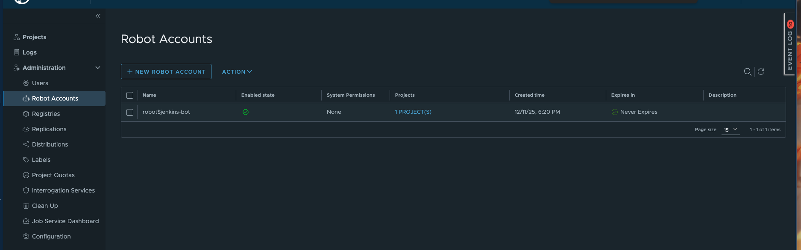
- Bước 1: Tạo repo helm trên Harbor
  - Login vào Harbor sau đó vào Projects > New Project.
    <image src ="./7.png">
  - Tại hộp thoại New Project
    - Project Name: gõ tên project của bạn (chỉ dùng ký tự thường, không ký tự đặc biệt).
    - Access level: chọn public.
    - OK
    <image src ="./8.png">
  - Bấm vào PUSH COMMAND sẽ thấy các lệnh hỗ trợ push helm và image lên.
    <image src ="./9.png">
- Bước 2: Đóng gói và Đẩy (Push) lên Harbor
  ```
    # 1. Đóng gói thư mục thành file .tgz
    # (Đang đứng ở thư mục project-helm-build)
    helm package ./template-nlb
    # > Kết quả: Successfully packaged chart and saved it to: .../template-nlb-0.1.0.tgz

    # 2. Đẩy (Push) file .tgz lên Harbor
    # (Fix lỗi 401: URL chuẩn OCI là: oci://[HOST]/[PROJECT]/[CHART_NAME])
    helm push template-nlb-0.1.0.tgz oci://harbor.thongdev.site/template-nlb/template-nlb
  ```
    <image src ="./10.png">

---

## **Triển khai với ArgoCD**
- Bước 1: Chuẩn bị Jenkins
  - Jenkins bạn phải đảm bảo rằng đã cài helm push
  - Trường hợp chưa có bạn có thể cài bằng cách vào trực tiếp container Jenkins:
    ```
        # 1. Truy cập vào container Jenkins
        docker exec -it container_id_Jenkins_cua_Bạn /bin/bash
        # Sau đó tiến hành cài wget bằng lệnh:
        apt-get update && apt-get install -y wget
        # 2. Cài Helm Chart
        wget https://get.helm.sh/helm-v3.17.4-linux-amd64.tar.gz
        tar vxf helm-v3.17.4-linux-amd64.tar.gz
        sudo mv linux-amd64/helm /usr/bin/
        # 3. Cài helm push
        helm plugin install https://github.com/chartmuseum/helm-push
    ```
  - Chuẩn nhất vẫn là sửa DockerFile của Jenkins
    ```
        # =====================================================
        # STAGE 1: Downloader - Fetch and prepare binaries
        # =====================================================
        # Use a lightweight Alpine image to handle downloads
        FROM alpine:3.19 as downloader

        # Install curl and tar for downloading and extracting files
        RUN apk add --no-cache curl tar

        # 1. Download and prepare kubectl
        # Fetch the latest stable version of Kubernetes CLI
        RUN curl -LO "https://dl.k8s.io/release/$(curl -L -s https://dl.k8s.io/release/stable.txt)/bin/linux/amd64/kubectl" 
            && chmod +x kubectl

        # 2. Download and prepare Helm
        # Define Helm version for easy updates
        ENV HELM_VERSION=v3.17.4
        # arm64 - chip arm như apple silicol, amd64 cho chip x86
        RUN curl -L "https://get.helm.sh/helm-${HELM_VERSION}-linux-arm64.tar.gz" | 
        tar -xz 
            && mv linux-amd64/helm /helm
    ```
- Bước 2: Đưa các thành phần triển khai lên git
  Kiểm tra [tại đây](https://github.com/ThongVu1996/corejs/tree/argocd-harbor)
    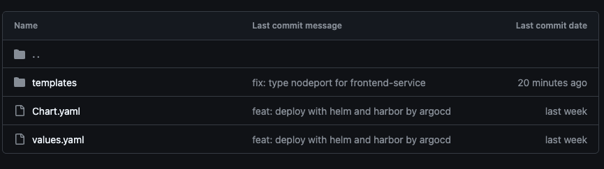
    
    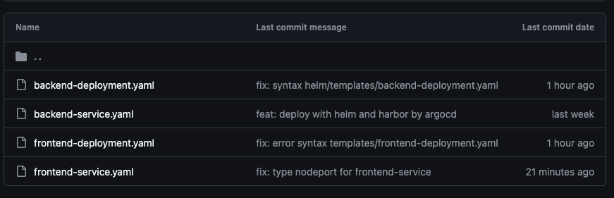
- Bước 3: Tạo helm chart template trên Jenkins

  - Flow trong này sẽ là `github push code` -> `jenkins thấy check webhooks` -> `jenkins build` -> `push docker images và helm được tạo ra lên Harbor`.
    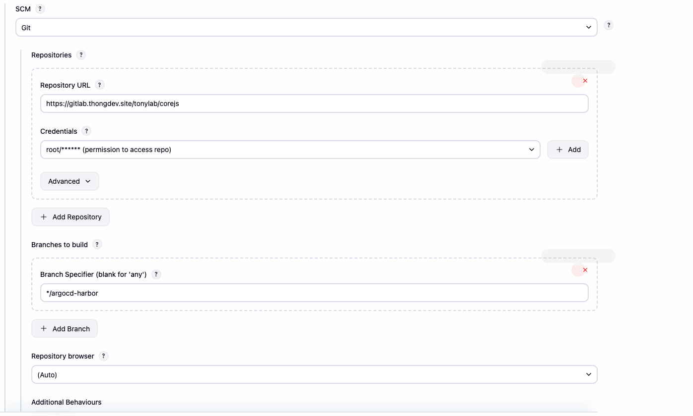

    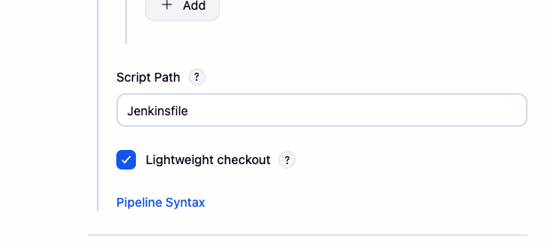
    
    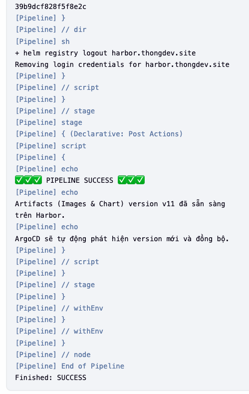
  - Kết quả trên harbor   
    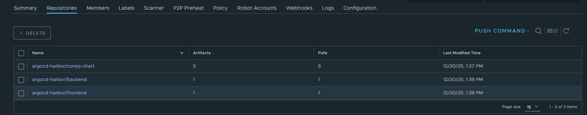
    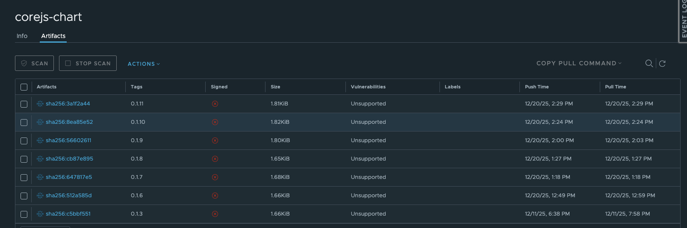
    
    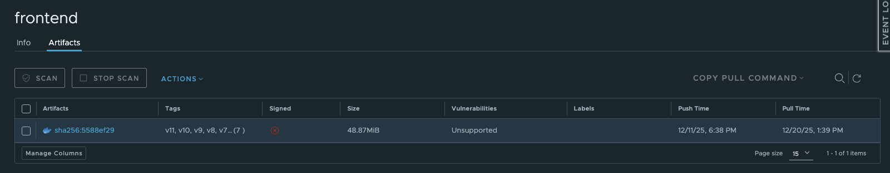

- Bước 4: Triển khai với helm lưu trữ trên Harbor bằng ArgoCD
  - 4.1: Tạo repo connect
    - Tại ArgoCD ta vào Setting > Repositories.
      <image src ="./15.png">
    - Bấm vào Connect Repo:
      <image src ="./16.png">
    - Ta tiến hành kết nối Harbor Repo với các config bên dưới:
      <image src ="./17.png">
      <image src ="./18.png">
    - Helm Repo đã được kết nối thành công:
      <image src ="./19.png">
  - 4.2: Tạo ArgoCD App
    - Tại phần Repo đã tạo thành công ta bấm vào dấu 3 chấm > Create application.
      <image src ="./20.png">
    - Cấu hình
      - **Application Name**: Đặt tên app
      - **Project Name**: Chọn **default**
      - **SYNC POLICY**: Automatic sau đó chọn **ENABLE  AUTO-SYNC** và **SELF HEAL**
      - **Chart**: Tên chart
      - **Tag**: Số tag (nếu muốn tự động sync được thì phải để tag dang *, eg: 0.1.\*)
      - **DESTINATION > Cluster URL** : Chọn **https://kubernetes.default.svc**

      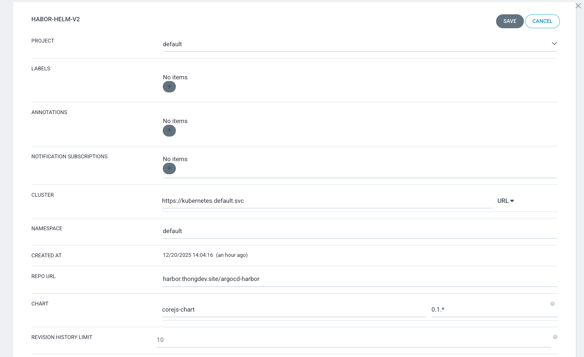
    - ArgoCD đã triển khai lên cụm K8S thành công

      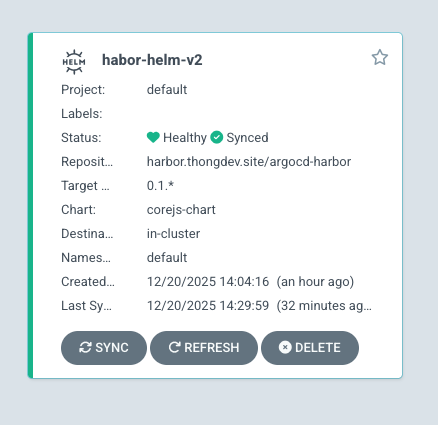
      
      
      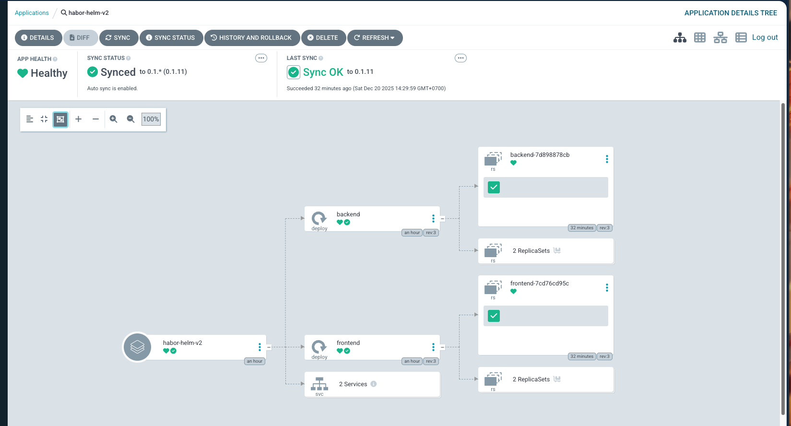
