# <center>BÀI LAB CUỐI KHÓA </center>

---

## Mục lục

- [**1. TỔNG QUAN DỰ ÁN (PROJECT OVERVIEW)**](#1-tổng-quan-dự-án-project-overview)
    - [**Stack Công nghệ**](#stack-công-nghệ)
- [**2. KIẾN TRÚC HỆ THỐNG VÀ LUỒNG DỮ LIỆU (ARCHITECTURE \& DATA FLOW)**](#2-kiến-trúc-hệ-thống-và-luồng-dữ-liệu-architecture--data-flow)
    - [**2.1. Luồng truy cập của người dùng (User Request Flow)**](#21-luồng-truy-cập-của-người-dùng-user-request-flow)
- [**3. YÊU CẦU HẠ TẦNG KỸ THUẬT (INFRASTRUCTURE REQUIREMENTS)**](#3-yêu-cầu-hạ-tầng-kỹ-thuật-infrastructure-requirements)
    - [**3.1. Primary Site - Cloud (AWS)**](#31-primary-site---cloud-aws)
    - [**3.2. Disaster Recovery (DR) Site - On-Premise**](#32-disaster-recovery-dr-site---on-premise)
- [**4. QUY TRÌNH CI/CD \& GITOPS (CI/CD PIPELINE)**](#4-quy-trình-cicd--gitops-cicd-pipeline)
    - [**4.1. Sơ đồ quy trình (Pipeline Diagram)**](#41-sơ-đồ-quy-trình-pipeline-diagram)
    - [**4.2. Chiến lược triển khai (Deployment Strategy)**](#42-chiến-lược-triển-khai-deployment-strategy)
    - [**4.3. Chi tiết các bước trong Pipeline**](#43-chi-tiết-các-bước-trong-pipeline)
- [**5. KỊCH BẢN ỨNG PHÓ SỰ CỐ (DISASTER RECOVERY PLAN)**](#5-kịch-bản-ứng-phó-sự-cố-disaster-recovery-plan)
    - [**5.1. Điều kiện kích hoạt (Trigger Condition)**](#51-điều-kiện-kích-hoạt-trigger-condition)
    - [**5.2. Quy trình Failover (Chuyển đổi dự phòng)**](#52-quy-trình-failover-chuyển-đổi-dự-phòng)
- [**6. THÔNG TIN MÃ NGUỒN \& TÀI NGUYÊN (RESOURCES)**](#6-thông-tin-mã-nguồn--tài-nguyên-resources)
- [**7. TRIỂN KHAI HỆ THỐNG TRÊN MÔI TRƯỜNG LOCAL**](#7-triển-khai-hệ-thống-trên-môi-trường-local)
  - [**7.1. Cài đặt Cloudflare Agent**](#71-cài-đặt-cloudflare-agent)
  - [**7.2. Cài đặt Nginx Ingress**](#72-cài-đặt-nginx-ingress)
  - [**7.3. Thiết lập biến môi trường (Secret)**](#73-thiết-lập-biến-môi-trường-secret)
  - [**7.4. Thiết lập Jenkins**](#74-thiết-lập-jenkins)
  - [**7.5. Kiểm tra Harbor**](#75-kiểm-tra-harbor)
  - [**7.6. Kiểm tra ECR**](#76-kiểm-tra-ecr)
  - [**7.7. Kiểm tra Manifest Github**](#77-kiểm-tra-manifest-github)
  - [**7.8. Triển khai ứng dụng bằng ArgoCD**](#78-triển-khai-ứng-dụng-bằng-argocd)
- [**8. TRIỂN KHAI HỆ THỐNG TRÊN CLOUD (AWS)**](#8-triển-khai-hệ-thống-trên-cloud-aws)
  - [**8.1. Triển khai Database (AWS RDS)**](#81-triển-khai-database-aws-rds)
  - [**8.2. Cấu hình Ứng dụng và Ingress**](#82-cấu-hình-ứng-dụng-và-ingress)
  - [**8.3. Cấu hình DNS trên Cloudflare**](#83-cấu-hình-dns-trên-cloudflare)
- [**9. KỊCH BẢN DISASTER RECOVERY (DR)**](#9-kịch-bản-disaster-recovery-dr)
  - [**9.1. Phân tích kịch bản**](#91-phân-tích-kịch-bản)
  - [**9.2. Mục tiêu cốt lõi**](#92-mục-tiêu-cốt-lõi)
  - [**9.3. Nguyên lý hoạt động**](#93-nguyên-lý-hoạt-động)
- [**10. THỰC HÀNH KỊCH BẢN DR**](#10-thực-hành-kịch-bản-dr)
  - [**10.1. Giả lập sự cố tại Local**](#101-giả-lập-sự-cố-tại-local)
  - [**10.2. Chuyển đổi sang AWS (Failover)**](#102-chuyển-đổi-sang-aws-failover)
  - [**10.3. Xác thực hệ thống**](#103-xác-thực-hệ-thống)
- [**PHÂN TÍCH CHUYÊN SÂU VỀ KIẾN TRÚC VÀ TRIỂN KHAI**](#phân-tích-chuyên-sâu-về-kiến-trúc-và-triển-khai)
  - [**1. Chiến lược lưu trữ dữ liệu (Data Persistence)**](#1-chiến-lược-lưu-trữ-dữ-liệu-data-persistence)
  - [**2. Tự động hóa Database Migration (CI/CD Hook)**](#2-tự-động-hóa-database-migration-cicd-hook)
  - [**3. Kiến trúc Web Server \& Container Design Patterns**](#3-kiến-trúc-web-server--container-design-patterns)
    - [**3.1. Đối với Frontend (Static Content Serving)**](#31-đối-với-frontend-static-content-serving)
    - [**3.2. Đối với Backend (Reverse Proxy \& FastCGI)**](#32-đối-với-backend-reverse-proxy--fastcgi)

---

## **1\. TỔNG QUAN DỰ ÁN (PROJECT OVERVIEW)**

Tài liệu này mô tả kiến trúc kỹ thuật, hạ tầng và quy trình triển khai tự động (CI/CD) cho ứng dụng Web (ReactJS \+ Laravel). Hệ thống được thiết kế theo mô hình **Hybrid Cloud**, đảm bảo tính sẵn sàng cao (High Availability) với cơ chế dự phòng thảm họa (Disaster Recovery \- DR) chuyển đổi linh hoạt giữa AWS Cloud và On-Premise server.

### **Stack Công nghệ**

* **Frontend:** ReactJS  
* **Backend:** Laravel  
* **Database:** MySQL (AWS RDS cho Cloud, MySQL Container cho Local)  
* **Orchestration:** Kubernetes (EKS & Local K8s)  
* **CI/CD & GitOps:** Jenkins, GitLab, ArgoCD, Harbor

---

## **2\. KIẾN TRÚC HỆ THỐNG VÀ LUỒNG DỮ LIỆU (ARCHITECTURE & DATA FLOW)**
### **2.1. Luồng truy cập của người dùng (User Request Flow)**

Hệ thống sử dụng CloudFlare làm điểm nhập (Entry point) để điều phối lưu lượng truy cập giữa Primary Site (Cloud) và DR Site (On-Premise).

**Sơ đồ luồng dữ liệu:**


**Quy trình xử lý chi tiết:**

1. **User Request:** Người dùng truy cập website thông qua tên miền.  
2. **DNS & Routing:** CloudFlare tiếp nhận request.  
   * *Trạng thái bình thường:* Route về AWS.  
   * *Trạng thái DR:* Route về Local thông qua CloudFlare Tunnel/Agent.  
3. **Ingress Layer:**  
   * **AWS:** Request đi qua AWS ALB (Application Load Balancer).  
   * **On-Premise:** Request đi qua CloudFlare Agent tại cụm K8s \-\> Ingress Nginx.  
4. **Service Layer:** Ingress điều hướng đến các Kubernetes Service tương ứng (Frontend/Backend).  
5. **Pod Execution:** Request được xử lý tại các Pod ứng dụng.

**Tham khảo:** Chi tiết về Ingress và Service trong Kubernetes [tại đây](https://www.google.com/search?q=./basic.md%23k8s).

---

## **3\. YÊU CẦU HẠ TẦNG KỸ THUẬT (INFRASTRUCTURE REQUIREMENTS)**

Hệ thống được chia thành hai môi trường vật lý riêng biệt để đảm bảo tính dự phòng.

### **3.1. Primary Site \- Cloud (AWS)**

Đây là môi trường Production chính phục vụ người dùng cuối.

* **Computing:** Cụm Amazon EKS (Elastic Kubernetes Service). ([Hướng dẫn cài đặt](https://github.com/ThongVu1996/cd-ci-lab/blob/master/aws/install.md))  
* **Container Registry:** Amazon ECR (Elastic Container Registry). ([Hướng dẫn cài đặt](https://www.google.com/search?q))  
* **Source Control (Mirror):** GitHub Repo. ([Tại đây](https://github.com/ThongVu1996/lab-final))  
* **Database:** Amazon RDS (MySQL). ([Hướng dẫn cài đặt](https://github.com/ThongVu1996/cd-ci-lab/blob/master/final/insall-AWS-RDS.md))  

### **3.2. Disaster Recovery (DR) Site \- On-Premise**

Môi trường dự phòng và cũng là nơi đặt hệ thống CI/CD trung tâm.

* **Orchestration:** Kubernetes Local Cluster. ([Hướng dẫn cài đặt](https://www.google.com/search?q))  
* **CI/CD Tooling:**  
  
  * Jenkins (Automation Server). ([Hướng dẫn cài đặt](https://github.com/ThongVu1996/cd-ci-lab/blob/master/all-in-one/all-in-one.md#b%C6%B0%E1%BB%9Bc-3-t%E1%BA%A1o-file-jenkinsdockerfile))  
  * GitLab (Source Code Management \- Private). ([Xem tại đây](https://www.google.com/search?q))  
* **Container Registry (Private):** Harbor.  
  * Cài đặt trên chip Intel: [Xem hướng dẫn](https://tonynguyen.top/harbor-registry-phan-1-cai-dat-harbor-registry-tren-ubuntu/)  
  * Cài đặt trên chip ARM: [Xem hướng dẫn](https://github.com/ThongVu1996/cd-ci-lab/blob/master/argocd/install-harbor.md)  
* **Network:** Tài khoản CloudFlare và Tên miền (Domain) đã cấu hình CloudFlare Tunnel.

---

## **4\. QUY TRÌNH CI/CD & GITOPS (CI/CD PIPELINE)**

Chúng ta tuân thủ nguyên tắc **GitOps**: Git là "nguồn chân lý duy nhất" (Single Source of Truth) cho trạng thái của hệ thống.

### **4.1. Sơ đồ quy trình (Pipeline Diagram)**

```mermaid
flowchart LR
    %% Style Definitions
    classDef person fill:#2d3748,stroke:#1a202c,stroke-width:2px,color:white,rx:10,ry:10;
    classDef system fill:#edf2f7,stroke:#a0aec0,stroke-width:1px,color:#2d3748,rx:5,ry:5;
    classDef storage fill:#ebf8ff,stroke:#4299e1,stroke-width:2px,color:#2b6cb0,shape:cylinder;
    classDef k8s fill:#3182ce,stroke:#2c5282,stroke-width:2px,color:white,shape:hexagon;
    classDef jenkins fill:#fff5f5,stroke:#fc8181,stroke-width:2px,color:#c53030,rx:5,ry:5;

    %% Nodes
    Dev(👨‍💻 Developer):::person
    CTO(🤵 CTO/Manager):::person

    subgraph OnPrem [🏠 On-Premise Infrastructure]
        GL[GitLab Local]:::system
        
        subgraph Jenkins_Server [Jenkins Pipeline]
            direction TB
            JenBuild[Stage 1: Build & Local]:::jenkins
            JenDeploy[Stage 2: Cloud Deploy]:::jenkins
        end
        
        Har[(Harbor Registry)]:::storage
        ArgoLoc[ArgoCD Local]:::system
        K8sLoc{{K8s Local}}:::k8s
    end

    subgraph Cloud [☁️ AWS Cloud Infrastructure]
        GitOps[GitOps Repo]:::system
        ECR[(AWS ECR)]:::storage
        ArgoCloud[ArgoCD Cloud]:::system
        EKS{{AWS EKS}}:::k8s
    end

    %% Connections - Linear Flow
    Dev ==>|1. Push Code| GL
    GL ==>|2. Webhook| JenBuild
    
    %% Local Path
    JenBuild -->|3. Build & Push| Har
    Har -->|4. Pull| ArgoLoc
    ArgoLoc -->|5. Auto Deploy| K8sLoc

    %% Approval Bridge - KEY CHANGE HERE
    JenBuild -.->|6. Request Approval| CTO
    CTO -.->|7. Approve| JenDeploy

    %% Cloud Path (Only starts from JenDeploy)
    JenDeploy -->|8. Push Image| ECR
    JenDeploy -->|9. Update Manifest| GitOps
    
    GitOps -->|10. Sync| ArgoCloud
    ArgoCloud -->|11. Rolling Update| EKS
    
    %% Link Styles
    linkStyle 5,6 stroke:#ed8936,stroke-width:2px,stroke-dasharray: 5 5;

```



### **4.2. Chiến lược triển khai (Deployment Strategy)**

* **Mô hình:** Pull-based Deployment.  
* **Quy tắc:**  
  * **Local:** Triển khai tự động ngay sau khi build thành công để Developer kiểm tra.  
  * **Cloud (Production):** Việc deploy lên môi trường Production (AWS) yêu cầu phê duyệt thủ công (Manual Approval).

### **4.3. Chi tiết các bước trong Pipeline**

1. **Code Commit:** Developer đẩy mã nguồn (Push code) lên GitLab Local.  
2. **Trigger Build:** GitLab gửi Webhook kích hoạt Job trên Jenkins.  
3. **Build & Local Release:**  
   * Jenkins build Docker Images và Helm Charts.  
   * Jenkins đẩy Artifacts (Image \+ Chart) lên **Harbor** (Local Registry).  
4. **Local Deployment (Tự động):**  
   * ArgoCD (Local) phát hiện Artifact mới trên Harbor (hoặc qua repo config).  
   * Tự động đồng bộ và triển khai lên **K8s Local** để kiểm thử.  
5. **Approval Gate (Quality Gate):**  
   * Jenkins tạm dừng và gửi yêu cầu phê duyệt đến CTO/PM.  
6. **Cloud Release (Sau khi Approve):**  
   * Sau khi CTO nhấn "Approve" trên Jenkins:  
   * Jenkins đẩy Image từ Harbor lên **AWS ECR**.  
   * Jenkins cập nhật Manifest/Helm values lên **GitOps Repo** (GitLab/GitHub).  
7. **Cloud Deployment (CD):**  
   * ArgoCD (quản lý cụm Cloud) phát hiện thay đổi trên GitOps Repo.  
   * Tự động đồng bộ (Sync) và cập nhật Rolling Update lên **AWS EKS**.

---

## **5\. KỊCH BẢN ỨNG PHÓ SỰ CỐ (DISASTER RECOVERY PLAN)**

Kịch bản này được kích hoạt khi Primary Site (AWS) gặp sự cố nghiêm trọng không thể phục hồi ngay lập tức.

### **5.1. Điều kiện kích hoạt (Trigger Condition)**

* Ứng dụng trên AWS không phản hồi (Time out).  
* Giả lập sự cố: Tắt cụm EKS hoặc scale replica của ứng dụng về 0\.

### **5.2. Quy trình Failover (Chuyển đổi dự phòng)**

1. **Phát hiện sự cố:** Hệ thống giám sát cảnh báo AWS Down.  
2. **Điều hướng Traffic:**  
   * *Trong môi trường Lab:* Quản trị viên truy cập CloudFlare Dashboard, trỏ DNS/Tunnel traffic về cụm Kubernetes Local.  
   * *Trong thực tế:* Sử dụng **Cloudflare Load Balancing** với Health Check để tự động điều hướng traffic về Local khi AWS không phản hồi.  
3. **Khôi phục:** Khi AWS hoạt động trở lại, traffic được điều hướng ngược lại Primary Site.

---

## **6\. THÔNG TIN MÃ NGUỒN & TÀI NGUYÊN (RESOURCES)**

Dưới đây là liên kết đến các kho lưu trữ mã nguồn và cấu hình phục vụ cho việc triển khai dự án:

| Hạng mục | Mô tả | Liên kết Repository |
| :---- | :---- | :---- |
| **Frontend** | Mã nguồn ReactJS | [Github FE Repo](https://github.com/ThongVu1996/lab-final-fe) |
| **Backend** | Mã nguồn Laravel | [Github BE Repo](https://github.com/ThongVu1996/lab-final-be) |
| **Cloud Config** | Mã nguồn Setup CI/CD cho Cloud | [Github Cloud Infra](https://github.com/ThongVu1996/lab-final) |
| **Full Project** | Mã nguồn đầy đủ (Local \+ Cloud) | [Github Full Lab](https://github.com/ThongVu1996/lab-final-full) |

--- 

# **7\. TRIỂN KHAI HỆ THỐNG TRÊN MÔI TRƯỜNG LOCAL**

Tài liệu này hướng dẫn chi tiết các bước triển khai ứng dụng lên hạ tầng Kubernetes tại Local, bao gồm cài đặt Cloudflare Tunnel, Nginx Ingress và thiết lập CI/CD.

## **7.1. Cài đặt Cloudflare Agent**

Để kết nối Cluster nội bộ ra Internet an toàn, chúng ta sử dụng Cloudflare Tunnel.

**Bước 1: Cài đặt qua Helm**

Trước tiên, hãy đảm bảo Helm Chart đã được cài đặt trên k8s (tham khảo [tại đây](https://github.com/ThongVu1996/cd-ci-lab/blob/master/argocd/argocd-with-helm.md#t%E1%BA%A1o-helm-chart-tr%C3%AAn-k8s)). Sau đó chạy lệnh:

```bash

   helm repo add cloudflare [https://cloudflare.github.io/helm-charts](https://cloudflare.github.io/helm-charts)
   helm repo update
   helm install cloudflare-agent cloudflare/cloudflare-utils \
   --namespace cloudflare-agent --create-namespace \
   --set cloudflared.token=<YOUR_TUNNEL_TOKEN>

```

**Bước 2: Lấy Token**

YOUR\_TUNNEL\_TOKEN được lấy từ mục **Install and run a connector** trên giao diện Cloudflare như hình dưới:


**Bước 3: Kiểm tra cài đặt**

Sử dụng lệnh sau để kiểm tra xem Cloudflare Agent đã hoạt động chưa:

```bash
   kubectl get pods \-A | grep cloud
```

Kết quả hiển thị:


## **7.2. Cài đặt Nginx Ingress**

Chúng ta sẽ cài đặt Nginx Ingress Controller với loại Service là ClusterIP để tăng tính bảo mật.

**Bước 1: Cài đặt**

 ```bash
    helm install ingress-nginx ingress-nginx/ingress-nginx \
      --namespace ingress-nginx --create-namespace \
      --set controller.service.type=ClusterIP \
      --set controller.watchIngressWithoutClass=false \
      --set controller.ingressClassResource.name=nginx \
      --set controller.ingressClassResource.enabled=true \
      --set controller.ingressClassResource.default=true \
      --timeout 30m0s
 ```

*Lưu ý:* Tham số \--set controller.ingressClassResource.name=nginx giúp Nginx chỉ quản lý các Ingress có khai báo đúng class name.

**Bước 2: Kiểm tra kết quả**

```bash
kubectl get svc -n ingress-nginx
```


**Tại sao sử dụng ClusterIP?**

* **Bảo mật:** Khác với NodePort (mở cổng 30000-32767 trên tất cả các Node, dễ bị scan IP), ClusterIP chỉ tạo IP ảo nội bộ, hoàn toàn "ẩn" với Internet bên ngoài.  
* **Quản lý:** Không cần mở port thủ công trên Firewall/Security Group, tránh rủi ro mở nhầm "0.0.0.0/0" hoặc xung đột cổng trong môi trường nhiều người dùng.  
* **Luồng dữ liệu:** Bắt buộc traffic phải đi qua Cloudflare Tunnel (nơi có các lớp bảo vệ) trước khi vào cụm K8s. Traffic chỉ được phép đi vào Nginx Ingress nếu xuất phát từ Pod có nhãn app: cloudflared.

**Cấu hình Cloudflare Tunnel**

Khi cấu hình Tunnel, bạn không cần dùng IP Private mà sử dụng địa chỉ DNS nội bộ của K8s. Điền vào ô URL giá trị: http://ingress-nginx-controller.ingress-nginx.svc.cluster.local:80.


*Giải thích địa chỉ:* \<service-name\>.\<namespace\>.svc.cluster.local

* \<service-name\>: Tên service (trong cột NAME khi get svc).  
* \<namespace\>: Namespace chứa service đó.

## **7.3. Thiết lập biến môi trường (Secret)**

Backend Laravel cần các biến môi trường từ file .env. Trong K8s, ta dùng Secret để lưu trữ các giá trị này.

**Tạo Secret cho môi trường Local**

```bash
kubectl create namespace yorisoi-local

kubectl create secret generic yorisoi-secret \
        --namespace yorisoi-local \
        --from-literal=APP_ENV=‘production’ \
        --from-literal=APP_DEBUG='false’ \
        --from-literal=APP_URL=’domain’ \
        --from-literal=APP_KEY='base64:Thay_The_Bang_Key_Cua_Ban_Vao_Day' \
        --from-literal=JWT_SECRET=‘jwt_tao_bang_lenh_ php artisan jwt:secret\
        --from-literal=DB_CONNECTION='mysql' \
        --from-literal=DB_HOST='mysql-svc' \
        --from-literal=DB_PORT='3306' \
        --from-literal=DB_DATABASE='yorisoi_db' \
        --from-literal=DB_USERNAME='yorisoi_user' \
        --from-literal=DB_PASSWORD='MatKhauDbCuaBan' \
        --from-literal=MYSQL_ROOT_PASSWORD='MatKhauRootCuaBan' \
        --from-literal=MYSQL_PASSWORD='MatKhauDbCuaBan' \
        --from-literal=MYSQL_DATABASE='yorisoi_db' \
        --from-literal=MYSQL_USER='yorisoi_user'
```

Kiểm tra secret:

```bash
kubectl describe secret yorisoi-secret -n yorisoi-local
```

**Tạo Secret cho môi trường AWS (sử dụng RDS)**

```bash
kubectl create secret generic yorisoi-secret \
--namespace yorisoi-prod \
--from-literal=APP_ENV='production' \
--from-literal=APP_KEY='base64:eZ5f9kN7uDSUsnyxoQwISBdgsfHb3XJj4UW4Be7YBlE=' \
--from-literal=JWT_SECRET='xAR12UlxQenjBfOPMTDIjRewTUJlKRu8sjU7gyJ6A8fYkS7v6PpXPI1xEMlKZ9M0' \
--from-literal=DB_CONNECTION='mysql' \
--from-literal=DB_HOST='lab-final-db.cn46i6qw2flt.ap-southeast-1.rds.amazonaws.com' \
--from-literal=DB_DATABASE='yorisoi_db' \
--from-literal=DB_PORT='3306' \
--from-literal=DB_USERNAME='yorisoi_user' \
--from-literal=DB_PASSWORD='thaolinh123'
```

## **7.4. Thiết lập Jenkins**

Sau khi code được đẩy lên GitLab, Jenkins sẽ tự động build. Do Jenkins cần đẩy code lên cả AWS nên trong đó phải cài thêm AWS CLI. Vào trong docker của Jenkins chạy các lệnh sau để kiểm tra:

```bash
aws sts get-caller-identity
kubectl version --client
eksctl version
```

Kết quả như ảnh là được:


Nội dung Jenkinsfile xem [tại đây](https://github.com/ThongVu1996/lab-final-full/blob/main/Jenkinsfile).

Sử dụng giao diện **Blue Ocean** để theo dõi quá trình build:


Kết quả build thành công:


## **7.5. Kiểm tra Harbor**

Trên Harbor, Image và Helm Chart sẽ được đẩy lên tương ứng với phiên bản build.

Dự án trên Harbor:


Danh sách Images:


Chi tiết Platform:


*Lưu ý:* Image có hai phiên bản (amd64, arm64) do sử dụng buildx. K8s sẽ tự chọn phiên bản phù hợp với chip của máy chủ. Trên môi trường Product nên dùng máy chủ chip AMD để tối ưu tốc độ build và tương thích.

## **7.6. Kiểm tra ECR**

Kiểm tra danh sách Repository và Images trên AWS ECR:


## **7.7. Kiểm tra Manifest Github**

Kiểm tra repo chứa manifest để đảm bảo code và config đã được cập nhật:


File values cấu hình:


## **7.8. Triển khai ứng dụng bằng ArgoCD**

Như đã biết ở các bài lab trước, thì việc argoCD ở local sẽ không thể pull được images và helm chart với config defautl. Chúng ta có một cách đó là public harbor lên internet bằng Zero Trust (xem thêm [tại đây](https://github.com/ThongVu1996/cd-ci-lab/blob/master/argocd/argocd-base.md#3-tri%E1%BB%83n-khai))
Tuy nhiên với bài lab này việc public harbor lên trển internet là không hợp lý, vì vậy chúng ta phải sửa coredns của cụm k8s

**Bước 1:** Mở ConfigMap để chỉnh sửa

```bash
kubectl edit configmap coredns -n kube-system
```

**Bước 2:** Sửa cấu hình có nội dung tương tự file, để forward sang DNS nội bộ của local với tên miền của harbor

```bash
apiVersion: v1
data:
  Corefile: |
    local.thongdev.site:53 {
        errors
        cache 30
        forward . 192.168.1.30
    }
    .:53 {
        errors
        health {
           lameduck 5s
        }
        ready
        kubernetes cluster.local in-addr.arpa ip6.arpa {
           pods insecure
           fallthrough in-addr.arpa ip6.arpa
           ttl 30
        }
        prometheus :9153
        forward . /etc/resolv.conf {
           max_concurrent 1000
        }
        cache 30 {
           disable success cluster.local
           disable denial cluster.local
        }
        loop
        reload
        loadbalance
    }
```

**Bước 3: Chuẩn bị Storage**

Tạo thư mục chứa data cho MySQL trên Node (ví dụ: k8s-master-2):

```bash
# Đây là do cấu hình vậy
mkdir /data/mysql-pv
```

**Bước 4: Tạo Application**

Bạn có thể tạo App trên giao diện (tham khảo [tại đây](https://github.com/ThongVu1996/cd-ci-lab/blob/master/argocd/argocd-with-helm.md), search `Bước 4: Triển khai với helm lưu trữ trên Harbor bằng ArgoCD` cho nhanh thấy) hoặc dùng file YAML sau:

```yaml
apiVersion: argoproj.io/v1alpha1
kind: Application
metadata:
name: yorisoi-local
namespace: argocd
spec:
project: default
source:
        # 1. Trỏ về Harbor
        repoURL: 'harbor.local.thongdev.site/lab-final'
        # 2. Chọn CHART GÓI (Wrapper) thay vì Chart Gốc
        chart: yorisoi-local 
        # 3. Version động
        targetRevision: '0.1.*'
        
        # KHÔNG CẦN helm: values Ở ĐÂY NỮA
        # Vì mọi thứ đã nằm trong yorisoi-local/values.yaml rồi

destination:
        server: 'https://kubernetes.default.svc'
        namespace: yorisoi-local
syncPolicy:
        automated:
        prune: true
        selfHeal: true
        syncOptions:
        - CreateNamespace=true
```

Rồi chạy lệnh:

```bash
kubectl apply -f ten_file_config.yaml
```

**Bước 3: Kết quả triển khai**

Ứng dụng xuất hiện trên ArgoCD:


Chi tiết đồng bộ:


**Bước 4: Truy cập ứng dụng**

* Trường hợp thành công:
  


* Trường hợp thất bại:


**Bước 5: Kiểm tra Log**

Để debug hoặc theo dõi traffic thật ở local, xem log của Nginx Ingress:

```bash
kubectl logs -f -l app.kubernetes.io/name=ingress-nginx -n ingress-nginx
```

Log sẽ hiển thị khi bạn F5 trang web:


---

# **8\. TRIỂN KHAI HỆ THỐNG TRÊN CLOUD (AWS)**

Khác với môi trường Local nơi mọi thành phần đều chạy trong Container, trên môi trường Cloud (AWS), chúng ta sẽ tận dụng các dịch vụ được quản lý (Managed Services) để tăng tính ổn định và khả năng mở rộng.

## **8.1. Triển khai Database (AWS RDS)**

Thay vì chạy MySQL trên Kubernetes (như ở Local), chúng ta sẽ sử dụng dịch vụ Amazon RDS (Relational Database Service).

* **Lợi ích:** Tăng khả năng sao lưu, phục hồi và tính sẵn sàng cao (High Availability).  
* **Hướng dẫn cài đặt:** Chi tiết các bước tạo và cấu hình AWS RDS bạn có thể xem [tại đây](https://github.com/ThongVu1996/cd-ci-lab/blob/master/final/insall-AWS-RDS.md).
* **Kết quả**:

  

## **8.2. Cấu hình Ứng dụng và Ingress**

Trong Repository [source code](https://github.com/ThongVu1996/lab-final) đã bao gồm sẵn các file manifest được cấu hình riêng cho môi trường AWS. Do đó, quy trình triển khai trên ArgoCD tương tự như local, chỉ khác về đích đến (Destination Cluster).

Sau khi ứng dụng đã được triển khai lên cụm EKS (hoặc K8s trên AWS), chúng ta cần lấy địa chỉ của Load Balancer (ELB/ALB) để cấu hình tên miền.

Sử dụng lệnh sau để lấy địa chỉ Ingress:

```bash
kubectl get ingress -A
```

Kết quả sẽ hiển thị địa chỉ ADDRESS của Load Balancer do AWS cấp:


## **8.3. Cấu hình DNS trên Cloudflare**

Để trỏ tên miền về hạ tầng AWS, chúng ta thực hiện cấu hình bản ghi DNS như sau:

1. Truy cập Dashboard của Cloudflare.  
2. Tạo một bản ghi mới với **Type** là CNAME.  
3. **Name:** Điền subdomain mong muốn (ví dụ: dr cho kịch bản Disaster Recovery).  
4. **Target:** Dán địa chỉ AWS ELB/ALB đã lấy ở bước trên.  
5. Lưu lại (Save).

Sau khi DNS được cập nhật, truy cập vào tên miền dr.\<domain-cua-ban\> sẽ thấy kết quả hiển thị tương tự như khi chạy ở Local, nhưng lúc này hệ thống đang vận hành hoàn toàn trên AWS.

---

# **9\. KỊCH BẢN DISASTER RECOVERY (DR)**

## **9.1. Phân tích kịch bản**

Trong bài toán thực tế về DR (Khôi phục thảm họa), kịch bản thường gặp là: Hệ thống chính (Primary) chạy trên Cloud (AWS) gặp sự cố ngừng hoạt động \-\> Điều hướng lưu lượng về hệ thống dự phòng (Secondary) tại Local (On-premise).

Tuy nhiên, để thuận tiện cho việc demo trong bài lab này (do chúng ta đã dựng xong môi trường Local trước), quy trình sẽ được thực hiện theo chiều ngược lại:

* **Hiện trạng:** Hệ thống đang chạy ổn định ở Local.  
* **Sự cố giả lập:** Hệ thống Local gặp lỗi hoặc mất kết nối.  
* **Hành động:** Chuyển đổi (Failover) sang hệ thống chạy trên AWS.

## **9.2. Mục tiêu cốt lõi**

Mục tiêu tối thượng của kịch bản DR là tính **trong suốt với người dùng cuối (Transparency)**:

* Người dùng truy cập vào trang web vẫn sử dụng dịch vụ bình thường.  
* Họ không nhận biết được (và không cần biết) hệ thống backend đang được phục vụ bởi máy chủ Local hay Cloud AWS.

## **9.3. Nguyên lý hoạt động**

Để đạt được sự chuyển đổi mượt mà này, yếu tố quan trọng nhất là **quản lý lưu lượng (Traffic Routing)**.

Tại một thời điểm, lưu lượng truy cập từ người dùng chỉ nên được điều hướng về một nơi duy nhất (Active-Passive):

* **Bình thường:** DNS trỏ về Cloudflare Tunnel (Local).  
* **Khi có sự cố:** Cập nhật DNS (hoặc Load Balancer) để trỏ về AWS ELB (Cloud).

---

# **10\. THỰC HÀNH KỊCH BẢN DR**

Phần này hướng dẫn chi tiết các bước thực hiện thao tác chuyển đổi (Failover) từ Local sang AWS để kiểm chứng kịch bản DR.

## **10.1. Giả lập sự cố tại Local**

**Bước 1: Ngắt kết nối Cloudflare Tunnel**

Để giả lập sự cố mất kết nối, ta truy cập vào cấu hình Public Hostname trong Cloudflare Tunnel và thay đổi subdomain sang một giá trị khác (ví dụ: đổi thành tên sai). Điều này sẽ cắt đứt đường dẫn traffic vào cụm Local.

Kết quả sau khi thay đổi:


**Bước 2: Xác nhận sự cố (Downtime)**

Kiểm tra truy cập trang web. Nếu trang web báo lỗi hoặc không thể truy cập, nghĩa là hệ thống Local đã "chết" đúng như kịch bản.


## **10.2. Chuyển đổi sang AWS (Failover)**

**Bước 3: Điều hướng DNS về AWS**

Tiến hành trỏ tên miền về hạ tầng AWS để khôi phục dịch vụ.  
Truy cập Cloudflare Dashboard \-\> DNS \-\> Records và tạo (hoặc cập nhật) bản ghi CNAME:

* **Name:** Subdomain của trang web.  
* **Target:** Địa chỉ AWS ELB (đã lấy được ở phần 8.2 \- Triển khai Cloud).
  


**Bước 4: Kiểm tra phục hồi dịch vụ**

Đợi khoảng 30-60 giây để Cloudflare cập nhật DNS toàn cầu. Sau đó tải lại trang web.  
Kết quả mong đợi: Trang web hoạt động trở lại bình thường.


## **10.3. Xác thực hệ thống**

**Bước 5: Kiểm tra Log trên AWS**

Mặc dù giao diện người dùng giống hệt nhau, ta cần xác minh rằng backend xử lý request hiện tại chính là AWS EKS.

Mở terminal kết nối tới AWS EKS và chạy lệnh xem log Nginx Ingress:

```bash
kubectl logs -f -l app.kubernetes.io/name=ingress-nginx -n ingress-nginx
```


Khi bạn thao tác trên trang web (F5 hoặc đăng nhập), log mới sẽ xuất hiện trên terminal của AWS, chứng tỏ kịch bản DR đã thành công và hệ thống đang chạy hoàn toàn trên Cloud.


---

# **PHÂN TÍCH CHUYÊN SÂU VỀ KIẾN TRÚC VÀ TRIỂN KHAI**

Phần này đi sâu vào các quyết định kỹ thuật (Technical Decisions) được áp dụng trong dự án, giải thích lý do tại sao hệ thống được thiết kế và vận hành theo mô hình hiện tại.

## **1\. Chiến lược lưu trữ dữ liệu (Data Persistence)**

Khi triển khai Database (như MySQL) trên môi trường Kubernetes Local, mặc định dữ liệu được lưu trong lớp Read-Write của Container. Điều này dẫn đến rủi ro: nếu Pod Database bị lỗi, khởi động lại hoặc bị xóa (Pod Crash/Restart), toàn bộ dữ liệu sẽ biến mất.

Giải pháp:  
Chúng ta phải sử dụng cơ chế Volume Mounting. Cụ thể, cần tạo một thư mục trên máy Local (Host) và ánh xạ (mount) nó vào thư mục chứa dữ liệu của MySQL trong Container (/var/lib/mysql).

* **Mục đích:** Đảm bảo dữ liệu được lưu trữ bền vững (Persistent) trên ổ cứng vật lý của máy chủ, độc lập với vòng đời của Pod.

## **2\. Tự động hóa Database Migration (CI/CD Hook)**

Với Backend sử dụng Laravel, việc đồng bộ cấu trúc Database (Schema) phù hợp với version code mới là bắt buộc. Quy trình chuẩn yêu cầu chạy lệnh `php artisan migrate --seed --force` mỗi khi triển khai.

Vấn đề:  
Nếu chạy lệnh này thủ công hoặc chạy trực tiếp trong Pod ứng dụng chính (Application Pod) khi khởi động, có thể gây ra hiện tượng Race Condition (xung đột khi nhiều Pod chạy cùng lúc) hoặc làm chậm quá trình startup của ứng dụng.  
Giải pháp:  
Chúng ta thiết kế một Kubernetes Job riêng biệt để xử lý việc này.

* **Cơ chế hoạt động:** Job này được cấu hình để chỉ khởi chạy sau khi các Service thiết yếu (Database và Backend Core) đã sẵn sàng. Nó thực hiện migration một lần duy nhất cho mỗi lần deploy, đảm bảo tính toàn vẹn dữ liệu.  
* *Tham khảo cấu hình Job chi tiết:* [tại đây](https://github.com/ThongVu1996/lab-final-full/blob/main/charts/yorisoi-stack/templates/migration-job.yaml)

## **3\. Kiến trúc Web Server & Container Design Patterns**

Mặc dù Nginx đều xuất hiện ở cả Frontend và Backend, vai trò và cách đóng gói (Packaging) của nó lại hoàn toàn khác nhau.

### **3.1. Đối với Frontend (Static Content Serving)**

* **Đặc thù:** Code Frontend sau khi build (React, Vue, v.v.) chỉ là tập hợp các file tĩnh (HTML, CSS, JS). Chúng không có khả năng tự thực thi hay lắng nghe request.  
* **Vai trò của Nginx:** Đóng vai trò là **Web Server** thuần túy.  
* **Triển khai:** Chúng ta build một Docker Image bao gồm Nginx và copy source code đã build vào thư mục root của Nginx. Nginx sẽ trực tiếp "giao hàng" (serve) các file này cho trình duyệt người dùng.  
* **Cấu trúc Pod:** Thông thường chỉ chứa **1 Container**.


### **3.2. Đối với Backend (Reverse Proxy & FastCGI)**

* **Đặc thù:** Backend (Laravel) cần một môi trường thời gian thực (Runtime Environment) để biên dịch và chạy code PHP, thường là php-fpm.  
* **Vai trò của Nginx:** Đóng vai trò là **Reverse Proxy**.  
  1. Nginx nhận request từ Client.  
  2. Nginx chuyển tiếp request (qua giao thức FastCGI) đến php-fpm.  
  3. php-fpm xử lý logic, truy vấn DB và trả kết quả về cho Nginx.  
  4. Nginx trả response cho Client.  
* Triển khai (Mô hình Sidecar):  
  Chúng ta tách Nginx và Backend code thành 2 Image riêng biệt. Điều này giúp Image nhẹ hơn và đảm bảo nguyên tắc "Mỗi container một trách nhiệm".  
  * **Trên ArgoCD/Kubernetes:** Bạn sẽ thấy Pod Backend có trạng thái **2/2** (Ready/Total). Điều này nghĩa là trong 1 Pod đang chạy song song 2 Containers:  
    1. **Container App:** Chạy code Laravel (PHP-FPM).  
    2. **Container Nginx:** Đứng bên cạnh (Sidecar) để hứng traffic và chuyển cho App.
  

Việc tách biệt này cũng giúp khả năng mở rộng (Scaling) tốt hơn. Khi lưu lượng tăng cao, ta có thể scale cả Pod (bao gồm cặp Nginx \+ PHP-FPM) để đáp ứng nhu cầu.
