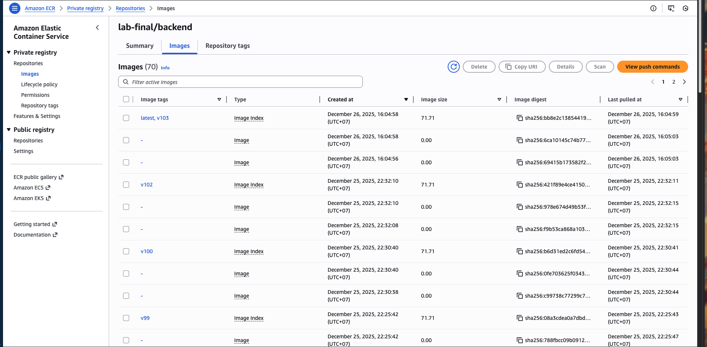

# <center>BÀI LAB CUỐI KHÓA </center>

---

## Table of Content
- [BÀI LAB CUỐI KHÓA ](#bài-lab-cuối-khóa-)
  - [Table of Content](#table-of-content)
  - [Tổng quan dự án](#tổng-quan-dự-án)
  - [Yêu cầu kỹ thuật](#yêu-cầu-kỹ-thuật)
    - [Hạ tầng](#hạ-tầng)
      - [On-Premise (DR Site)](#on-premise-dr-site)
      - [Cloud (Primary Site)](#cloud-primary-site)
    - [Quy trình CI/CD](#quy-trình-cicd)
    - [Kịch bản DR](#kịch-bản-dr)
    - [Dự án cần triển khai](#dự-án-cần-triển-khai)
  - [Phân tích bài toán](#phân-tích-bài-toán)
    - [Flow hoạt động về dữ liệu](#flow-hoạt-động-về-dữ-liệu)
    - [Flow CI-CD](#flow-ci-cd)
  - [Triển khai ở Local](#triển-khai-ở-local)
    - [Cài đặt Cloudflare Agent](#cài-đặt-cloudflare-agent)
    - [Cài đặt Nginx Ingress](#cài-đặt-nginx-ingress)
    - [Thiết lập biến môi trường](#thiết-lập-biến-môi-trường)
    - [Thiết lập jenkins](#thiết-lập-jenkins)
    - [Kiểm tra Harbor](#kiểm-tra-harbor)
    - [Kiểm tra ECR](#kiểm-tra-ecr)
    - [Kiểm tra minifest github](#kiểm-tra-minifest-github)
    - [Tiến hành sử dụng argoCD để deploy ứng dụng lên cụm K8s](#tiến-hành-sử-dụng-argocd-để-deploy-ứng-dụng-lên-cụm-k8s)
  - [Triển khai ở Cloud](#triển-khai-ở-cloud)
  - [Kịch bản DR](#kịch-bản-dr-1)
    - [Phân tích](#phân-tích)
    - [Thực hành](#thực-hành)
  - [Phân tích chuyên sâu:](#phân-tích-chuyên-sâu)

---

## Tổng quan dự án
- Công ty A yêu cầu xây dựng một hệ thống triển khai ứng dụng (CI/CD) đảm bảo tính sẵn sàng cao (High Availability) và khả năng phục hồi sau thảm họa (Disaster Recovery).
 - Hệ thống chính (Primary) chạy trên Cloud (AWS EKS) để phục vụ khách hàng toàn cầu với tốc độ cao.
 - Hệ thống dự phòng (DR Site) chạy tại văn phòng (On-Premise) để đề phòng trường hợp Cloud bị sập (Region Outage) hoặc đứt cáp quang biển.
 - **Đặc biệt:** Code nguồn phải được bảo mật nội bộ. Chỉ phiên bản Release mới được đẩy ra Public Cloud.

---

## Yêu cầu kỹ thuật
### Hạ tầng
#### On-Premise (DR Site)
- K8s Local (xem [tại đây]())
- Jenkins, GitLab (xem [tại đây]())
- Harbor (xem [tại đây với chip intel](https://tonynguyen.top/harbor-registry-phan-1-cai-dat-harbor-registry-tren-ubuntu/), [tại đây với chip arm](https://github.com/ThongVu1996/cd-ci-lab/blob/master/argocd/install-harbor.md))
- Tài khoản CloudFlare và 1 tên miền 
#### Cloud (Primary Site)
- Cụm AWS EKS (xem [tại đây](https://github.com/ThongVu1996/cd-ci-lab/blob/master/aws/install.md) )
- AWS ECR (xem [tại đây]())
- Gihub Repo (xem [tại đây](https://github.com/ThongVu1996/lab-final))

### Quy trình CI/CD 

 

- Yêu cầu khi trong quá trình phát triển chỉ đưa lên local, khi thực sự release thì sẽ qua 1 bước kiểm duyệt và cần quyền approve của người có thẩm quyền. 
- Sau khi được chấp thuận thì dự án deploy lên AWS

### Kịch bản DR 
- Khi app đang chạy trên AWS
- AWS gặp sự cố (giả lập bằng cách tắt cụm EKS hoặc đưa replica của app vê 0)
- Lên CloudFlare chuyển traffic về local (trong khuôn khổ bài lab sẽ làm bằng tay sử dụng `CloudFlare Tunnel`, còn khi triển khai thực tế ta sử dụng `Cloudflare Load Balancing`)

### Dự án cần triển khai
- Chúng ta triển khai 1 app với FE dùng React, BE dùng Laravel, DB sử dụng MySQL
- Code FE xem [tại đây](https://github.com/ThongVu1996/lab-final-fe) và BE xem [tại đây](https://github.com/ThongVu1996/lab-final-be)
- Code setup CI-CD cho phần cloud xem [tại đây](https://github.com/ThongVu1996/lab-final) , full code cho cả local và cloud xem [tại đây](https://github.com/ThongVu1996/lab-final-full) 

---

## Phân tích bài toán 
### Flow hoạt động về dữ liệu
  ```bash
                        User truy cập trang web 

                                  ⬇️

                        CloudFlare nhận request 

                                  ⬇️

                        CloudFlare Agent (tại cụm k8s) nhận request

                                  ⬇️

                        Ingress Nginx Local / AWS ALB 

                                  ⬇️

                                Service
                        
                                  ⬇️

                                 Pod
  ```

- Để có thể hiểu hơn về Ingress và Service thì có thể xem [tại đây](./basic.md#k8s) 
- Với bài toán này ta sẽ xây dựng 1 service cho FE, 1 cho BE, 1 cho DB (với local vì với AWS ta sử dụng RDS của AWS).

### Flow CI-CD
- Trong bài lab này chúng ta sẽ tuân thủ theo nguyên tắc pull base với gitOps là chân lý duy nhất
- Flow CI-CD sẽ như sau
  ```bash
                  👨‍💻 Developer push code mới lên GitLab Local

                                      ⬇️

                  📡 GitLab tự động gửi Webhook cho **Jenkins**.

                                      ⬇️

                  👷‍♂️ Jenkins nhận code, build **Docker images** (frontend & backend) và helm chart

                                      ⬇️

                  📦 Jenkins push images và helm chart lên Harbor (sefl-host ở local)

                                      ⬇️

                  ⏸️ Jenkins dừng lại, chờ phê duyệt từ CTO.

                                      ⬇️

                  🧑‍💼 CTO đăng nhập Jenkins và nhấn "Approve".

                                      ⬇️

                  🚀 Jenkins push registry để lên gitlab.

                                      ⬇️

                  🔍 ArgoCD Phát Hiện Thay Đổi
                  (ArgoCD polling Git repository (mỗi 3 phút), phát hiện commit mới từ Jenkins)
                  
                                      ⬇️

                  🚀 ArgoCD Auto-Sync to Kubernetes
                    ✅ Apply manifests: kubectl apply -f deployment.yaml
                    🔄 Rolling Update: Pods được update với image mới
                    💚 Health Check: ArgoCD kiểm tra pods healthy
                      
  ```

--- 

## Triển khai ở Local
### Cài đặt Cloudflare Agent 
 - Đầu tiên chúng ta phải cài Helm Chart lên k8s trước [tại đây](https://github.com/ThongVu1996/cd-ci-lab/blob/master/argocd/argocd-with-helm.md#t%E1%BA%A1o-helm-chart-tr%C3%AAn-k8s) 
    ```bash
          helm repo add cloudflare https://cloudflare.github.io/helm-charts
          helm repo update
          helm install cloudflare-agent cloudflare/cloudflare-utils \
            --namespace cloudflare-agent --create-namespace \
            --set cloudflared.token=<YOUR_TUNNEL_TOKEN>
    ```
  -  `YOUR_TUNNEL_TOKEN` có thể được lấy từ đoạn `Install and run a connector` như trong ảnh

     
 - Kiểm tra Cloudflare Agent đã được cài thành công chưa ta dùng lệnh
    ```bash
        kubectl get pods -A | grep cloud
    ```
 
   

### Cài đặt Nginx Ingress 
 ```bash
    helm install ingress-nginx ingress-nginx/ingress-nginx \
      --namespace ingress-nginx --create-namespace \
      --set controller.service.type=ClusterIP \
      --set controller.watchIngressWithoutClass=false \
      --set controller.ingressClassResource.name=nginx \
      --set controller.ingressClassResource.enabled=true \
      --set controller.ingressClassResource.default=true \
      --timeout 30m0s
 ```
  - `--set controller.ingressClassResource.name=nginx` sẽ giúp Nginx sẽ chỉ lắng nghe những Ingress có khai báo đúng tên lớp (class name) mà nó quản lý.

 - Kiểm tra kết quả chúng ta dùng lệnh 
    ```bash
    kubectl get svc -n ingress-nginx
    ```
  
    

 - Ở đây chúng ta tạo ra controller với type là ClusterIP mà không phải là NodePort vì nhắm làm tăng tính bảo mật cho hệ thống.
 - Bởi vì với type là NodePort, Kubernetes sẽ mở một cổng tĩnh (thường từ 30000-32767) trên tất cả các Node (bao gồm cả Worker và đôi khi là Master) trong cụm. Hacker chỉ cần tìm ra IP của một Node bất kỳ là có thể quét cổng và tấn công trực tiếp vào dịch vụ của bạn.
 - NodePort yêu cầu bạn phải quản lý thủ công việc mở cổng trên tường lửa (Firewall/Security Group) của hệ thống hạ tầng. Nếu bạn lỡ tay mở "0.0.0.0/0", bất kỳ ai trên thế giới cũng có thể kết nối vào.
 - Trong môi trường nhiều người dùng (Multi-tenant), các đội nhóm khác nhau có thể vô tình mở các cổng NodePort trùng nhau hoặc để lộ các dịch vụ nhạy cảm (như Database) ra ngoài mà không biết.
 - ClusterIP: Dịch vụ chỉ có một địa chỉ IP ảo nội bộ. Không có cổng nào được mở trên máy vật lý/máy ảo (Node). Nó hoàn toàn "vô hình" trước mọi quét cổng từ bên ngoài Internet.
 - ClusterIP bắt buộc mọi traffic phải đi qua Cloudflare Tunnel, nơi đã có sẵn các lớp bảo vệ cực mạnh của Cloudflare trước khi đến được cụm k8s.
 - Với type là Cluster thì nó chỉ cho phép Traffic đi vào Nginx Ingress nếu nó đến từ Pod có nhãn là app: cloudflared. Tất cả các Pod khác trong cụm đều bị chặn.
 - Để cấu hình Cloudflare Tunnel cũng không cần phải đưa ra địa chỉ IP private (địa chỉ IP local trong cụm k8s), mà chỉ cần điền vào ô `URL` giá trị là `http://ingress-nginx-controller.ingress-nginx.svc.cluster.local:80`.

    

- `<service-name>.<namespace>.svc.cluster.local` (đây chính là địa chỉ điển vào URL)
  - <service-name> (Tên Service): Đây là giá trị nằm trong cột NAME.
  - <namespace> (Không gian tên): Đây là giá trị bạn đã điền sau tham số -n khi chạy lệnh.

### Thiết lập biến môi trường
- Với laravel là backend khi triển khai chúng ta cần sử dụng biến môi trường qua file `.env`.
- Để làm được điều đó chúng ta sẽ phải tạo secret key cho k8s, và các biến đó sẽ được đọc trong các file minifest.
  ```bash
        kubectl create namespace yorisoi-local

        kubectl create secret generic yorisoi-secret \
          --namespace yorisoi-local \
          --from-literal=APP_ENV=‘production’ \
          --from-literal=APP_DEBUG='false’ \
          --from-literal=APP_URL=’domain’ \
          --from-literal=APP_KEY='base64:Thay_The_Bang_Key_Cua_Ban_Vao_Day' \
          --from-literal=JWT_SECRET=‘jwt_tao_bang_lenh_ php artisan jwt:secret\
          --from-literal=DB_CONNECTION='mysql' \
          --from-literal=DB_HOST='mysql-svc' \
          --from-literal=DB_PORT='3306' \
          --from-literal=DB_DATABASE='yorisoi_db' \
          --from-literal=DB_USERNAME='yorisoi_user' \
          --from-literal=DB_PASSWORD='MatKhauDbCuaBan' \
          --from-literal=MYSQL_ROOT_PASSWORD='MatKhauRootCuaBan' \
          --from-literal=MYSQL_PASSWORD='MatKhauDbCuaBan' \
          --from-literal=MYSQL_DATABASE='yorisoi_db' \
          --from-literal=MYSQL_USER='yorisoi_user'
  ```
  - Kiểm tra bằng lệnh
    ```bash
       kubectl describe secret yorisoi-secret -n yorisoi-local
    ```
  - Với AWS do ta triển khai DB bằng RDS nên các thông số sẽ ít hơn
    ```bash
      kubectl create secret generic yorisoi-secret \
      --namespace yorisoi-prod \
      --from-literal=APP_ENV='production' \
      --from-literal=APP_KEY='base64:eZ5f9kN7uDSUsnyxoQwISBdgsfHb3XJj4UW4Be7YBlE=' \
      --from-literal=JWT_SECRET='xAR12UlxQenjBfOPMTDIjRewTUJlKRu8sjU7gyJ6A8fYkS7v6PpXPI1xEMlKZ9M0' \
      --from-literal=DB_CONNECTION='mysql' \
      --from-literal=DB_HOST='lab-final-db.cn46i6qw2flt.ap-southeast-1.rds.amazonaws.com' \
      --from-literal=DB_DATABASE='yorisoi_db' \
      --from-literal=DB_PORT='3306' \
      --from-literal=DB_USERNAME='yorisoi_user' \
      --from-literal=DB_PASSWORD='thaolinh123'
    ```
  - Kiểm tra bằng lệnh tương tự ở trên chỉ thay namespace thành yorisoi-prod

### Thiết lập jenkins
- Ta đã biết cách cài đặt jenkins
- Với nội dụng Jenkins ta xem [tại đây](https://github.com/ThongVu1996/lab-final-full/blob/main/Jenkinsfile)
- Sau khi code được đẩy lên gitlab -> Jenkins sẽ tiến hành build
- Ta có thể vào `Open Blue Ocean` ở trong ảnh để xem quá trình build.

  
- Kết quả của quá trình build.

  

### Kiểm tra Harbor
- Ta sẽ thấy images và helm chart được đẩy lên tương ứng với version trong Jenkins

   

   

   

 - Trong ảnh ta có thể thấy images có hai phiên bản là amd và arm. Vì trong quá trình build đã sử dụng buildx để build multiple plataform.
 - Với 2 iamges được tạo ra như vậy thì khi k8s chạy nó sẽ tự biết phải lấy bản nào để có thể dùng được (dựa trên chip của máy host đang cài k8s).
 - Tuy nhiên buildx sẽ làm tốc độ giảm đi, nên với môi trường product chúng ta nên sử dụng máy host có kernal là chip amd vì thường thì các cloud đa phần chỉ support phiên bản chip amd.

### Kiểm tra ECR
- Kiểm tra các repo

   

   

### Kiểm tra minifest github
 - Kiểm tra repo ta sẽ thấy code được đẩy lên

   

   

### Tiến hành sử dụng argoCD để deploy ứng dụng lên cụm K8s
 - Nhớ tạo nơi chứa data cho Mysql ở cụm node quy định trong file config ở đây là k8s-master-2
  ```bash
    # Đây là do cấu hình vậy
    mkdir /data/mysql-pv
  ```
- Cách kết nối repo và tạo application thì các bài lab trước đã có hướng dẫn rồi
  (tham khảo [tại đây](https://github.com/ThongVu1996/cd-ci-lab/blob/master/argocd/argocd-with-helm.md), search `Bước 4: Triển khai với helm lưu trữ trên Harbor bằng ArgoCD` cho nhanh thấy)
- Với application ngoài cách tạo bằng tay ta hoàn toàn có thể sử dụng 1 file cấu hình bằng yaml rồi chạy lệnh
  ```bash
      kubectl apply -f ten_file_config.yaml
  ```

  ```bash
      apiVersion: argoproj.io/v1alpha1
      kind: Application
      metadata:
        name: yorisoi-local
        namespace: argocd
      spec:
        project: default
        source:
          # 1. Trỏ về Harbor
          repoURL: 'harbor.local.thongdev.site/lab-final'
          # 2. Chọn CHART GÓI (Wrapper) thay vì Chart Gốc
          chart: yorisoi-local 
          # 3. Version động
          targetRevision: '0.1.*'
          
          # KHÔNG CẦN helm: values Ở ĐÂY NỮA
          # Vì mọi thứ đã nằm trong yorisoi-local/values.yaml rồi
        
        destination:
          server: 'https://kubernetes.default.svc'
          namespace: yorisoi-local
        syncPolicy:
          automated:
            prune: true
            selfHeal: true
          syncOptions:
            - CreateNamespace=true
  ```
- Kết quả như hình 
  
   

   
 - Truy cập vào trang web ta sẽ thấy kết quả 
  - Thành công:
    
    
  - Thất bại
   
    
  - Kiểm tra đúng là app đã chạy ở local ta dùng lệnh sau để theo dõi
      ```bash
        kubectl logs -f -l app.kubernetes.io/name=ingress-nginx -n ingress-nginx
      ```
   - Nó sẽ hiển thị thêm log mỗi khi bạn F5 trang
  
     
---

## Triển khai ở Cloud
- Ở phía local chúng ta triển khai DB là mysql lên container, còn ở trên AWS chúng ta triển khai nó lên AWS RDS
- Chi tiết về cách cài AWS RDS xem [tại đây](https://github.com/ThongVu1996/cd-ci-lab/blob/master/final/insall-AWS-RDS.md)
  

- Trong code ở [repo](https://github.com/ThongVu1996/lab-final) đã bao gồm việc các file minifest để cấu hình cho k8s trên AWS. Nên ở đây chúng ta chỉ cần tạo app và rồi trỏ cloudflare về AWS là xong
- Đầu tiên ta cũng lấy address của AWS ELB 
  ```bash
      kubectl get ingress -A
  ```
 
  
 - Ở trên cloudflare ta tạo 1 bản ghi với type là CNAME với Name là sub domain (eg: dr) và Target chính là địa chỉ ta lấy ở trên, sau đó ấn Save là được.
 - Kết quả cũng sẽ như hình ở bên local thôi

 --- 

## Kịch bản DR
### Phân tích
- Như đầu bài lab ta có để cập đến thì AWS chết -> đưa nó về local
- Nhưng ở đây ta tiến hành deploy local trước nên chúng ta làm ngược lại là đưa từ local lên AWS (kết quả cũng sẽ tương đương nhau).
- Mục tiêu là người dùng chỉ cần truy cập vào trang web vẫn thấy dùng được, chứ họ không hề biết là hệ thống đang được chạy ở AWS hay local.
- Để đạt được điều đó thì 1 lưu ý quan trọng là tại thời điểm trang web chỉ trỏ lưu lượng về một nơi duy nhất.

### Thực hành
- Bước 1: Ta vào bên trong bản ghi của cloudflare tunnel và chuyển subdomain sang giá trị khác như hình

  
  
  
 - Bước 2: Kiểm tra xem trang web đã chết chưa. Kết quả như hình là đúng.
  
  
 - Bước 3: Tiến hành tạo bản ghi CNAME với tên subdomain của trang web là targer là kết quả lấy được như đã để cập ở phần triển khai Cloud ở trên (Vào DNS -> Records)
 
    

    

 - Bước 4: Kiểm tra lại trang web xem đã lên chưa, đợi khoảng 30-60s để cloudflare cập nhật, kết quả trang web lên như hình.

   

   

- Bước 5: Tương tự với bên local, để kiểm tra nó đang thực sự dùng của AWS thì ta cũng dùng lệnh (chạy ở máy kết nối với AWS EKS)
    ```bash
    kubectl logs -f -l app.kubernetes.io/name=ingress-nginx -n ingress-nginx
     ```
    
   
   - Mỗi lần ta đăng nhập vào hệ thống để thì log sẽ in ra thêm 
   
   

--- 

## Phân tích chuyên sâu:
- Vì khi triển khai ở local ta deploy DB vào 1 container, nên ta cần tạo ra 1 thư mục nhằm mount data ra máy local tránh trường hợp mất dữ liệu khi pod chết.
- Ở đây chúng ta dùng backend lả Laravel, vì vậy khi deploy code lên nó sẽ cần luôn phải chạy lệnh `php artisan migrate --seed --force` để cập nhật các trường mới trong DB nếu code có update.
- Chính vì vậy chúng ta cần tạo ra 1 job, và job đó nó sẽ chay sau khi mà ta đã tạo xong service dành cho db và be (laravel). Ta có thể xem kỹ nó [tại đây](https://github.com/ThongVu1996/lab-final-full/blob/main/charts/yorisoi-stack/templates/migration-job.yaml)
- Nginx có vai trò nhận request từ client -> chuyển đến cho server. Vì vậy khi xây dựng dockerfile chúng ta phải có nginx trong đó.
  - Tuy nhiên sẽ có sự khác nhau giữa nginx của BE và FE
   - Với FE thì các file các file tĩnh và chúng không thể tự chạy (cung cấp data cho trình duyệt) mà chúng cần có 1 webserver để làm việc đó, mà ở đây là Nginx.
   - Việc gộp chung FE vào image Nginx thực chất là copy các file tĩnh vào thư mục mặc định của Nginx để nó "giao hàng" cho người dùng.
   - Còn với backend thì khác, nó cần một môi trường để chạy code. Còn nginx đóng vai trò là webserver để nhận request -> gửi đến backend -> backend chạy code -> trả cho nginx -> trả lại cho client
   - Chính vì vậy mà nginx và backend tách thành 2 images riêng, giúp images nhẹ đi, khi cần scale backend khi lưu lượng lớn cũng dễ dàng vì lúc đó nó không kèm nginx đi kèm.
   - Khi nhìn vào trong argoCD ta sẽ thấy trong POD backend sẽ có 2/2 (1 container be, 1 container nginx), còn fe thì chỉ có 1 là vậy.
   
    
   
    

