# 
CÀI ĐẶT AWS RDS

--- 

# Khái niệm
- RDS là một dịch vụ cơ sở dữ liệu được quản lý cho phép bạn chạy hệ thống cơ sở dữ liệu quan hệ trên đám mây
- Để tìm hiểu nhiều hơn ta có thể đọc [tại đây](https://viblo.asia/p/co-ban-ve-amazon-relational-database-service-rds-3P0lP1jm5ox)
--- 

# Cài đặt
- Bước 1: Vào AWS console -> vào search -> gõ RDS -> chọn option như hình.
 
    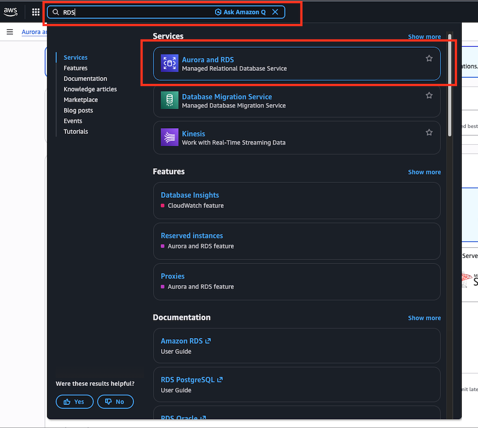

- Bước 2: Chọn full configuration -> engin chọn MySQl, các options khác chọn như hình.
    
    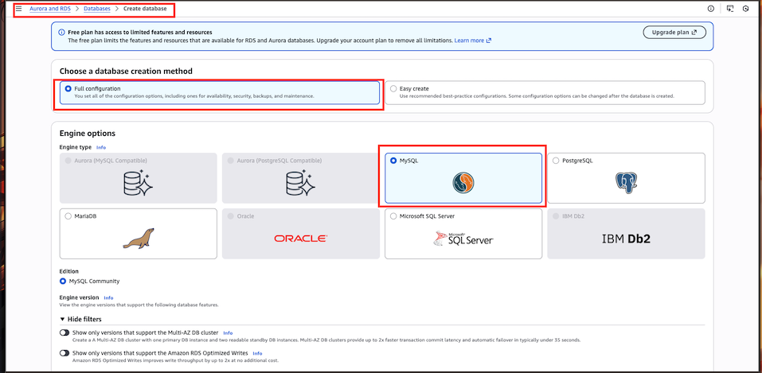
    
    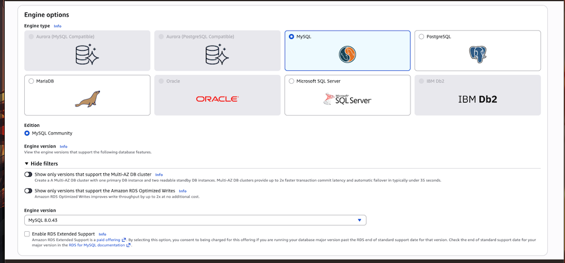

- Bước 3: Chọn Free Tier để không bị tính phí server hàng tháng.

    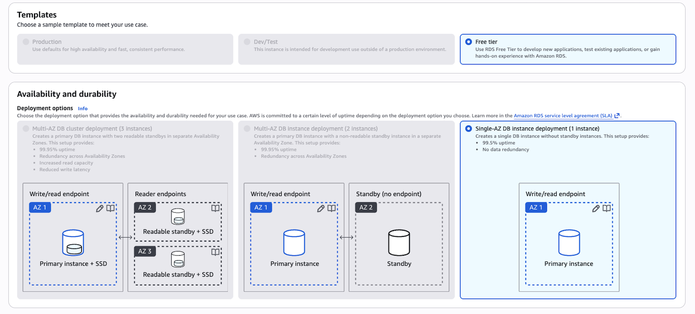

- Bước 4: Điền các thông tin về Data base 
  
    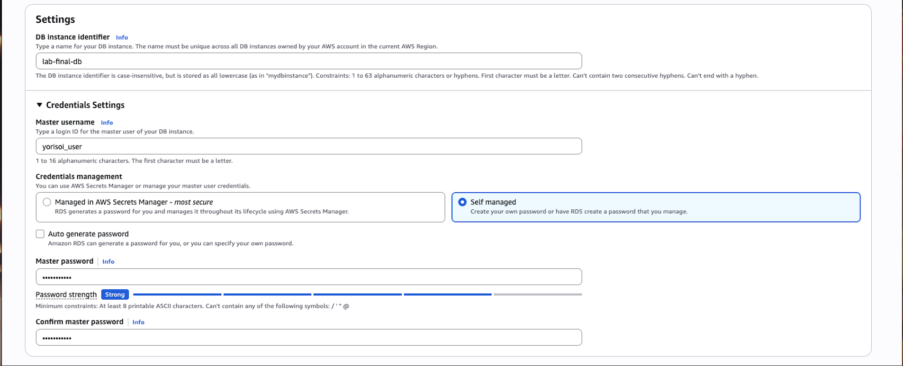

  - `DB instance Identifier` viết vào tên db, đây sẽ là tên db được quản lý bởi AWS RDS, nó không liên quan gì đến DB của phần service BE.
  - `Master username`: Tương ứng với biến DB_USERNAME (tên db mà backend sẽ tương tác đến).
  - `Master password:` Tương ứng với biến DB_USERNAME (mật khẩu của db).

- Bước 5: Cấu hình về hệ thống máy chủ cho DB, lựa chọn như trong ảnh

   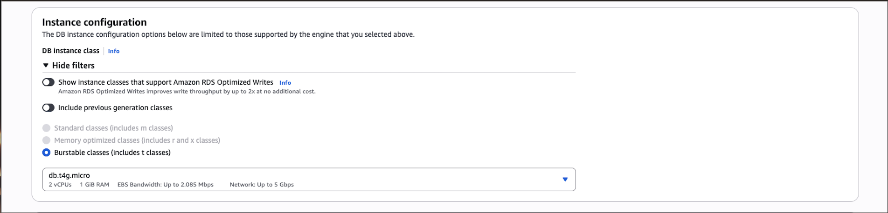

- Bước 6: Cấu hình khả năng lưu trữ của DB
  
    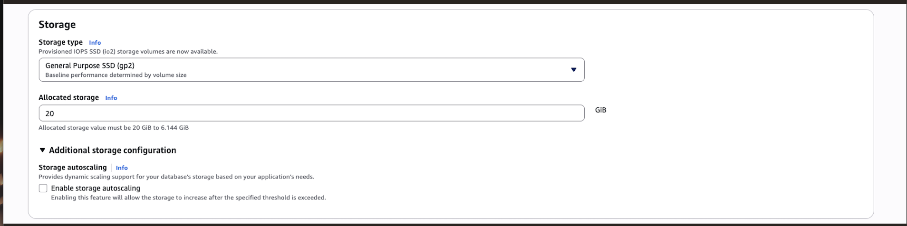

  - `Storage type`: loại ổ đĩa vật lý sẽ lưu trữ dữ liệu.
    - `General Purpose SSD (gp2/gp3)`: Đây là lựa chọn phổ biến nhất, cân bằng giữa chi phí và hiệu năng. Nó phù hợp cho hầu hết các ứng dụng web, môi trường phát triển (Dev/Test).
      (Lưu ý: Hiệu năng (IOPS) của gp2 tỉ lệ thuận với dung lượng ổ đĩa. Ổ càng lớn thì tốc độ đọc/ghi càng nhanh.)
    - Provisioned IOPS SSD (io1/io2): (Được nhắc đến trong dòng chữ nhỏ phía trên). Loại này dành cho các ứng dụng cực kỳ quan trọng, yêu cầu tốc độ đọc/ghi (I/O) rất cao và ổn định, không phụ thuộc vào dung lượng ổ đĩa. Tuy nhiên, chi phí rất đắt.
    - Magnetic: Loại ổ cứng cũ (HDD), tốc độ chậm, hiện nay ít khi được dùng trừ khi bạn muốn tối ưu chi phí tối đa cho các dữ liệu ít truy cập.
  - `Allocated storage`: Dung lượng lưu trữ cấp phát.
    - Đơn vị: GiB (Gibibyte).
    - Giới hạn: 20 GiB đến 6.144 GiB (chọn 20GB để tối ưu chi phí).
    - Chỉ có thể tăng dung lượng bộ nhớ, chứ không thể giảm.
  - `Storage autoscaling`: Tự động mở rộng lưu trữ.
    - Cơ chế: Nếu bạn tích vào ô Enable storage autoscaling, khi dung lượng sắp hết, AWS sẽ tự động mua thêm ổ cứng và cộng dồn vào cho bạn mà không cần phải dừng database (downtime).
    - Lợi ích: Giúp bạn yên tâm không phải canh chừng dung lượng mỗi ngày và chỉ phải trả tiền cho phần dung lượng tăng thêm khi thực sự cần dùng đến.
      (Nhưng trong bài lab này ta sẽ không tích)

- Bước 7: Connectivity
  
   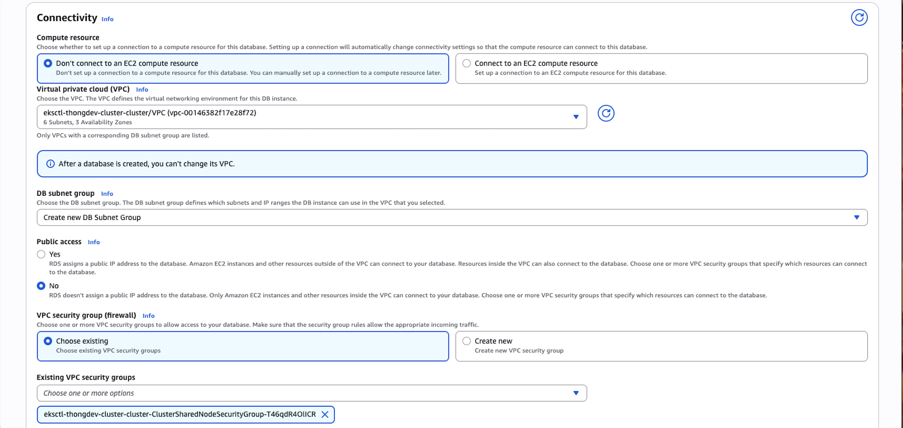
   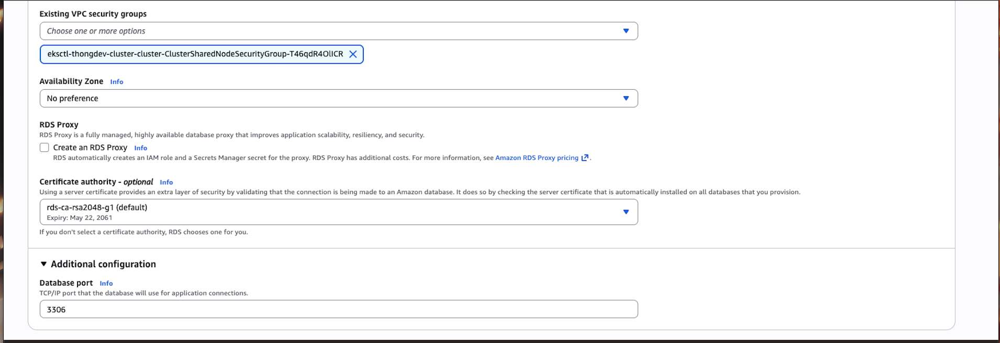

   - `Compute resource`: Tài nguyên tính toán. Đây là tính năng giúp AWS tự động cấu hình mạng nếu bạn đã có sẵn một máy chủ EC2 muốn kết nối tới database này.
      - Don’t connect to an EC2 compute resource: Bạn sẽ tự cấu hình kết nối thủ công sau. Đây là lựa chọn phổ biến nếu bạn chưa rõ máy chủ nào sẽ dùng database này.
      - Connect to an EC2 compute resource: Nếu bạn chọn mục này và chọn một instance EC2 có sẵn, AWS sẽ tự động thiết lập Security Group để EC2 đó có thể truy cập thẳng vào RDS mà bạn không cần chỉnh tay.
   - `Virtual private cloud (VPC)`: Đây là "mạng ảo" riêng biệt trên đám mây của bạn.
     - Database của bạn phải nằm trong một VPC cụ thể.
     - Lưu ý quan trọng: Như dòng cảnh báo màu xanh trong ảnh, sau khi tạo database, bạn không thể thay đổi VPC. Nếu chọn sai, bạn sẽ phải tạo lại database mới hoặc dùng các biện pháp di trú phức tạp.
   - `DB subnet group`: Một Subnet Group là tập hợp các dải mạng (subnets) trong VPC mà RDS có thể sử dụng.
     - Nó xác định các địa chỉ IP mà database có thể nhận.
     - Thông thường, bạn nên chọn hoặc để AWS tạo một Subnet Group bao phủ ít nhất 2 hoặc 3 Availability Zones (AZs) để đảm bảo tính dự phòng cao.
  - `Public access`: Truy cập công cộng.
    - No (Khuyến nghị): Database sẽ không có địa chỉ IP công cộng. Chỉ các dịch vụ nằm bên trong VPC (như EC2, Lambda của bạn) mới thấy được nó. Đây là cách an toàn nhất.
    - Yes: Database sẽ có IP công cộng. Bạn có thể dùng máy tính cá nhân ở nhà để kết nối trực tiếp vào database qua Internet. Rất nguy hiểm nếu bạn không cấu hình tường lửa (Security Group) kỹ càng.
  - `VPC security group`: Firewall
    - Choose existing: Chọn một nhóm bảo mật đã có sẵn (trong ảnh bạn đang chọn một group liên quan đến EKS - Kubernetes).
    - Create new: AWS sẽ tạo một nhóm mới và bạn phải vào đó để mở cổng (ví dụ cổng 3306 cho MySQL hoặc 5432 cho PostgreSQL) thì mới kết nối được.
  - `Existing VPC security groups`: Lựa chọn group có sẵn để cho phép các node trong cụm Kubernetes (EKS) của bạn truy cập vào.
  - `Certificate authority (Cơ quan chứng thực - CA)`: chứng chỉ số dùng để mã hóa kết nối SSL/TLS giữa ứng dụng và database.
    - rds-ca-rsa2048-g1 (Default): Đây là chứng chỉ tiêu chuẩn hiện nay. Nó đảm bảo dữ liệu truyền đi trên đường truyền được mã hóa, tránh bị nghe lén.
    - Lưu ý: Chứng chỉ có thời hạn (như trong ảnh là đến năm 2061). Bạn thường không cần thay đổi mục này trừ khi có yêu cầu bảo mật đặc biệt từ doanh nghiệp.
  - `Database port`: port của DB.
    - 3306: Đây là cổng mặc định của MySQL và MariaDB.
    - PostgreSQL, cổng mặc định sẽ là 5432.

- Bước 8: Lựa chọn phương thức authentication

  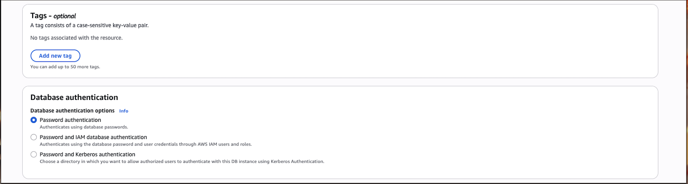

  - `Password authentication (Xác thực bằng mật khẩu)`: Đây là cách truyền thống và phổ biến nhất.
    - Sử dụng tên người dùng (username) và mật khẩu được lưu trữ trực tiếp trong chính cơ sở dữ liệu để đăng nhập.
  - Password and IAM database authentication (Xác thực bằng mật khẩu và IAM)
    - Cho phép bạn đăng nhập bằng mật khẩu database HOẶC sử dụng quyền từ AWS IAM (Identity and Access Management).
    - Ưu điểm: Bạn không cần quản lý mật khẩu trong code ứng dụng; thay vào đó, bạn dùng các "token" tạm thời được cấp bởi AWS. Cách này bảo mật hơn và dễ quản lý quyền truy cập tập trung.
  - Password and Kerberos authentication (Xác thực bằng mật khẩu và Kerberos)
    - Sử dụng giao thức Kerberos (thường đi kèm với Microsoft Active Directory) để xác thực người dùng.
    - Khi nào dùng: Thường dùng trong các doanh nghiệp lớn đã có sẵn hệ thống quản lý người dùng tập trung (như Windows Domain) và muốn đồng bộ tài khoản đó để đăng nhập vào database.
  
- Bước 9: Monitoring theo dõi "sức khỏe" và hiệu năng của database

  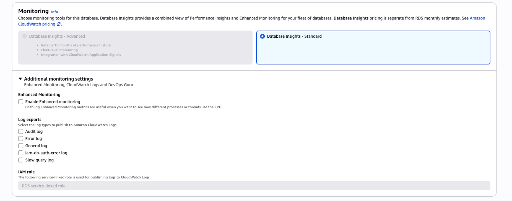

  - `Database Insights (Thông tin chuyên sâu)`: tính năng mới của AWS giúp kết hợp dữ liệu từ nhiều nguồn để bạn có cái nhìn tổng thể về hiệu suất.
    - Standard (Mặc định): Cung cấp các số liệu cơ bản về hiệu suất.
    - Advanced (Nâng cao): (Hiện đang bị mờ trong ảnh của bạn) Cho phép lưu trữ lịch sử hiệu suất lên đến 15 tháng, giám sát ở cấp độ toàn bộ cụm (fleet) và tích hợp sâu với CloudWatch Application Signals.
  - `Enhanced Monitoring (Giám sát nâng cao)`
    - Chức năng: Nó thu thập dữ liệu trực tiếp từ một "agent" chạy trên instance thay vì chỉ lấy từ hypervisor.
    - Lợi ích: Bạn có thể xem chi tiết cách các tiến trình (processes) hoặc luồng (threads) đang sử dụng CPU như thế nào. Nó cung cấp độ phân giải dữ liệu cao hơn (tới mức 1 giây một lần), giúp tìm ra nguyên nhân chính xác khi DB bị chậm đột ngột.
  - `Log exports (Xuất nhật ký)`: cho phép bạn đẩy các loại file log của database sang Amazon CloudWatch Logs để lưu trữ lâu dài và thiết lập cảnh báo
    - Audit log: Nhật ký kiểm tra (ai đã truy cập, thực hiện lệnh gì).
    - Error log: Các lỗi phát sinh trong quá trình vận hành database.
    - General log: Ghi lại mọi câu lệnh SQL thực thi (thường gây tốn tài nguyên, chỉ nên bật khi cần debug).
    - iam-db-auth-error log: Lỗi liên quan đến xác thực bằng quyền IAM.
    - Slow query log: (Rất quan trọng) Ghi lại các câu lệnh SQL chạy quá lâu, giúp bạn tối ưu hóa query và index.
  - Nếu là môi trường Production (vận hành thật): Nên bật Slow query log và Enhanced Monitoring để dễ dàng xử lý sự cố khi hệ thống bị treo hoặc chậm.
  - Nếu là môi trường Test/Dev: Có thể để mặc định như trong ảnh để tiết kiệm chi phí (vì CloudWatch Logs và Enhanced Monitoring sẽ tính phí riêng).

- Bước 10: Addition config
  
  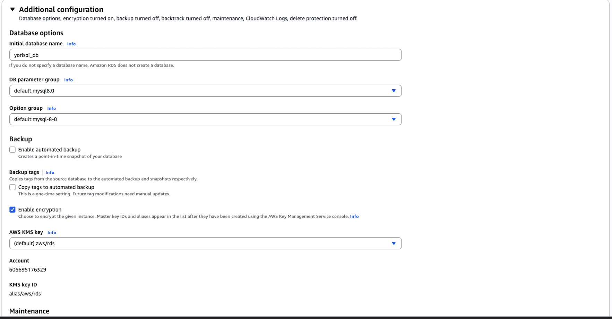
  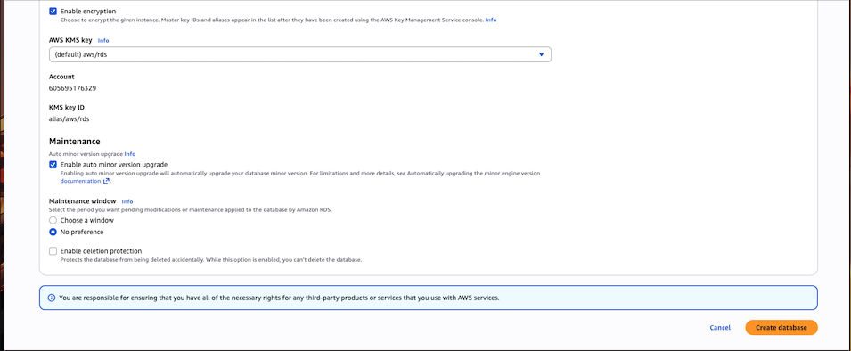

 - Chứa các cài đặt chuyên sâu về tên cơ sở dữ liệu, tham số hệ thống, sao lưu và bảo mật.
 - `Database options (Tùy chọn cơ sở dữ liệu)`
   - Initial database name: Đây là tên của database (lược đồ) đầu tiên được tạo ra ngay khi instance khởi chạy. Trong ảnh, bạn đang đặt là yorisoi_db. Nếu bạn để trống, AWS sẽ chỉ tạo server (instance) trống mà không có database bên trong.
   - DB parameter group: Một tập hợp các cấu hình engine (như bộ nhớ đệm, định dạng thời gian, encoding...). Trong ảnh đang dùng bản mặc định cho MySQL 8.0. Nếu muốn chỉnh sửa các biến hệ thống (ví dụ: max_connections), bạn phải tạo một group mới thay vì dùng bản default.
   - Option group: Dùng để bật các tính năng bổ sung của engine (ví dụ: plugin hỗ trợ hoặc các tính năng bảo mật đặc thù). Thường thì cấu hình mặc định là đủ cho hầu hết nhu cầu cơ bản.
 - `Backup`
   - Enable automated backup: Nếu tích chọn, AWS sẽ tự động tạo bản sao lưu (snapshot) hàng ngày cho database của bạn trong một "khung giờ sao lưu" nhất định. Điều này cho phép bạn khôi phục dữ liệu về bất kỳ thời điểm nào trong quá khứ (Point-in-time recovery).
   - Copy tags to automated backup: Nếu bạn có gắn thẻ (tags) cho database (ví dụ: Environment: Production), tùy chọn này giúp các bản sao lưu cũng sẽ có các thẻ tương tự, giúp việc quản lý chi phí và tài nguyên dễ dàng hơn.
 - `Encryption (Mã hóa)`
   - Enable encryption: (Đang được chọn trong ảnh) Đây là tính năng mã hóa dữ liệu "tĩnh" (Data at rest). Toàn bộ dữ liệu lưu trữ trên ổ đĩa, bản sao lưu và log đều sẽ được mã hóa để đảm bảo an toàn.
   - AWS KMS key: Đây là chìa khóa dùng để mã hóa. Bạn đang dùng khóa mặc định của AWS ((default) aws/rds). Bạn cũng có thể tự tạo khóa riêng trong dịch vụ KMS để có quyền kiểm soát việc thu hồi hoặc quản lý khóa chặt chẽ hơn.
   - Việc bật Encryption (Mã hóa) thường chỉ thực hiện được ngay khi tạo. Bạn không thể tắt hoặc bật mã hóa sau khi instance đã được tạo xong mà không phải tạo một instance mới từ bản backup.
 - `Maintenance`
   - Cho phép bạn chọn Maintenance window (Khung giờ bảo trì). AWS sẽ dùng khoảng thời gian này để thực hiện các việc như nâng cấp phiên bản hệ điều hành hoặc vá lỗi bảo mật định kỳ cho server của bạn.
