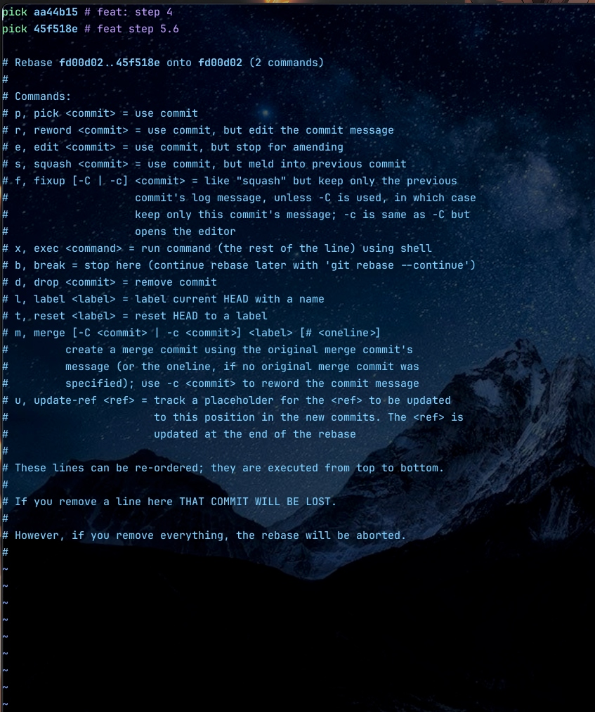

# Git Merge vs Git Rebase: Hướng Dẫn Chi Tiết & Auto-Squash

Trong Git, khi bạn muốn kết hợp code từ nhánh feature vào nhánh chính (main), hai lựa chọn phổ biến nhất là **Merge** và **Rebase**. Mặc dù mục đích cuối cùng giống nhau, nhưng cách chúng xử lý lịch sử commit lại hoàn toàn khác biệt.

Bài viết này sẽ giúp bạn hiểu rõ bản chất, sự khác biệt về commit order, và đặc biệt là kỹ thuật **Interactive Rebase** kèm theo "bí kíp" Auto-Squash cực tiện lợi.

---

## 1. Git Merge

**Git Merge** là cách an toàn và phổ biến nhất để tích hợp code. Nó tạo ra một "Merge Commit" mới, đóng vai trò là điểm giao nhau của hai nhánh.

### Đặc điểm:
*   **Non-destructive**: Không thay đổi lịch sử cũ.
*   **Traceability**: Giữ nguyên thông tin thời gian thực của branch feature.
*   **Graph Structure**: Tạo ra cấu trúc hình thoi (diamond shape) trong lịch sử Git.

### Minh họa Quy trình Merge
*(Sơ đồ bên dưới minh họa hai nhánh nhập lại làm một thông qua Merge Commit `M`)*


### Ưu/Nhược điểm:
*   ✅ **Ưu điểm**: Dễ dùng, bảo toàn lịch sử gốc.
*   ❌ **Nhược điểm**: Nếu merge quá nhiều, lịch sử branch sẽ trở nên rối rắm (spaghetti history) với hàng tá đường kẻ chằng chịt.

> **Mẹo**: Bạn có thể dùng lệnh `git log --oneline --graph` để xem rõ cấu trúc rẽ nhánh và thứ tự danh sách commit sau khi merge. Còn muốn xem thứ tự commit theo thời gian thì bỏ flag `--graph` đi 

---

## 2. Git Rebase

**Git Rebase** hoạt động theo nguyên tắc: "Mang toàn bộ commit của nhánh mình, đặt lên đầu ngọn của nhánh khác".

### Đặc điểm:
*   **Linear History**: Lịch sử trở thành một đường thẳng tắp, không còn nhánh rẽ.
*   **Rewritten History**: Git thực chất **tạo ra các commit mới** (có mã hash mới) với nội dung code tương tự, nhưng base (gốc) đã thay đổi.

### Minh họa Quy trình Rebase
*(Sơ đồ bên dưới minh họa việc "nhấc" các commit F1, F2 từ nhánh cũ và đặt nối tiếp vào sau C4 của nhánh Main)*



### Ưu/Nhược điểm:
*   ✅ **Ưu điểm**: Lịch sử cực kỳ sạch sẽ, dễ nhìn, dễ debug (git bisect).
*   ❌ **Nhược điểm**: **Nguy hiểm** nếu dùng trên branch đã push public (shared branch) vì nó thay đổi Hash ID của commit, gây conflict cho người khác.

---

## 3. So Sánh Commit Order (Thứ tự Commit)

Sự khác biệt lớn nhất nằm ở thứ tự thời gian trong lịch log:

| Tiêu chí | Git Merge | Git Rebase |
| :--- | :--- | :--- |
| **Cấu trúc** | **Phi tuyến tính** (Có rẽ nhánh) | **Tuyến tính** (Thẳng hàng) |
| **Thứ tự Commit** | **Chronological** (Theo thời gian thực). Commit của feature có thể nằm xen kẽ commit của main. | **Linear Sequence**. Toàn bộ commit của feature sẽ nằm **SAU** commit mới nhất của main, bất kể feature code thực tế được viết trước đó. |
| **Dấu vết** | Rõ ràng là code này đến từ feature nào (nhờ Merge Commit). | Khó biết code này từng thuộc feature nào (trông như code mới viết liền tù tì). |

---

## 4. Git Interactive Rebase (`-i`) & Squash

Rebase không chỉ dùng để cập nhật code mới, mà còn là công cụ mạnh mẽ để **dọn dẹp lịch sử** trước khi merge. Đó là `git rebase -i` (Interactive).

### Cú pháp lệnh

Bạn có thể chọn mốc để bắt đầu sửa đổi bằng cách dùng tham chiếu `HEAD` hoặc mã Hash cụ thể:

*   **Dùng HEAD**: `git rebase -i HEAD~3` (Sửa 3 commit gần nhất).
*   **Dùng Hash**: `git rebase -i <parent-hash>`
    > **Lưu ý**: `<parent-hash>` phải là mã hash của **commit cha** (liền trước) của commit bạn muốn bắt đầu sửa. Ví dụ, nếu muốn sửa commit `C`, bạn phải chọn hash của `B`.

### Giao diện Interactive Rebase

Khi chạy lệnh, một trình soạn thảo sẽ hiện ra liệt kê các commit:



**Quy tắc quan trọng cần nhớ**:
1.  **Thứ tự hiển thị**: Danh sách commit được sắp xếp theo thời gian **tăng dần** (Oldest -> Newest). Commit cũ nhất nằm trên cùng, commit mới nhất nằm dưới đáy. Điều này ngược với lệnh `git log` thông thường (mới nhất ở trên).
2.  **Các lệnh thao tác**:
    *   `pick`: Giữ nguyên commit.
    *   `reword` (r): Giữ commit nhưng sửa lại message.
    *   `edit` (e): Dừng lại để sửa code trong commit đó.
    *   `squash` (s): Gộp commit này vào commit phía trước nó (dòng ở trên).
    *   `fixup` (f): Giống squash nhưng bỏ message.
    *   `drop` (d): Xóa luôn commit.

### Mẹo nhanh: Sửa commit mới nhất

- Nếu bạn chỉ muốn sửa message hoặc thêm file vào commit **mới nhất** (trên cùng), bạn không cần dùng rebase phức tạp mà hãy dùng:

    ```bash
    git commit --amend -m "Message mới"
    # Hoặc chỉ git commit --amend để mở editor sửa message
    ```
    *(Lệnh này cũng có thể dùng để sửa code: bạn `git add` file còn thiếu (hoặc sử dụng với trường hợp không có file thay đổi vẫn được) rồi chạy lệnh trên. Lưu ý nó cũng thay đổi Hash ID, nên quy tắc an toàn vẫn áp dụng như Rebase).*

### ⚠️ Cảnh báo quan trọng
- Chỉ thực hiện rebase, squash, hay amend trên **nhánh riêng (local branch)** của bạn. Nếu bạn sửa lịch sử trên nhánh chung (shared branch) mà người khác đang pull về, bạn sẽ gây ra xung đột nghiêm trọng cho cả team.

---

## 5. Kỹ Thuật "Lười": Autosquash (`fixup=reword`)

Đây là một kỹ năng nâng cao giúp bạn sửa commit cũ cực nhanh mà không cần thao tác thủ công nhiều trong màn hình interactive.

**Tình huống**: Bạn phát hiện commit cũ `abc1234` bị sai typo message hoặc thiếu code, nhưng bạn lười mò mẫm trong `git rebase -i` để tìm dòng đó và sửa thủ công.

### Bước 1: Tạo commit sửa đổi (Fixup)

Giả sử commit cần sửa có hash là `abc1234`. Bạn chạy:

```bash
git commit --fixup=reword:abc1234
```

*   Git sẽ mở editor ngay lập tức cho bạn nhập message mới (nếu dùng `reword`).
*   Sau khi lưu, Git tạo ra một commit tạm có tên dạng `amend! ...` hoặc `fixup! ...`.

### Bước 2: Chạy Autosquash

Chạy lệnh rebase với cờ `--autosquash`:

```bash
git rebase -i --autosquash abc1234^
```
*(Dấu `^` nghĩa là lấy commit cha của `abc1234` làm mốc để bắt đầu rebase)*

**Kết quả kỳ diệu**:
*   Git **tự động** sắp xếp các commit `fixup!`/`amend!` nằm ngay bên dưới commit gốc `abc1234`.
*   Git **tự động** chuyển action từ `pick` sang `fixup` hoặc `reword` tương ứng.
*   Bạn chỉ cần kiểm tra và save, không cần cut-paste hay chỉnh sửa gì thêm.

### ⚠️ Lưu Ý Sống Còn

Vì Rebase (và Squash/Fixup) là hành động **viết lại lịch sử** (thay đổi nội dung và mã Hash cũ):

1.  **Chỉ làm trên local branch** hoặc branch cá nhân của riêng bạn.
2.  **Tuyệt đối KHÔNG** làm khi branch đó đang được người khác dùng chung (Shared Branch).
3.  Sau khi Rebase xong, bạn bắt buộc phải **force push** để cập nhật lên server:

```bash
git push --force-with-lease
```
*(Dùng `--force-with-lease` an toàn hơn `--force` vì nó sẽ chặn bạn lại phản nếu có ai đó vừa đẩy code mới lên mà bạn chưa biết).*
