# [Authentication Series - Part 2] Refresh Token Rotation - Gài bẫy Hacker và xử lý lỗi Logout oan (Race Condition).

Chào mừng quay trở lại với Serie Authentication.

Ở **[Phần 1](./part_1.md)**, chúng ta đã thống nhất mô hình tiêu chuẩn: **Access Token** (ngắn hạn, lưu RAM) kết hợp với **Refresh Token** (dài hạn, lưu HttpOnly Cookie). Đây là nền tảng vững chắc giúp cân bằng giữa trải nghiệm người dùng và bảo mật.

Tuy nhiên, mô hình cơ bản này vẫn tồn tại một "gót chân Achilles": **Nếu Hacker đánh cắp được Refresh Token (dù nó nằm trong Cookie), hắn có thể âm thầm gia hạn và duy trì quyền truy cập tài khoản của bạn trong suốt 30 ngày (hoặc hơn).**

Làm sao để phát hiện và chặn đứng điều này khi Server là Stateless? Câu trả lời nằm ở kỹ thuật **Refresh Token Rotation**. Nhưng "hiện đại thì hại điện", kỹ thuật này lại sinh ra một lỗi cực kỳ khó chịu: **Race Condition** (Hiệu ứng logout oan).

Bài viết này sẽ giúp bạn giải quyết triệt để cả hai vấn đề trên.

---

## I. Refresh Token Rotation: Dùng một lần rồi vứt

### 1. Vấn đề của Refresh Token tĩnh
Trong mô hình cũ, Refresh Token (RT) giống như một chiếc thẻ từ ra vào tòa nhà. Bạn được cấp 1 cái, và dùng đi dùng lại nó trong 30 ngày. Nếu kẻ trộm lấy được thẻ, hắn cứ thế đi ra đi vào mà bảo vệ không hề hay biết.

### 2. Giải pháp: Token Rotation (Xoay vòng)
Chúng ta thay đổi luật chơi: **Mỗi Refresh Token chỉ được sử dụng DUY NHẤT 1 LẦN.**

**Quy trình:**
1.  Client gửi `RT_Old` lên Server để xin cấp mới.
2.  Server kiểm tra `RT_Old`. Nếu hợp lệ:
    *   Hủy (Revoke) `RT_Old` ngay lập tức.
    *   Cấp `AT_New` và `RT_New`.
3.  Client lưu `RT_New` để dùng cho lần sau.

---

## II. Cơ chế "Bẫy Hacker": Reuse Detection

Tại sao Rotation lại bảo mật hơn? Vì nó cho phép chúng ta phát hiện hành vi trộm cắp thông qua cơ chế **Reuse Detection** (Phát hiện tái sử dụng).

Hãy tưởng tượng kịch bản sau:
*   **Bình thường:** Bạn có `RT_1` trong máy.
*   **Bị hack:** Hacker cài virus/XSS, trộm được `RT_1`. Lúc này cả Bạn và Hacker đều cầm `RT_1`.

Cuộc đua bắt đầu. Vì `RT_1` chỉ dùng được 1 lần, ai dùng trước người đó thắng, nhưng kẻ đến sau sẽ kích hoạt "bom nguyên tử".

### Kịch bản A: Hacker nhanh tay hơn

1.  Hacker gửi `RT_1` đổi lấy `RT_2`. Server hủy `RT_1`. Hacker đăng nhập thành công.
2.  Bạn (User thật) giờ mới gửi `RT_1` lên Server.
3.  **BÁO ĐỘNG ĐỎ (Reuse Detection):** Server thấy `RT_1` đã bị hủy (revoked) mà vẫn có người mang tới dùng.
4.  **Suy luận:** *"Chắc chắn token đã bị clone! Ta không biết ai là chủ thật, ai là kẻ gian."*
5.  **Hành động:** Server kích hoạt cơ chế tự vệ -> **Xóa toàn bộ chuỗi token (Family)** của user này (bao gồm cả `RT_2` mà Hacker đang cầm).
6.  **Kết quả:** Hacker đang hí hửng dùng `RT_2` thì bị đá văng ra ngay lập tức ở request tiếp theo. Bạn cũng bị logout, nhưng tài khoản được an toàn.

> [!TIP]
> **UX Tip:** Khi tình huống này xảy ra, đừng chỉ báo lỗi chung chung. Hãy cảnh báo User: *"Phát hiện bất thường bảo mật. Phiên đăng nhập đã bị hủy để bảo vệ tài khoản của bạn. Vui lòng đổi mật khẩu ngay lập tức."*

### Kịch bản B: Bạn nhanh tay hơn

   

1.  Bạn dùng `RT_1` đổi lấy `RT_2`. Server hủy `RT_1`.
2.  Hacker dùng `RT_1`.
3.  **BÁO ĐỘNG ĐỎ:** Server thấy `RT_1` bị dùng lại -> Xóa sạch toàn bộ token (bao gồm `RT_2` của bạn).
4.  **Kết quả:** Cả hai cùng "chết chùm". Hacker bị chặn đứng vĩnh viễn.

---

## II.b. Mở rộng: Các lớp phòng thủ bổ sung (Anomaly Detection)

Ngoài Rotation, chúng ta có thể phát hiện Access Token hoặc Refresh Token bị hack dựa trên sự thay đổi bất thường của ngữ cảnh (Context). Kỹ thuật này gọi là **Fingerprinting**.

### 1. Kiểm tra IP & User-Agent (Thiết bị)
Khi cấp phát Token, Server sẽ lưu lại "dấu vân tay" của thiết bị vào Database (bảng `refresh_tokens`).
*   **Dấu vân tay:** IP Address + User-Agent (Trình duyệt/Hệ điều hành).

**Luồng kiểm tra:**
 user dùng `RT` để gửi request. Server so sánh IP/User-Agent hiện tại với IP/User-Agent lúc cấp phát `RT`.

**Phát hiện:**
*   **User-Agent thay đổi:** Đang dùng Chrome trên Windows tự nhiên chuyển sang Safari trên iPhone? -> **99% là Hack**. Block ngay.
*   **IP thay đổi:** Đang ở IP Hà Nội, 1 giây sau thấy IP ở New York? -> **Impossible Travel** (Di chuyển bất khả thi). Block ngay.

### 2. Ví dụ thực tế: Cơ chế của Facebook / Google
Các ông lớn này áp dụng "Challenge Flow" khi nghi ngờ Token bị lộ hoặc có đăng nhập lạ.

*   **Tình huống:** Hacker trộm Token và dùng nó ở một địa chỉ IP lạ.
*   **Hệ thống phản ứng:**
    *  Tạm thời khóa quyền truy cập của Token này (dù Token vẫn còn hạn và đúng chữ ký).
    *  Gửi Email/Notification cho chủ tài khoản: *"Chúng tôi phát hiện hoạt động đăng nhập bất thường từ thiết bị lạ gần Bắc Kinh, Trung Quốc."*
    *  **Yêu cầu xác nhận:**
        *   Nếu User bấm "Đây là tôi": Server whitelist IP mới và cho phép Token hoạt động tiếp.
        *   Nếu User bấm "Không phải tôi": Server lập tức hủy toàn bộ Token, bắt đổi mật khẩu và đá Hacker ra.

> [!IMPORTANT]
> **Lưu ý triển khai:** Với IP, hãy cẩn thận vì người dùng di động (4G) thay đổi IP liên tục. Nên dùng logic check GeoIP (Vị trí địa lý) thay vì check khớp chuỗi IP chính xác 100% để tránh Block nhầm User thật.

---

## III. Vấn đề kỹ thuật: Race Condition (Hiệu ứng "Logout Oan")

Rotation rất an toàn, nhưng nó gây ra một lỗi kinh điển cho Frontend Developer: **Race Condition**.

### 1. Mô tả lỗi
Giả sử trang Dashboard của bạn khi vừa load sẽ gọi song song 2 API: `getUserProfile()` và `getNotifications()`.

1.  Access Token hết hạn. Cả 2 API cùng lúc trả về lỗi **401 Unauthorized**.
2.  Frontend (nếu code interceptor không khéo) sẽ gửi **2 request /refresh gần như cùng lúc**, cả hai đều mang theo `RT_1`.
3.  **Request A** đến Server trước (tích tắc):
    *   Hợp lệ. Server đổi `RT_1` -> `RT_2`.
    *   `RT_1` bị đánh dấu là "Đã dùng" (Revoked).
4.  **Request B** đến Server sau (chậm 100ms):
    *   Vẫn mang theo `RT_1`.
    *   Server kiểm tra thấy `RT_1` đã revoked -> Kích hoạt **Reuse Detection**.
    *   Server nghĩ đây là Hacker -> Hủy toàn bộ token.

**Hậu quả:** User chính chủ, không làm gì sai, tự nhiên bị đá văng ra màn hình Login chỉ vì... mạng nhanh quá!

---

## IV. Giải pháp kỹ thuật phía Frontend (Client-side First)

Trước khi nhờ cậy đến Server, Frontend phải là "tuyến phòng thủ đầu tiên". Chúng ta có 2 chiến trường để xử lý việc này:

### A. Luồng Reactive (Hàng đợi - Queue)
*   **Xử lý bị động:** Đợi lỗi rồi mới sửa.
*   **Vấn đề:** Khi nhiều request cùng lúc gặp lỗi 401.
*   **Giải pháp:** Pattern **Promise Singleton**.

**Logic:**
1.  Request A bị 401 -> Đặt cờ `isRefreshing = true`. Gọi API refresh.
2.  Request B bị 401 -> Thấy `isRefreshing == true` -> Tạm dừng, nhảy vào hàng đợi (`failedQueue`).
3.  Khi Request A refresh xong -> Lấy token mới, quay lại giải phóng hàng đợi, thực thi lại Request B.

> [!IMPORTANT]
> **Client-side First:** Nếu Frontend làm tốt việc này, Server sẽ đỡ phải dùng đến Grace Period, giảm tải rất nhiều cho DB.

### B. Luồng Proactive (Chủ động phòng ngừa)
*   **Tối ưu trải nghiệm (UX Zero-Latency).**
*   Thay vì đợi token chết (lỗi 401) rồi mới đi cứu, tại sao chúng ta không gia hạn nó trước khi nó chết?

**Cơ chế:** Client cài một bộ đếm (Timer) hoặc kiểm tra thời gian hết hạn trước mỗi lần gửi request.

**Logic:**
1.  Decode Access Token để lấy `exp` (thời gian hết hạn).
2.  Nếu `(exp - now) < 5 phút` (Sắp hết hạn):
    *   Client tự động gọi API `/refresh` ngầm bên dưới (Silent Refresh).
    *   User vẫn đang lướt web bình thường mà không hề hay biết token đã được đổi mới.

**Kết quả:** User hầu như không bao giờ gặp lỗi 401, loading mượt mà, không có độ trễ khi refresh.

---

## V. Giải pháp kỹ thuật phía Backend: Grace Period (Thời gian ân hạn)

Dù Frontend có làm tốt đến đâu, vẫn có trường hợp ngoại lệ (ví dụ: User mở 2 tab trình duyệt cùng lúc). Lúc này, Server cần một "tấm lưới an toàn".

*   **Định nghĩa:** Là khoảng thời gian ngắn (ví dụ: 10 - 20 giây) tính từ lúc Token bị revoked, mà Server vẫn chấp nhận nó hợp lệ (hoặc xử lý nhẹ nhàng) thay vì coi là hành vi hack.

*   > [!NOTE]
    > **Security Note:** Thời gian này nên cấu hình càng ngắn càng tốt (thường 5-10s là đẹp). Nếu để quá dài, Hacker có thể tận dụng khe hở này.

### Luồng xử lý mới tại Server:

Khi nhận được một Refresh Token (`RT_Input`) đã bị revoked:
1.  **Kiểm tra:** `RT_Input` bị hủy cách đây bao lâu?
2.  **Nếu < 10 giây (Trong Grace Period):**
    *   Hiểu rằng: *"À, đây là do mạng lag hoặc gửi trùng request thôi."*
    *   **Hành động:** Trả về Access Token mới (nhưng không xoay vòng RT nữa, trả về lại RT hiện tại của chuỗi, hoặc chỉ cấp AT).
    *   **Quan trọng:** KHÔNG kích hoạt báo động đỏ.
3.  **Nếu > 10 giây:**
    *   Hiểu rằng: *"Token chết cả tiếng rồi mà giờ mới moi lên dùng? Chắc chắn là Hacker."*
    *   **Hành động:** Kích hoạt **Reuse Detection** -> Xóa sạch -> Logout.

---

## VI. Thiết kế Database (Database Schema)

Để hiện thực hóa logic trên, chúng ta không thể lưu Token kiểu key-value đơn giản được nữa. Cần một cấu trúc dữ liệu quan hệ chặt chẽ.

Dưới đây là thiết kế bảng `refresh_tokens` tiêu chuẩn:

| Tên trường | Kiểu dữ liệu | Ý nghĩa |
| :--- | :--- | :--- |
| `id` | UUID/BigInt | Khóa chính. |
| `token_hash` | String | Hash của chuỗi token (để bảo mật nếu DB bị lộ). |
| `user_id` | UUID | Token này thuộc về User nào? |
| `family_id` | UUID | **Cực kỳ quan trọng.** Định danh cho một chuỗi xoay vòng. `RT_1`, `RT_2`... đều chung 1 `family_id`. Xóa family này là xóa tất cả. |
| `user_agent` | String | **(Mới)** Lưu User-Agent lúc tạo token để đối chiếu. |
| `ip_address` | String | **(Mới)** Lưu IP lúc tạo token để check Impossible Travel. |
| `is_revoked` | Boolean | Trạng thái: Đã bị dùng hay chưa. |
| `expires_at` | Timestamp | Thời điểm hết hạn tuyệt đối (ví dụ 30 ngày). |
| `created_at` | Timestamp | Thời điểm tạo. |
| `revoked_at` | Timestamp | Thời điểm bị hủy (Dùng để tính Grace Period). |

### Vai trò của family_id
*   Khi User đăng nhập trên Chrome -> Server tạo `family_id`: **A**.
*   Khi User đăng nhập trên Mobile -> Server tạo `family_id`: **B**.
*   Nếu phát hiện hack trên Chrome -> Server xóa `family_id`: **A**.
*   **Kết quả:** User bị logout trên Chrome, nhưng Mobile vẫn dùng bình thường. Tránh ảnh hưởng dây chuyền không cần thiết.

---

## VII. Kiến trúc Nâng cao

Trong hệ thống Microservices, đừng để mỗi service tự lo việc này.
*   **Mô hình tốt nhất:** API Gateway hoặc một Auth Service riêng biệt sẽ đảm nhận việc verify Refresh Token và cấp Access Token.
*   Các Service con (Order, Product...) chỉ việc verify Access Token (Stateless).

Để nâng tầm hệ thống lên mức Enterprise/High-Scale, cần cân nhắc các yếu tố sau:
### A. Thu hồi Access Token tức thì (Blacklist)
*   **Vấn đề:** AT là `stateless`. Nếu User báo mất máy, làm sao xóa AT ngay lập tức mà không đợi 15 phút hết hạn?
*   **Giải pháp:** Sử dụng **Redis Blacklist**.
    *   Khi User logout/đổi pass: Lưu `jti` (JWT ID) của AT vào Redis với thời gian sống = thời gian còn lại của Token.
    *   Middleware check: Mỗi request đều check xem `jti` có nằm trong Redis Blacklist không.
    *   *Trade-off:* Hy sinh một chút tính "stateless" để lấy bảo mật cao hơn.

### B. Hiệu năng & Caching (Redis)
*   **Vấn đề:** Query SQL Database mỗi lần refresh token là gánh nặng lớn cho DB khi high traffic.
*   **Giải pháp:**
    *   Lưu metadata của Refresh Token (đặc biệt là `familyId`, `revokedAt`) lên Redis.
    *   Check logic Grace Period/Reuse Detection trên Redis (Tốc độ cực nhanh).
    *   Chỉ ghi xuống SQL Database (Async) để lưu trữ lâu dài.

### C. Mobile Native App (iOS/Android)
*   **Lưu ý:** Cơ chế Cookie trên Mobile App hoạt động khác trình duyệt và thường khó kiểm soát.
*   **Best Practice:**
    *   **Không dùng** LocalStorage hay Cookie.
    *   **Dùng Secure Storage:**
        *   iOS: **Keychain Services**.
        *   Android: **EncryptedSharedPreferences (Keystore)**.
    *   Các thư viện như `flutter_secure_storage` hay `react-native-keychain` giúp wrap các API này. Đây là nơi lưu trữ được mã hóa cấp hệ điều hành, an toàn hơn nhiều so với Web.

### D. Kiến trúc tối thượng: BFF (Backend For Frontend) - Zero Token Architecture
*Dành cho các hệ thống Tài chính/Ngân hàng yêu cầu bảo mật mức "Paranoid".*

Mô hình **Access Token** (RAM) + **Refresh Token** (HttpOnly Cookie) mà chúng ta vừa xây dựng đã đạt chuẩn bảo mật 99% cho hầu hết các ứng dụng thương mại.

Tuy nhiên, vẫn còn một câu hỏi: *"Liệu có cách nào để trình duyệt hoàn toàn không biết Access Token hay Refresh Token là cái gì không?"*

**Ý tưởng:**
*   **Client (Browser):** Chỉ giữ một `SessionID` vô hại. Hacker dù có XSS lục tung trình duyệt cũng không tìm thấy bất kỳ Token nào.
*   **BFF (Backend Node.js):** Đứng giữa, nhận `SessionID`, tra cứu Token thật trong Redis và thay mặt Client gọi API.

**Thực tế:** Đây là mô hình bảo mật cao nhất (**Zero Token on Client**), nhưng đi kèm với cái giá rất đắt về chi phí hạ tầng và độ trễ (Latency).

> *Khoan đã! Làm sao để setup một con server đứng giữa mà không làm chậm hệ thống? Làm sao map SessionID với JWT hiệu quả?*

Đây là một sự thay đổi hoàn toàn về tư duy kiến trúc (từ Stateless sang Stateful ở rìa). Chủ đề này quá lớn và phức tạp để gói gọn trong vài dòng.

👉 **Nếu bạn muốn vươn tới cảnh giới bảo mật cao nhất, hãy đón đọc bài viết tiếp theo (Extra): [Authentication Part 4] Kiến trúc BFF (Backend For Frontend) & Token Handler Pattern**

---

## VIII. Tổng kết

Qua hai phần đầu, chúng ta đã xây dựng được một kiến trúc xác thực đạt được sự cân bằng hoàn hảo:

1.  **UX Đỉnh cao:** Người dùng không bị gián đoạn, không thấy loading bất chợt nhờ chiến lược Proactive Refresh (Frontend) và Grace Period (Backend).
2.  **Bảo mật Tối đa:**
    *   **Chống XSS:** Bằng cách lưu Refresh Token trong HttpOnly Cookie.
    *   **Chống Trộm:** Bằng cơ chế Reuse Detection (Bẫy Hacker).
    *   **Chống Bất thường:** Bằng IP/User-Agent Fingerprinting.
    *   **Chống CSRF:** Bằng việc gửi Access Token qua Header.
3.  **Hiệu năng Tốt:** Giảm tải database nhờ Access Token (Stateless) và Client Queueing.

Lý thuyết đã đủ "chín". Nhưng từ lý thuyết đến code chạy được là cả một bầu trời khoảng cách. Làm sao để code logic Reuse Detection bằng Node.js? Làm sao cấu hình Redis để xử lý việc này tốc độ cao?

👉 **Đón đọc Phần 3: Thực chiến Code - Triển khai hệ thống Token Rotation với Docker & Node.js [tại đây](./part_3.md).**
