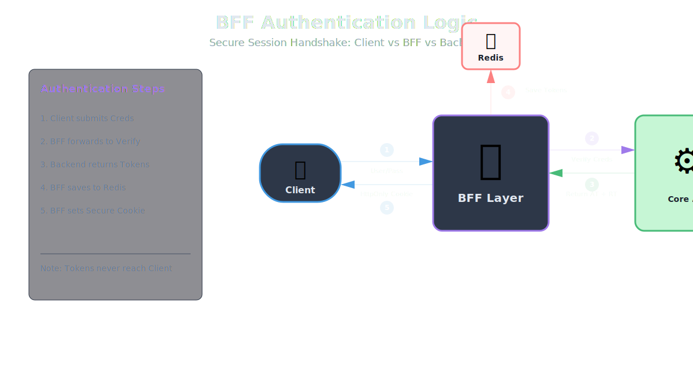
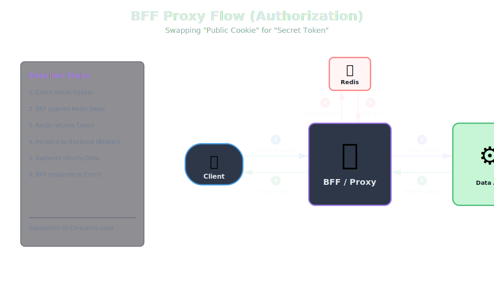
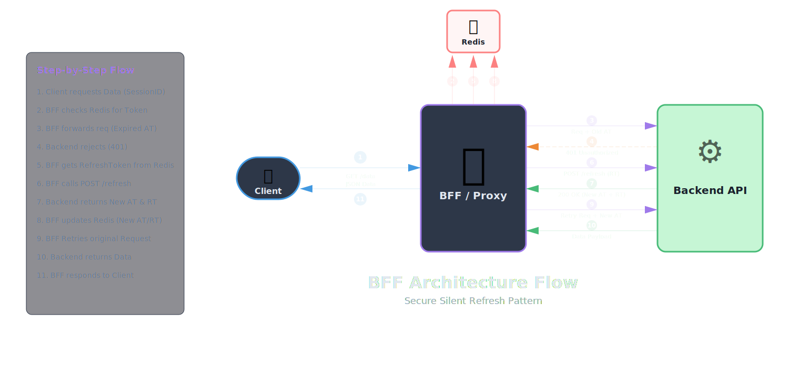

# [Authentication Part 4] BFF Pattern - Khi Browser hoàn toàn "mù tịt" về Token.

Trong bối cảnh bảo mật hiện đại, trình duyệt (Browser) được coi là môi trường không tin cậy (untrusted environment). Việc lưu trữ Access Token/Refresh Token nhạy cảm ngay tại LocalStorage hoặc SessionStorage của trình duyệt đang dần trở thành một lỗ hổng chí mạng trước các cuộc tấn công XSS (Cross-Site Scripting) và việc rò rỉ dữ liệu.

Mô hình Backend for Frontend (BFF) kết hợp với Token Handler Pattern ra đời để giải quyết triệt để vấn đề này bằng cách tuân thủ nguyên tắc: "Browser hoàn toàn mù tịt về Token".
---

## I. Tổng quan và Vấn đề Bảo mật

### 1. Tại sao mô hình cũ (Lưu Token ở Client) lại nguy hiểm?

Trước khi đi vào giải pháp BFF, ta cần nhìn lại các cách lưu trữ Token truyền thống mà đa số các Single Page Apps (SPA) thường dùng và điểm yếu của chúng:

#### Cách làm 1 (Lưu tất cả ở Storage - Phổ biến nhất)
Backend trả Access Token (AT) và Refresh Token (RT). Frontend lưu cả hai vào LocalStorage hoặc SessionStorage để tiện lấy ra dùng.

#### Cách làm 2 (Hybrid - Lưu RT ở Cookie)
Một số hệ thống cải tiến bằng cách lưu RT vào HttpOnly Cookie, còn AT vẫn lưu ở Memory hoặc LocalStorage để JavaScript có thể đọc và gắn vào Header.

#### Rủi ro (Critical)

*   **Nguy cơ XSS (Cross-Site Scripting):** Nếu hacker chèn được mã độc JS vào web:
    *   Ở Cách 1: Hacker vét sạch cả AT và RT -> Chiếm đoạt tài khoản vĩnh viễn.
    *   Ở Cách 2: Dù RT an toàn trong Cookie, nhưng AT vẫn bị lộ (do nằm trong Memory/Storage). Hacker vẫn có thể dùng AT đánh cắp được để rút tiền hoặc phá hoại trong thời gian AT còn hiệu lực (thường 5-15 phút).

*   **Nguy cơ CSRF:** Khi bắt đầu dùng Cookie cho RT (Cách 2), bạn phải đối mặt thêm với rủi ro CSRF nếu không cấu hình SameSite chặt chẽ.

**Kết luận:** Cả hai cách trên đều để lộ ít nhất một phần Token (thường là AT) cho môi trường JavaScript thiếu an toàn. Mô hình BFF khắc phục triệt để bằng cách không để bất kỳ Token nào (cả AT lẫn RT) tồn tại ở phía Client.

### 2. Kiến trúc BFF: "Vạn lý trường thành" bảo vệ Token

Trong mô hình này, BFF đóng vai trò như một **"Vệ sĩ" (Security Proxy)**. Trình duyệt (Browser) không còn quyền sở hữu Token nữa. Đây là chuẩn mực bảo mật cao nhất hiện nay cho các hệ thống Tài chính/Ngân hàng.

#### Các thành phần chính

1.  **Client (Browser):**
    *   Chỉ biết đến **SessionID** (một chuỗi ký tự ngẫu nhiên vô nghĩa).
    *   Lưu trữ trong **HttpOnly Cookie** (JavaScript không thể chạm vào).
    *   Không hề biết AT hay RT là gì.

2.  **BFF (Node.js/Next.js Server):**
    *   Đứng giữa Client và Backend API.
    *   Hoạt động như một Web Server kiêm Proxy.
    *   Quản lý phiên đăng nhập (Session Management).
    *   Thực hiện logic đổi SessionID lấy Token.

3.  **Redis (Session Store):**
    *   Nơi lưu trữ cặp khóa: `SessionID` -> `{Access Token, Refresh Token, UserProfile}`.

4.  **Backend API:**
    *   Chỉ làm việc với Access Token chuẩn (JWT).
    *   Không quan tâm SessionID là gì.

---

## II. Luồng hoạt động chi tiết (Flow)

Dưới đây là luồng đi của dữ liệu từ lúc đăng nhập đến khi gọi API và cơ chế tự động làm mới token.

### A. Giai đoạn Đăng nhập (Authentication)

   
1.  **Client:** Gửi username/password lên BFF.
2.  **BFF:** Chuyển tiếp (Forward) thông tin này đến Backend API để xác thực.
3.  **Backend API:** Xác thực thành công, trả về Access Token (AT) và Refresh Token (RT) cho BFF.
4.  **BFF (Xử lý quan trọng):**
    *   Tạo ra một **SessionID** ngẫu nhiên (ví dụ: UUID).
    *   Lưu vào Redis: `Key=SessionID, Value={AT, RT, UserProfile}`.
    *   Thiết lập Cookie cho phản hồi về Client với cấu hình bảo mật tối đa:
        *   Value: `SessionID`
        *   HttpOnly: `True` (JavaScript không thể đọc được).
        *   Secure: `True` (Chỉ gửi qua HTTPS).
        *   SameSite: `Strict` (Chống CSRF).
5.  **Client:** Nhận được Cookie và lưu vào trình duyệt (Browser tự động quản lý).

### B. Giai đoạn Gọi dữ liệu (Authorization)

    
1.  **Client:** Cần lấy danh sách tài khoản. Client gọi API lên BFF: `GET /api/proxy/accounts`. (Browser tự động đính kèm Cookie chứa SessionID).
2.  **BFF:**
    *   Nhận request, bóc tách Cookie để lấy `SessionID`.
    *   Tra cứu trong Redis: Tìm Token tương ứng với SessionID này.
    *   Nếu tìm thấy AT: BFF xóa Cookie khỏi header (để không lọt SessionID xuống backend), và tiêm (inject) Header mới: `Authorization: Bearer <Access_Token_Lay_Tu_Redis>`.
    *   Forward request đã "độ" lại này sang Backend API.
3.  **Backend API:** Nhận request có Token hợp lệ, xử lý và trả data về BFF.
4.  **BFF:** Trả data về cho Client.

### C. Giai đoạn Tự động làm mới Token (Silent Refresh) - Điểm "ăn tiền" nhất

Đây là nơi BFF tỏa sáng. Client không hề biết Token đã hết hạn.

   

1.  **BFF:** Dùng AT trong Redis gọi Backend API.
2.  **Backend API:** Trả về lỗi **401 Unauthorized** (do AT hết hạn).
3.  **BFF (Cơ chế Intercept):**
    *   Bắt lỗi 401 này (KHÔNG trả về Client ngay).
    *   Hiểu rằng: *"À, thằng này hết hạn vé rồi, mình phải đi đổi vé mới cho nó."*
    *   Lấy Refresh Token từ Redis.
    *   Gọi API "Refresh" của Backend để lấy cặp AT/RT mới.
    *   *Lưu ý: Nếu RT cũng hết hạn nốt -> Lúc này BFF mới chấp nhận trả lỗi 401 về Client để bắt user đăng nhập lại.*
4.  **Cập nhật:**
    *   Backend trả về cặp `New_AT` và `New_RT`.
    *   BFF lưu `New_AT` và `New_RT` đè vào Redis (vẫn giữ nguyên SessionID cũ).
5.  **Re-play request:** BFF dùng `New_AT` để thực hiện lại request ban đầu của người dùng.
6.  **Kết quả:** Client nhận được dữ liệu bình thường mà không hề biết bên dưới vừa xảy ra một cuộc "giải cứu" phiên đăng nhập.

---

## III. Phân tích Bảo mật & Đánh đổi

### Tại sao mô hình này là "Chuẩn mực"?

1.  **Chống XSS Tuyệt đối với Token:**
    *   Hacker chèn mã độc JS.
    *   Hacker chạy `document.cookie` -> Trả về rỗng (do HttpOnly).
    *   Hacker lục `localStorage` -> Rỗng.
    *   **Kết luận:** Hacker có thể phá giao diện, nhưng không thể đánh cắp được Session hay Token để mang sang máy khác.

2.  **Giảm thiểu bề mặt tấn công (Attack Surface):**
    *   Việc giữ AT/RT (chứa User ID, Role, Scope...) hoàn toàn ở Server (Redis + BFF) giúp che giấu cấu trúc bảo mật nội bộ.

3.  **Kiểm soát phiên tập trung (Centralized Session Control):**
    *   Nếu phát hiện hành vi bất thường, Admin chỉ cần xóa Key trong Redis. Ngay lập tức, SessionID phía Client trở nên vô hiệu.

### Lưu ý khi triển khai (Trade-offs)

1.  **Phức tạp hơn:** Phải duy trì hạ tầng Redis và viết logic Middleware phức tạp ở BFF (Node.js).
2.  **Độ trễ (Latency):** Mỗi request đều phải qua BFF -> Tra cứu Redis. Tuy nhiên, Redis rất nhanh (vài ms) nên không đáng kể.
3.  **Vấn đề Race Condition (Đua tranh):**
    *   Khi Client gửi 5 request cùng lúc đúng lúc Token hết hạn.
    *   BFF cần cơ chế Locking hoặc Promise Queue để đảm bảo chỉ có 1 request thực hiện refresh token, 4 request còn lại phải đợi, tránh việc gọi refresh nhiều lần gây lỗi logout oan ức.
4.  **Rủi ro CSRF:**
    *   Chuyển sang Cookie đồng nghĩa với việc mở ra rủi ro CSRF.
    *   **Bắt buộc:** Phải cấu hình Cookie `SameSite=Strict` hoặc `Lax`, và sử dụng thêm cơ chế kiểm tra `Origin`/`Referer` Header tại BFF.

---

## IV. So sánh BFF vs Mô hình Session Truyền thống

**Câu hỏi:** *"Nếu đã dùng session_id, thế nó khác gì với cách truyền thống server gửi session_id xuống?"*

**Trả lời:** Về mặt cơ chế kỹ thuật (Technical Mechanism), nó giống hệt nhau: Cả hai đều dùng Cookie HttpOnly + SessionID + Redis.
Tuy nhiên, sự khác biệt nằm ở **Kiến trúc hệ thống (Architecture)** và **Dữ liệu được lưu trữ (Stored Data)**.

### Bảng so sánh chi tiết

| Tiêu chí | Mô hình Truyền thống (Monolith Session) | Mô hình BFF (Token Handler Pattern) |
| :--- | :--- | :--- |
| **Kiến trúc** | Client <-> Server (Monolith) | Client <-> BFF <-> Backend API |
| **Dữ liệu trong Redis** | **Lưu trực tiếp State (Trạng thái) của User.**   VD: `SessionID -> { user_id: 1, cart: [...], email: "a@b.com" }` | **Lưu Credentials (Chìa khóa) để vào hệ thống khác.**   VD: `SessionID -> { access_token: "xyz...", refresh_token: "abc..." }` |
| **Cách xác thực** | Server tra Redis -> Lấy thông tin User -> Xử lý logic tại chỗ. | BFF tra Redis -> Lấy Token -> Thay thế SessionID bằng Token -> Gửi sang Backend. |
| **Tính chất Backend** | **Stateful**. Nếu có 10 Microservices, cả 10 đều phải kết nối vào Redis để check session. Phá vỡ nguyên tắc Stateless. | **Stateless**. Backend hoàn toàn không biết SessionID, không cần kết nối Redis của BFF. Chỉ verify chữ ký JWT. |
| **Tính đa nền tảng** | **Kém**. Backend phải hỗ trợ cả Session (cho Web) và Token (cho Mobile) -> Code bẩn. | **Tốt**. Backend chỉ hỗ trợ duy nhất JWT. Web hay Mobile đều được chuẩn hóa. |
| **Ví dụ hình tượng** | Cầm vé xe đưa cho bảo vệ -> Bảo vệ mở sổ xem -> Lấy xe đưa cho bạn. (Bảo vệ nắm quyền). | Cầm vé xe đưa cho Lễ tân (BFF) -> Lễ tân mở két lấy **Chìa khóa thật** -> Đưa chìa khóa cho Tài xế (Backend) lái xe ra. |

---

## V. Chiến lược cho Mobile App vs Web

**Câu hỏi:** *"Tại sao Mobile App lại dùng Token (JWT) trực tiếp lưu trong Keychain thay vì Cookie/Session? Lợi thế là gì?"*

Lợi thế nằm ở **Cơ chế vận hành (Mechanism)** và **Tính chất Backend**:

### Mobile App không phải là Trình duyệt
*   Trình duyệt có cơ chế "thần thánh" tự động quản lý Cookie. Mobile thì không (phải dùng thư viện giả lập CookieJar rất phức tạp, dễ lỗi).
*   Việc dùng Header `Authorization: Bearer` là "ngôn ngữ bản địa", tường minh và dễ kiểm soát trên Mobile.

### Khả năng hoạt động Offline & Thông minh (Stateless)
*   Mobile App có thể giải mã (decode) JWT ngay dưới máy (không cần mạng) để lấy thông tin: Tên, Role, Thời gian hết hạn (exp).
*   **Lợi ích:** App có thể tự hiển thị "Xin chào Tùng" hoặc tự chuyển màn hình Login nếu thấy exp đã qua mà chưa cần gọi API. UX mượt hơn hẳn SessionID (vốn là chuỗi vô nghĩa).

### Chia sẻ tài nguyên Cross-Domain
*   Token là chìa khóa vạn năng, không bị giới hạn bởi Domain như Cookie. App có thể cầm Token gọi sang server ảnh, server chat bên thứ 3 dễ dàng.

### Backend Stateless (Quan trọng cho Scaling)
*   Nếu lượng dùng Mobile tăng đột biến (ví dụ Flash Sale), Backend xử lý JWT (tính toán CPU) chịu tải tốt hơn nhiều so với việc phải lookup Session trong Redis liên tục (I/O).

### Tổng kết mô hình "Lợi cả đôi đường":
*   **Web:** Dùng Session/Cookie (qua BFF) -> Để tận dụng bảo mật HttpOnly chống XSS.
*   **Mobile:** Dùng Token (JWT) trực tiếp -> Để tận dụng tính linh hoạt, Native và Stateless.
*   **Backend:** Chỉ viết **MỘT** bộ logic xác thực duy nhất (Validate JWT).

---

## VI. Rủi ro Bảo mật & Phân biệt Client

### 1. Nếu lộ SessionID thì sao? Có khác gì lộ Token không?

Bạn đúng là "Chìa khóa nào cũng mở được cửa". Nhưng khác biệt ở **Khả năng bị lộ** và **Khả năng khắc phục**:

*   **Khả năng bị lộ:**
    *   Token (LocalStorage): Dễ bị lộ qua XSS.
    *   SessionID (HttpOnly Cookie): Khó bị lộ hơn nhiều vì JS không đọc được. Hacker chỉ có thể tấn công CSRF (dễ chặn).

*   **Khả năng thu hồi (Kill Switch):**
    *   Lộ Token: Rất khó thu hồi ngay lập tức (Stateless). Hacker dùng đến khi hết hạn.
    *   Lộ SessionID: Server chỉ cần xóa Key trong Redis. Kẻ trộm bị "đá văng" ngay lập tức.

*   **Ràng buộc thiết bị (Fingerprinting):**
    *   BFF có thể lưu `SessionID -> {IP, UserAgent}`. Nếu thấy SessionID đang dùng ở VN mà 1 giây sau request từ Mỹ -> Chặn luôn. (JWT khó làm việc này).

### 2. Làm sao Server phân biệt request từ Mobile hay Web?

Backend API thường được thiết kế để "mù" (agnostic), nhưng có thể phân biệt ở cổng vào:

*   **Cách 1 (Endpoint Login riêng):**
    *   `/auth/login-web`: Trả Cookie HttpOnly (Lưu Redis).
    *   `/auth/login-mobile`: Trả JSON Token (Mobile tự lưu Keychain).

*   **Cách 2 (Header):**
    *   Client gửi `X-Client-Type: mobile`.
    *   Server check: Nếu là mobile -> Trả Token. Nếu là web -> Set Cookie.

*   **Lúc gọi API Data:** Backend LUÔN LUÔN nhận được JWT (do Mobile gửi trực tiếp hoặc BFF chuyển tiếp).

---

## VII. Quy hoạch Tài nguyên (Sizing & Scaling)

**Câu hỏi:** *"Tại sao BFF chỉ cần 5-10 server Node.js trong khi có tới 100 Microservices?"*

Đây là bài toán về **Tính chất công việc (Workload Nature)**.

### 1. I/O Bound (BFF) vs. CPU Bound (Backend)

*   **BFF (Node.js):**
    *   **Nhiệm vụ:** Nhận request -> Tra Redis -> Chuyển tiếp -> Nhận kết quả -> Trả về.
    *   **Đặc điểm:** Chủ yếu là "Đứng chờ" (Waiting). Chờ Redis, chờ Backend. Tốn cực ít CPU.
    *   Node.js (Non-blocking I/O): Một server nhỏ có thể duy trì hàng chục nghìn kết nối đang "chờ" cùng lúc.

*   **Backend Microservices:**
    *   **Nhiệm vụ:** Tính toán giá, Hash password (rất nặng), Join nhiều bảng DB, Render PDF, Xử lý giao dịch...
    *   **Đặc điểm:** Tốn năng lực xử lý (Processing). Tốn CPU và RAM gấp trăm lần BFF.
    *   **Ví dụ thực tế:** BFF mất 0.5ms CPU để forward, Backend mất 50ms CPU để xử lý. -> Backend tốn sức gấp 100 lần.

### 2. Ví dụ so sánh: Sân bay

*   **BFF (5-10 server):** Là đội ngũ **Kiểm soát viên không lưu**. Họ chỉ ngồi tháp canh, cầm bộ đàm, điều phối máy bay. Công việc nhẹ nhàng về thể lực, chỉ cần nhanh tay.
*   **Microservices (100 server):** Là đội ngũ **Kỹ thuật viên, Bốc xếp, Tiếp nhiên liệu**. Họ phải bê vác hành lý, bơm xăng, sửa động cơ. Công việc cực kỳ nặng nhọc.

### 3. Ý nghĩa con số "100 Microservices"

*   **Đa dạng (Variety):** Hệ thống có 100 loại service (Order, Payment, User...), nhưng một request thường chỉ gọi 1 service. BFF là cổng chung nhưng tải được chia nhỏ.
*   **Quy mô (Scale):** 100 server backend là tổng cộng của nhiều team. BFF chỉ làm nhiệm vụ "chỉ đường". Chỉ đường cho 20 xe hay 100 xe thì công sức không tăng lên bao nhiêu.

**Nguyên tắc vàng:** BFF phải "Mỏng" (**Thin Layer**). Tuyệt đối không viết logic tính toán phức tạp (như xử lý ảnh, vòng lặp lớn) tại BFF, nếu không nó sẽ trở thành nút thắt cổ chai ngay lập tức.

---

## VIII. Kỹ thuật Xử lý Race Condition (Concurrency Control)

Đây là vấn đề "sống còn" khi triển khai BFF, đặc biệt khi Client gửi nhiều request song song (ví dụ: tải Dashboard gồm 5 widget cùng lúc) ngay thời điểm Token vừa hết hạn.

### 1. Kịch bản lỗi (The Problem Scenario)

Giả sử Backend có cơ chế **Refresh Token Rotation** (RT chỉ dùng được 1 lần, dùng xong hủy ngay để cấp cái mới).

1.  **Request A** đến BFF -> Check AT hết hạn -> Gọi Refresh Token (đang xử lý).
2.  **Request B** đến BFF (ngay sau A 1ms) -> Check AT hết hạn -> Cũng gọi Refresh Token.
3.  **Request C, D, E** đến BFF -> Cũng gọi Refresh Token.

**Kết quả:**
*   Backend nhận 5 yêu cầu Refresh với cùng 1 mã RT cũ.
*   Yêu cầu đầu tiên thành công -> Cấp RT mới.
*   4 yêu cầu sau thất bại (do RT cũ đã bị hủy) -> Backend nghi ngờ bị tấn công (**Replay Attack**) -> **Hủy luôn RT mới vừa cấp**.

**Hậu quả:** Người dùng bị đăng xuất (Force Logout) ngay lập tức.

### 2. Giải pháp: Pattern "Promise Singleton" (Request Deduplication)

Tại BFF, chúng ta phải đảm bảo rằng: Tại một thời điểm, chỉ có **DUY NHẤT** một tiến trình Refresh Token được chạy cho một User. Các request khác đến sau phải "xếp hàng chờ" kết quả của tiến trình đó.

**Logic hoạt động:**

Tạo một biến cờ (trong bộ nhớ) hoặc một `Promise` để lưu trạng thái đang refresh. Ví dụ: `refreshTokenPromise`.

1.  **Khi Request A gặp lỗi 401:**
    *   Kiểm tra xem `refreshTokenPromise` có đang tồn tại không?
    *   Nếu Chưa (A là người đầu tiên): Gán `refreshTokenPromise = CallBackendRefresh()`.
    *   Sau đó A `await refreshTokenPromise`.

2.  **Khi Request B, C, D, E gặp lỗi 401:**
    *   Kiểm tra `refreshTokenPromise`.
    *   Nếu Có (A đang chạy): Không gọi Backend nữa. Chỉ cần `await refreshTokenPromise`.

3.  **Khi Request A hoàn tất (có Token mới):**
    *   `refreshTokenPromise` được giải quyết (resolved) trả về Token mới.
    *   Biến `refreshTokenPromise` được set lại về `null`.
    *   Cả 5 request A, B, C, D, E cùng lúc nhận được Token mới và tiếp tục thực hiện công việc của mình.

---

## Phần IX: Lời kết & Bước tiếp theo: Từ Bản vẽ đến Công trường

Hành trình của chúng ta qua 4 bài viết đã vẽ nên một lộ trình tiến hóa rõ rệt của bảo mật Authentication:

1.  **Cấp độ 1 (Sơ khai):** Access Token lưu LocalStorage. Nhanh, dễ, nhưng đầy rủi ro.
2.  **Cấp độ 2 (Tiêu chuẩn):** Access Token (RAM) + Refresh Token (Cookie). Cân bằng tốt, phù hợp 90% dự án.
3.  **Cấp độ 3 (Nâng cao):** Token Rotation & Reuse Detection. Cơ chế tự vệ chủ động chống trộm.
4.  **Cấp độ 4 (Tối thượng):** BFF & Token Handler. Zero Trust ở Client, bảo mật cấp Ngân hàng.

Đến đây, bạn đã nắm trong tay "bản vẽ thiết kế" của hệ thống bảo mật mạnh mẽ nhất. Bạn biết cách giấu Token, bạn biết cách dùng Redis làm trung gian.

**Tuy nhiên...**

Từ bản vẽ đến ngôi nhà thực tế là một khoảng cách lớn. Khi bắt tay vào code BFF, bạn sẽ đối mặt với hàng loạt câu hỏi thực tế hóc búa:

*   *Cấu hình Reverse Proxy trong Node.js/Next.js như thế nào để forward request mượt mà?*
*   *Code cái pattern "Promise Singleton" để xử lý Race Condition tại BFF ra sao?*
*   *Kết nối Redis và map SessionID với JWT cụ thể như thế nào?*
*   *Xử lý lỗi 401 từ Backend và Silent Refresh tại lớp Proxy làm sao để Client không hề hay biết?*

Tôi sẽ không để bạn dừng lại ở những sơ đồ lý thuyết. Chúng ta cần một **"Phòng thí nghiệm"** thứ hai, nơi kiến trúc BFF được hiện thực hóa bằng những dòng code cụ thể.

👉 **Đừng bỏ lỡ phần cuối cùng của Series: [Authentication Part 5] Thực chiến BFF: Xây dựng Security Proxy "One-Click" với Next.js, Laravel & Redis [tại đây](./part_5.md)**
*(Chúng ta sẽ cùng nhau code một con BFF server hoàn chỉnh, xử lý toàn bộ luồng Proxy, Session Management và Auto-Refresh).*

**Happy Coding & See you in the Lab!**

## Tài liệu tham khảo
[1]: [Silent Authentication in Next.js](https://dev.to/datarockets/silent-authentication-in-nextjs-55kp)
